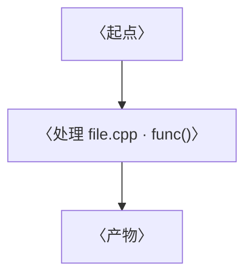

<!--
  复制本文件作为新文档起点：
  1. 文件名改为 snake_case 英文，后缀取自 documentation_guide.md §2.1
     （如 vortex_force_stage_change_notes.md）
  2. 填写下面的元数据头、各章节，删掉本注释与所有〈占位说明〉
  3. 写完在 README.md 登记
  规则详见 ./documentation_guide.md
-->

# 〈文档标题：中文，可中英混排〉

**日期:** YYYY-MM-DD
**分支:** 〈当前分支〉
**关联 commit:** `〈短hash〉` - "〈提交标题〉"
**作者:** 〈可选〉
**JIRA:** 〈可选，ENG-xxxxx〉

> 〈一句话引言：这篇文档讲什么、读完能获得什么。可选。〉

---

## 0. 一句话概括

〈一两句把核心结论说清，让人 10 秒抓住要点。〉

---

## 1. 涉及文件 / 关键文件索引

〈用「文件 · 符号 · 职责」，不写行号。详见规范 §6。〉

| 文件 | 符号（函数/类/字段） | 职责 |
|---|---|---|
| `path/to/file.cpp` | `someFunction()` | 〈一句话〉 |
| `path/to/other.{h,cpp}` | `SomeClass` | 〈一句话〉 |

---

## 2. 〈背景 / 概念〉

〈先讲读懂正文所需的最小概念。〉

---

## 3. 数据流 / 流程图

〈图上方先用一行文字摘要说明图意（mermaid 不渲染时也能读）。类型选用见规范 §7.2。〉

本图说明：〈一句话摘要〉。



---

## 4. 逐项详解（以及"为什么"）

〈按"做什么 / 为什么需要 / 注意点"展开每处关键改动或环节。引用源码用「文件·符号」。〉

```cpp
// 讲解性示例：注释可中文
// 若此片段将原样入库，则注释改为 English only（见规范 §8）
```

---

## N. 验证 / 落地清单

〈怎么确认改动生效。改动类文档必填。〉

- [ ] 〈构建/编译通过〉
- [ ] 〈运行表现符合预期〉
- [ ] 〈相关资产/配置已就位〉

---

## 附录（可选）

### 术语表
| 术语 | 含义 |
|---|---|
| 〈Term〉 | 〈解释〉 |

### 自检命令
〈放可复跑的 grep/命令，便于将来验证文档是否仍成立。见规范 §10。〉

```bash
grep -rn "〈符号〉" path/to/dir/
```
