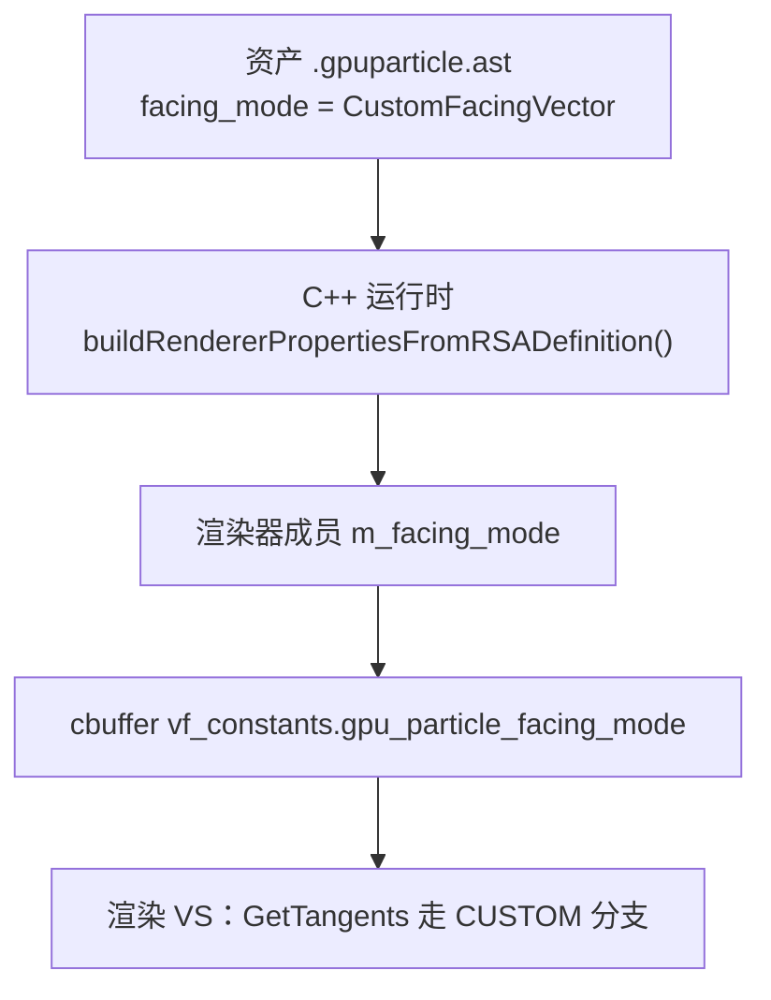

# docs/ 文档编写规范

**日期:** 2026-06-10
**分支:** feature/node-alignment
**关联 commit:** （本规范引入提交）

> 本规范统一 `docs/` 下技术文档的命名、目录、骨架、图表、源码引用、元数据与语言。
> 目标：让任意一篇文档**易找、易读、抗过期**。本文件自身严格遵循它定义的规则，可当活样例。
>
> 新建文档前请：① 读本规范；② 复制 [`doc_template.md`](./doc_template.md) 作为起点；③ 写完在 [`README.md`](./README.md) 登记。

---

## 目录

- [0. 一句话概括](#0-一句话概括)
- [1. 适用范围与目标](#1-适用范围与目标)
- [2. 文件命名规范](#2-文件命名规范)
- [3. 目录结构](#3-目录结构)
- [4. 文档骨架与章节](#4-文档骨架与章节)
- [5. 头部元数据块](#5-头部元数据块)
- [6. 源码引用规范 ★核心★](#6-源码引用规范-核心)
- [7. 图表规范（mermaid）★核心★](#7-图表规范mermaid核心)
- [8. 语言与编码](#8-语言与编码)
- [9. 交叉引用规范](#9-交叉引用规范)
- [10. 防过期与维护](#10-防过期与维护)
- [11. PR 前自检清单](#11-pr-前自检清单)

---

## 0. 一句话概括

一篇文档 = **snake_case 英文文件名** + **元数据头** + **统一骨架** + **mermaid 图** + **按"文件·符号"引用源码（不写行号）**，并在 `README.md` 索引里登记。

---

## 1. 适用范围与目标

- **约束对象**：本规范发布后**新建**的所有 `docs/` 文档。
- **存量文档**：已有 18 篇旧文档**不强制立即改名/重构**；建议在下次实质性修改它时顺手迁移（见 §10 渐进迁移）。
- **目标三件事**：统一**形式**（命名/骨架/图）、保证**可追溯**（元数据 + 关键文件索引）、做到**抗过期**（符号引用 + 自检命令）。

---

## 2. 文件命名规范

**全小写 `snake_case` 英文**，扩展名 `.md`。功能/主题名也用 snake_case：

| 主题 | 文件名示例 |
|---|---|
| 涡旋力 stage | `vortex_force_stage_change_notes.md` |
| Billboard 朝向对齐 | `billboard_facing_and_alignment_flow.md` |
| 圆环形分布 | `shape_location_torus_change_notes.md` |

### 2.1 后缀词表（统一，二选一别混用）

| 后缀 | 用途 | 取代的旧中文后缀 |
|---|---|---|
| `_change_notes` | 某功能/stage 的改动说明（**默认**） | `_修改说明`、`_功能改动说明` |
| `_flow` / `_pipeline` | 运行流程 / 数据管线详解 | `_运行流程详解` |
| `_algorithm` | 算法推导/数学模型 | `_Algorithm` |
| `_guide` | 操作 / 热更 / 排查指南 | `_guide`（热更指南） |
| `_architecture` | 模块/系统架构总览 | `_整体架构与流程` |

### 2.2 命名硬规则

- 一律 `[a-z0-9_]`，**禁中文、禁大写、禁连字符 `-`、禁空格**。
- stage 类文档统一**带 `_stage`**（如 `point_force_stage_*`），不要时有时无。
- 文件名应能让人不打开就猜到主题与文档类型。

---

## 3. 目录结构

- 所有文档**扁平**放在 `docs/` 根，不建按功能的子目录（数量可控时扁平更易检索）。
- `docs/README.md` —— 索引（写作入口 + 文档目录），**单一事实来源**。
- `docs/documentation_guide.md` —— 本规范。
- `docs/doc_template.md` —— 可复制模板。
- **编码**：UTF-8、**无 BOM**、LF 换行。

---

## 4. 文档骨架与章节

统一用**阿拉伯数字**标题 `## 0. / ## 1. / ## 2.`（弃用"第 N 章"与"一、二、三"混用）。

固定骨架（标 ★ 为必填）：

```
# <标题>                      ← H1，中文，可中英混排
<元数据头块>                   ← 见 §5 ★
> <一句话引言/目标>            ← blockquote，可选

## 目录                        ★ 锚点链接到各章节
## 0. 一句话概括               ★ 让人 10 秒抓住要点
## 1. 涉及文件                 ★ 表格：文件 · 符号 · 职责
## 2. <正文分章...>            正文：概念 → 数据流图 → 逐项详解
...
```

> 简短的纯说明文档（无改动）可省略"验证清单"，但"一句话概括 + 涉及文件"始终必填。

---

## 5. 头部元数据块

紧跟 H1，用**粗体键值行**（行尾留两个空格做硬换行）。

**必填**：日期、分支、关联 commit。**可选**：作者、JIRA 单号。

```markdown
**日期:** 2026-06-10
**分支:** feature/node-alignment
**关联 commit:** `a1ad31a24d` - "添加 PointForceStage"
**作者:** yangxu.li            （可选）
**JIRA:** ENG-22632            （可选）
```

- 日期用 `YYYY-MM-DD`；**禁止相对日期**（"上周""最近"）。
- `关联 commit` 写短 hash + 提交标题；多个用逗号分隔。
- 这组字段也是**抗过期锚点**：读者据此知道文档对应的代码版本（见 §10）。

---

## 6. 源码引用规范 ★核心★

### 6.1 一律用「文件名 · 函数/符号名」，禁止行号

行号随分支/改动漂移，**不写行号**。引用一段代码时定位到**函数名/类名/符号名**：

```
✅ chaos_gpu_particle_billboard_renderer.cpp · getDynamicMeshElements()
✅ chaos_gpu_particle_system.cpp · buildRendererPropertiesFromRSADefinition()
✅ chaos_gpu_particle_render_attribute.h · GPUParticleVertexFactoryConstants（结构体）
❌ chaos_gpu_particle_billboard_renderer.cpp:383
❌ system.cpp:795-796
```

- 路径用**仓库相对路径**或文件名；同名文件多时给出足够的路径前缀消歧。
- 头/源成对可合并：`chaos_gpu_particle_compute_dispatch.{h,cpp} · dispatchStage()`。
- 确需指向某行逻辑时，用**代码摘录块**贴出那几行，而不是写行号。

### 6.2 每篇维护「关键文件索引」表

作为文档↔代码的稳定映射枢纽（放 §1 涉及文件，或附录）：

| 文件 | 符号 | 职责 |
|---|---|---|
| `chaos_gpu_particle_system.cpp` | `buildRendererPropertiesFromRSADefinition()` | 资产 → 渲染属性 |
| `chaos_gpu_particle_billboard_renderer.cpp` | 构造函数 / `getDynamicMeshElements()` | 属性 → 成员 → cbuffer |

---

## 7. 图表规范（mermaid）★核心★

### 7.1 一律用 mermaid，弃用 ASCII 框图

流程图、调用链、层次/依赖、数据结构、状态机一律用 mermaid 代码块。仅**极简内联示意**（一两个箭头）可保留纯文本。

### 7.2 图类型选用速查

| 表达内容 | mermaid 类型 |
|---|---|
| 数据流 / 处理流程 | `flowchart TD` 或 `flowchart LR` |
| 调用链 / 帧时序 / 对象交互 | `sequenceDiagram` |
| 模块依赖 / 层次结构 | `graph TD` |
| 数据结构 / 类关系 | `classDiagram` |
| 生命周期 / 状态机 | `stateDiagram-v2` |

### 7.3 图的硬规则

- **每张图上方配一行文字摘要**：mermaid 不渲染时仍能读懂图意。
- 节点标签可中文，但**避免特殊字符**：含 `()[]{}:` 等时用 `"..."` 包裹；多行用 `<br/>`。
- 渲染兼容：GitHub 与 VS Code（内置/插件）均支持 ```` ```mermaid ```` 围栏块；提交前在预览里确认出图。

### 7.4 换行控制 ★

mermaid 默认按固定像素宽度自动折行，中文字符常在无关位置断开（如"平台原生指令"断为"平台原\n生指令"）。**必须禁用自动折行，全部换行由 `<br/>` 手动控制**。

在每个 mermaid 块首行（`flowchart TD` 之前）加入 `wrappingWidth` 配置，设为大值（如 400）即可阻止自动折行：

````markdown

````

`wrappingWidth` 表示节点最大宽度（像素）。设为 400 时，单行超过约 35 个中文字才会触发自动折行——正常节点远不会触达，等于全部由 `<br/>` 控制。

示例（数据流）：



---

## 8. 语言与编码

- **正文、表格、图标签：中文**；标识符（类名/函数/文件名/字段）保留英文原文。
- **代码块注释**：
  - 文档里**讲解性**示例（仅用于说明、不会原样入库）→ 注释可用中文。
  - 凡是**会原样进入源码**的片段 → 注释遵循根 `CODE_STYLE.md` 的 **English only**。
- 文件统一 **UTF-8 无 BOM**。

---

## 9. 交叉引用规范

- 文档间链接用**相对路径** + 反引号文件名作锚文本：`` [`doc_template.md`](./doc_template.md) ``。
- **链接目标必须真实存在**（提交前校验，见 §11）。
- 新增文档**必须在 [`README.md`](./README.md) 登记**；该索引是文档目录的**单一事实来源**，其它文档的"相关文档"列表只做补充、不与之竞争。

---

## 10. 防过期与维护

文档失效几乎都来自"代码变了、文档没跟上"。规范用三层防线：

1. **符号引用而非行号**（§6）—— 函数改名远比行号变动少，引用更耐久。
2. **元数据锚点**（§5）—— 头部"日期/分支/关联 commit"标明文档对应的代码版本；读者发现对不上时知道是文档旧了。
3. **自检命令附录** —— 在文档附录放可复跑的 grep/命令，让读者一键验证文档描述是否仍成立。例如：

```bash
# 校验某符号是否仍存在
grep -rn "getDynamicMeshElements" _source/_engine/.../renderer/
# 校验资产是否仍配了目标模式
grep -rl "CustomFacingVector" --include=*.gpuparticle.ast _content/
```

**渐进迁移**：改动旧文档时，顺手把它升级到本规范（改名、补元数据、ASCII 图转 mermaid、行号引用转符号）。不要求一次性全量迁移。

---

## 11. PR 前自检清单

- [ ] 文件名为 `snake_case` 英文，后缀取自 §2.1 词表。
- [ ] 含合规元数据头（日期/分支/关联 commit）。
- [ ] 骨架含「目录 + 一句话概括 + 涉及文件」。
- [ ] 所有流程/结构图为 mermaid，且每图上方有文字摘要。
- [ ] 源码引用为「文件·符号」，**无 `file:line` 行号**。
- [ ] 交叉引用目标文件均存在。
- [ ] 已在 `README.md` 登记。

自检 grep（在 `docs/` 下运行）：

```bash
# 1) 新文档不应出现行号引用（理想为空）
grep -nE '\.(cpp|h|hlsl|hlsli|cs):[0-9]+' your_new_doc.md
# 2) 文件名合规（应只匹配到自己；中文名/大写名会暴露）
ls *.md | grep -vE '^[a-z0-9_]+\.md$'
```

