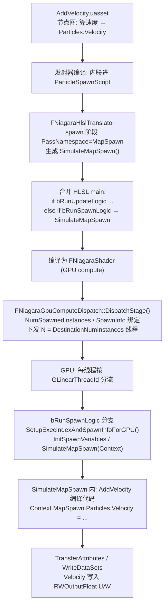
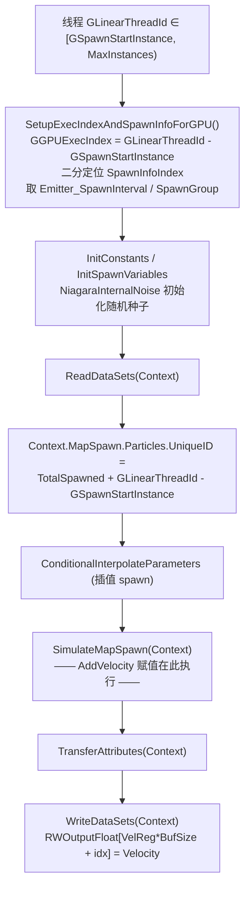

# Niagara GPU Add Velocity 粒子 Spawn 流程

**日期:** 2026-06-29
**分支:** UE-5.5.4 源码阅读
**关联 commit:** 无（基于 UnrealEngine 5.5.4 官方源码静态分析，未做改动）
**作者:** yangxu.li

> 本文解析传统（VM 编译）Niagara GPU emitter 的 `Add Velocity` 模块在 **粒子 Spawn 阶段** 的执行流程。只讲 GPU 侧，CPU/VectorVM 路径与 Stateless 路径不涉及。读完能回答：编辑器里的 `AddVelocity` 模块脚本，是怎么被翻译成 HLSL、又怎么在 GPU spawn 的 compute shader 里把"初始速度"写到每个新粒子的 `Particles.Velocity` 缓冲的。

---

## 0. 一句话概括

`AddVelocity` 是一个 NiagaraScript 模块资产（`Content/Modules/Spawn/Velocity/AddVelocity.uasset`），它的节点图被 `FNiagaraHlslTranslator` 内联编译进 spawn 脚本的 `SimulateMapSpawn()` 函数体；GPU 上 `FNiagaraGpuComputeDispatch::DispatchStage()` 下发一个覆盖"老粒子 + 新粒子"的 compute shader，线程按 `GLinearThreadId` 落入 `bRunSpawnLogic` 分支，在该分支里跑 `SetupExecIndexAndSpawnInfoForGPU()` → `SimulateMapSpawn()`，由编译出的赋值代码直接写 `Context.MapSpawn.Particles.Velocity`，再经 `WriteDataSets()` 落到输出 UAV。

---

## 1. 涉及文件 / 关键文件索引

> 文件路径相对 Niagara 插件根 `Engine/Plugins/FX/Niagara/`。

| 文件 | 符号（函数/类/字段） | 职责 |
|---|---|---|
| `Content/Modules/Spawn/Velocity/AddVelocity.uasset` | `AddVelocity`（UNiagaraScript, Usage=Module） | 传统 AddVelocity 模块脚本资产：节点图定义"取速度 + 写 Particles.Velocity" |
| `Content/Modules/Spawn/Velocity/AddVelocityFromPoint.uasset` | `AddVelocityFromPoint` | 变体：从点向外辐射 |
| `Content/Modules/Spawn/Velocity/AddVelocityInCone.uasset` | `AddVelocityInCone` | 变体：锥形随机方向 |
| `Source/NiagaraEditor/Private/NiagaraHlslTranslator.cpp` | `FNiagaraHlslTranslator` | 把 spawn/update 脚本节点图翻译成 HLSL，spawn 与 update 拼在同一 `main` 的两个分支 |
| `Source/NiagaraEditor/Private/NiagaraHlslTranslator.cpp` | spawn stage 注册（`PassNamespace = "MapSpawn"`） | 声明 spawn 翻译阶段，输出函数名为 `SimulateMapSpawn` |
| `Source/NiagaraEditor/Private/NiagaraHlslTranslator.cpp` | spawn/update 分支生成（`bRunSpawnLogic`） | 生成 `if(bRunUpdateLogic)...else if(bRunSpawnLogic)...`，spawn 分支调 `SimulateMapSpawn(Context)` |
| `Source/NiagaraEditor/Private/NiagaraHlslTranslator.cpp` | `WriteDataSets()` 生成 | 把 `Context.MapSpawn.Particles.Velocity` 写到 `RWOutputFloat` UAV 的代码 |
| `Source/Niagara/Private/NiagaraGpuComputeDispatch.cpp` | `FNiagaraGpuComputeDispatch::DispatchStage()` | **GPU spawn 下发入口**：算 spawn 数、绑 uniform、RDG 下发 compute |
| `Source/Niagara/Private/NiagaraGpuComputeDispatch.cpp` | `PrepareTicksForProxy()` | 帧首规划：算 `DestinationNumInstances`、置 `bFirstStage`、填 `SpawnInfo` |
| `Source/Niagara/Private/NiagaraEmitterInstanceImpl.cpp` | `GpuSpawnInfo` 填充 | CPU 侧把每批 spawn 的 IntervalDt/Group/StartIndex 写进 `SpawnInfoParams/StartOffsets` |
| `Source/NiagaraShader/Public/NiagaraShader.h` | `FNiagaraShader::FParameters` | shader uniform：`NumSpawnedInstances`、`EmitterSpawnInfoOffsets`、`EmitterSpawnInfoParams` |
| `Shaders/Private/NiagaraEmitterInstanceShader.usf` | `SetupExecIndexAndSpawnInfoForGPU()` | 新粒子线程把 `GLinearThreadId` 翻成"组内 spawn 索引"+定位 SpawnInfo |
| `Shaders/Private/NiagaraEmitterInstanceShader.usf` | `EmitterSpawnInfoOffsets` / `EmitterSpawnInfoParams` | spawn 批次边界与参数（IntervalDt/InterpStartDt/Group/StartIndex） |
| `Shaders/Private/NiagaraEmitterInstanceShader.usf` | `NiagaraInternalNoise()` | spawn 线程初始化随机种子（AddVelocity 的随机速度来源） |

---

## 2. 背景 / 概念

- **模块 = NiagaraScript 资产**：传统 Niagara 模块不是 C++ 类，而是一份 `UNiagaraScript`（`Usage = ENiagaraScriptUsage::Module`）节点图资产，放在 `Content/Modules/...`。`AddVelocity` 的图本质就是"读若干输入参数 → 算出一个 `float3` 速度 → 赋值给 `Particles.Velocity`"。发射器编译时，这些模块图被内联拼进发射器的 ParticleSpawnScript。

- **GPU 脚本是 spawn/update 合并的单 compute shader**：`FNiagaraHlslTranslator` 把 spawn 脚本和 update 脚本翻译成**同一份 HLSL**，包在 `if (bRunUpdateLogic) { SimulateMap(Context) } else if (bRunSpawnLogic) { SimulateMapSpawn(Context) }` 里。一个 dispatch 同时处理老粒子（走 update）和新粒子（走 spawn），靠线程索引分流。

- **`bFirstStage` 与 spawn 数**：发射器的第一个 Particle 模拟 stage 是 spawn stage。`PrepareTicksForProxy()` 算出 `DestinationNumInstances = PrevNumInstances + 新生数`，`DispatchStage()` 在 `bFirstStage` 时取 `InstancesToSpawn = DestinationNumInstances - SourceNumInstances` 作为 `NumSpawnedInstances` 下发。

- **SpawnInfo 批次**：一帧内可能有多批 spawn（不同 SpawnGroup / 间隔）。CPU 把每批的 `(IntervalDt, InterpStartDt, Group, GroupSpawnStartIndex)` 压进 `EmitterSpawnInfoParams`，边界压进 `EmitterSpawnInfoOffsets`。新粒子线程在 shader 里二分定位自己属于哪一批，从而拿到正确的 spawn 时间/间隔——这对"插值 spawn"（interpolated spawning）让粒子在帧内均匀分布至关重要，也是 AddVelocity 里随机种子能逐粒子区分的基础。

---

## 3. 数据流 / 流程图

本图说明：从模块资产到 GPU spawn 分支写出 Velocity 的完整链路（上半 CPU 编译，下半 GPU 执行）。



本图说明：GPU 单线程的 spawn 分支内部步骤（AddVelocity 在其中执行）。



---

## 4. 逐项详解（以及"为什么"）

### 4.1 模块资产与内联编译

`AddVelocity.uasset` 是一份 NiagaraScript 模块，节点图大致是：取分布参数（速度向量 / 锥角 / 点源等）→ 经随机或方向计算得到 `float3` → 写 `Particles.Velocity`。`AddVelocityFromPoint`、`AddVelocityInCone` 是同族变体资产。

发射器编译时，发射器的 ParticleSpawnScript 把所有 spawn 模块（含 AddVelocity）的图**内联**进自己的图。`FNiagaraHlslTranslator` 为 spawn 阶段注册一个翻译阶段，`PassNamespace = TEXT("MapSpawn")`，于是这些模块图编译出的 HLSL 全部落在 `SimulateMapSpawn(Context)` 函数体里——AddVelocity 在其中就是一句对 `Context.MapSpawn.Particles.Velocity` 的赋值（或 `+=`）。

> **为什么是内联而不是函数调用**：VM/HLSL 翻译把模块图展平成线性指令流，模块边界在编译后消失。这样 GPU 上没有"调模块函数"的开销，所有 spawn 模块共用同一个 Context，按发射器里模块的排列顺序串行执行。

### 4.2 spawn/update 双分支的生成

`FNiagaraHlslTranslator` 在生成 `main` 时（Particle 迭代源），先算分流条件（编译期字符串拼出）：

```hlsl
GSpawnStartInstance = RWInstanceCounts[ReadInstanceCountOffset];   // 老粒子数
const uint MaxInstances = GSpawnStartInstance + NumSpawnedInstances;
const bool bRunUpdateLogic = bRunSpawnUpdateLogic && GLinearThreadId <  GSpawnStartInstance && GLinearThreadId < MaxInstances;
const bool bRunSpawnLogic  = bRunSpawnUpdateLogic && GLinearThreadId >= GSpawnStartInstance && GLinearThreadId < MaxInstances;
```

- `GSpawnStartInstance`：从实例计数 UAV 读出的"上一帧存活粒子数"。
- `NumSpawnedInstances`：CPU 下发的本帧新生数 M。
- 线程 `0 .. GSpawnStartInstance-1` → 老粒子 → update 分支。
- 线程 `GSpawnStartInstance .. GSpawnStartInstance+M-1` → 新粒子 → spawn 分支。

随后生成两个分支体。**spawn 分支**：

```hlsl
else if (bRunSpawnLogic)
{
    SetupExecIndexAndSpawnInfoForGPU();   // 粒子迭代源才调这个
    InitConstants(Context);
    InitSpawnVariables(Context);
    ReadDataSets(Context);
    if (bParticleSpawnStage == true)
    {
        Context.MapSpawn.Particles.UniqueID = Engine_Emitter_TotalSpawnedParticles + GLinearThreadId - GSpawnStartInstance;
        ConditionalInterpolateParameters(Context);
        SimulateMapSpawn(Context);         // ← AddVelocity 的赋值代码在这里
    }
    TransferAttributes(Context);
    WriteDataSets(Context);                // ← Velocity 落盘到 UAV
}
```

> **为什么 spawn/update 共一个 dispatch**：避免为新生粒子单独开一个 dispatch（多一次管线切换 + 边界处理）。代价是每个线程要做一次索引比较，但对 GPU 而言这比多发一个 dispatch 便宜。

### 4.3 新粒子线程的上下文建立

`SetupExecIndexAndSpawnInfoForGPU()`（`NiagaraEmitterInstanceShader.usf`）做两件事：

1. **算组内 spawn 索引**：`GGPUExecIndex = GLinearThreadId - GSpawnStartInstance`，把全局线程号折算成"本帧第几个新粒子"。
2. **二分定位 SpawnInfo**：`EmitterSpawnInfoOffsets` 是按 `NIAGARA_MAX_GPU_SPAWN_INFOS_V4` 打包的边界数组。shader 用一个 UNROLL 循环统计 `GGPUExecIndex >= EmitterSpawnInfoOffsets[i]` 的分量数，得到 `SpawnInfoIndex`，进而取本批的 `Emitter_SpawnInterval` / `Emitter_SpawnGroup` / `GroupSpawnStartIndex`，再把 `GGPUExecIndex` 折成"本批内第几个"。

随后 `NiagaraInternalNoise(GLinearThreadId * 16384, ..., EmitterTickCounter)` 给本线程初始化随机种子——AddVelocity 里"在区间内随机取速度"就靠这个种子逐粒子区分、且逐帧随 `EmitterTickCounter` 变化。

> **为什么需要 SpawnInfo**：一帧内可以有多批 spawn（burst、不同 group），它们有不同的时间间隔。新粒子需要知道自己属于哪一批，才能算出正确的 spawn 时刻（用于插值 spawn 把粒子均匀撒在帧内）。AddVelocity 的随机性也绑定到这个逐粒子的 UniqueID/种子上，保证每个新粒子拿到独立速度。

### 4.4 AddVelocity 在 SimulateMapSpawn 里的执行

`SimulateMapSpawn(Context)` 内是所有 spawn 模块编译出的内联 HLSL，按发射器模块顺序执行。对 AddVelocity 而言，核心就是一句对 `Context.MapSpawn.Particles.Velocity` 的写入，例如（Linear 模式示意）：

```hlsl
// 编译出的示意（实际由节点图翻译，非手写）
float3 Vel = RandomRangeFloat3(VelocityMin, VelocityMax);   // 用本线程随机种子
Context.MapSpawn.Particles.Velocity += Vel * VelocityScale; // 或直接赋值
```

`AddVelocityInCone` 变体会在编译出的代码里构造锥内随机方向（类似 Stateless 路径里的 `SinCos` 构向 + 四元数旋转），`AddVelocityFromPoint` 会算 `normalize(Position - Origin)`。这些逻辑都是节点图翻译的产物，对每个新粒子线程独立执行。

注意：传统路径下 AddVelocity **直接改 `Particles.Velocity`**，不像 Stateless 那样折进位置积分。位置如何受速度影响，取决于发射器里是否还挂了 `Solve Forces`/`Gravity` 之类的 update 模块——那是 update 阶段的事，不在本文 spawn 范畴。

### 4.5 写回 UAV

`TransferAttributes(Context)` 把 `Context.MapSpawn` 的属性搬到写出结构；`WriteDataSets(Context)` 把每个属性按其寄存器偏移写到输出 UAV，Velocity 大致是：

```hlsl
RWOutputFloat[VelocityRegister * ComponentBufferSizeWrite + ParticleIndex + 0] = Context.MapSpawn.Particles.Velocity.x;
RWOutputFloat[VelocityRegister * ComponentBufferSizeWrite + ParticleIndex + 1] = Context.MapSpawn.Particles.Velocity.y;
RWOutputFloat[VelocityRegister * ComponentBufferSizeWrite + ParticleIndex + 2] = Context.MapSpawn.Particles.Velocity.z;
```

这一帧 spawn 出来的 M 个新粒子的 Velocity 就此落进持久粒子缓冲，下一帧的 update stage 会接着读它。

> **插值 spawn 的特殊情况**：当 `bInterpolatedSpawning == true`（或 `bAlwaysRunUpdateScript`）时，spawn 分支跑完 `SimulateMapSpawn` 后**还会再跑一次 `SimulateMap(Context)`（update）**，让新粒子在 spawn 的同一帧就经历一次 update 积分，保证 spawn 时刻分布在帧内的粒子位置连续。此时 AddVelocity 给的初速度会在同帧就被 update 里的力求解消费。

---

## 5. GPU 下发侧：DispatchStage 关键步骤

`FNiagaraGpuComputeDispatch::DispatchStage()`（`NiagaraGpuComputeDispatch.cpp`）对 spawn stage 的处理：

1. **算 spawn 数**：`bFirstStage` 时 `InstancesToSpawn = DestinationNumInstances - SourceNumInstances`，写入 `Destination->SetNumSpawnedInstances(...)`。
2. **dispatch 维度**：`DispatchCount = DestinationNumInstances`（老 + 新），线程组大小取 `FNiagaraShader::GetDefaultThreadGroupSize(OneD)`（典型 64）。
3. **绑 uniform**：`NumSpawnedInstances`、`EmitterSpawnInfoOffsets`、`EmitterSpawnInfoParams`（从 `InstanceData.SpawnInfo` memcpy 进 `FNiagaraShader::FParameters`）、`SimStart`（首帧/重置标志）、`EmitterTickCounter`。
4. **RDG 下发**：`GraphBuilder.AddPass(..., ERDGPassFlags::Compute | NeverCull)` 内 `SetComputePipelineState` + `DispatchComputeShader(ThreadGroupCount)`。

CPU 侧 `SpawnInfo` 由 `FNiagaraEmitterInstanceImpl` 在 tick 时填充：逐批写 `IntervalDt/InterpStartDt/SpawnGroup/GroupSpawnStartIndex`，剩余槽位用 `INT32_MAX` 哨兵填满。

---

## 6. 与 Stateless 路径的差异（对照，不展开）

| 维度 | 传统 VM GPU（本文） | Stateless |
|---|---|---|
| 模块形态 | NiagaraScript 资产，节点图 | `UNiagaraStatelessModule` C++ 类 |
| 编译 | `FNiagaraHlslTranslator` 翻译成 HLSL 内联进 `SimulateMapSpawn` | `BuildEmitterData` 写共享结构 + `SetShaderParameters` 烤 uniform |
| spawn 调度 | `DispatchStage` 下发，spawn/update 同 shader 按 `bRunSpawnLogic` 分流 | 单一 `StatelessMain` kernel，线程=活粒子，按 Age 重算 |
| 粒子状态 | 持久 GPU buffer，spawn 写新粒子 | 无持久缓冲，每帧重算 |
| AddVelocity 在 GPU | 真实赋值代码（写 `Particles.Velocity`） | `Null_Simulate`（空），数据折进 `SolveVelocitiesAndForces` |

---

## 附录

### 术语表

| 术语 | 含义 |
|---|---|
| `SimulateMapSpawn` | 翻译器为 spawn 阶段生成的函数体，内联所有 spawn 模块（含 AddVelocity） |
| `bRunSpawnLogic` | 线程是否走 spawn 分支（`GLinearThreadId ∈ [GSpawnStartInstance, MaxInstances)`） |
| `GSpawnStartInstance` | 上一帧存活粒子数，spawn/update 分界 |
| `NumSpawnedInstances` | 本帧新生粒子数 M |
| SpawnInfo | 一帧内多批 spawn 的边界与参数，供新粒子线程定位自己的批次 |
| 插值 spawn (interpolated spawning) | 把新生粒子均匀撒在帧内时间上，spawn 后同帧补跑一次 update |

### 自检命令

```bash
# 确认传统 AddVelocity 模块资产存在
ls Engine/Plugins/FX/Niagara/Content/Modules/Spawn/Velocity/

# 确认翻译器生成 spawn 分支与 SimulateMapSpawn 调用
grep -n "bRunSpawnLogic\|SimulateMapSpawn\|PassNamespace = TEXT(\"MapSpawn\")" Engine/Plugins/FX/Niagara/Source/NiagaraEditor/Private/NiagaraHlslTranslator.cpp

# 确认 spawn 线程上下文建立函数
grep -n "SetupExecIndexAndSpawnInfoForGPU\|EmitterSpawnInfoOffsets\|NumSpawnedInstances" Engine/Plugins/FX/Niagara/Shaders/Private/NiagaraEmitterInstanceShader.usf

# 确认 GPU 下发侧 spawn 数计算与 uniform 绑定
grep -n "InstancesToSpawn\|NumSpawnedInstances\|EmitterSpawnInfoOffsets" Engine/Plugins/FX/Niagara/Source/Niagara/Private/NiagaraGpuComputeDispatch.cpp
```
