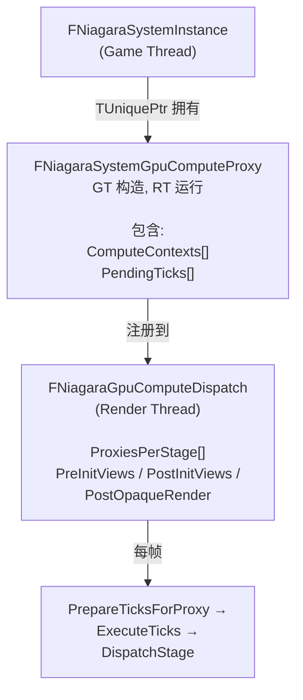
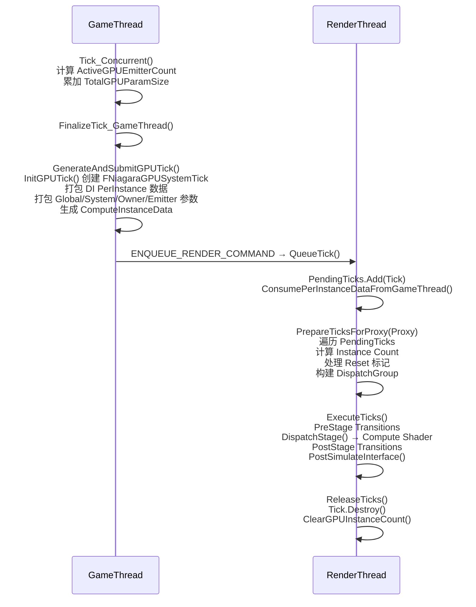
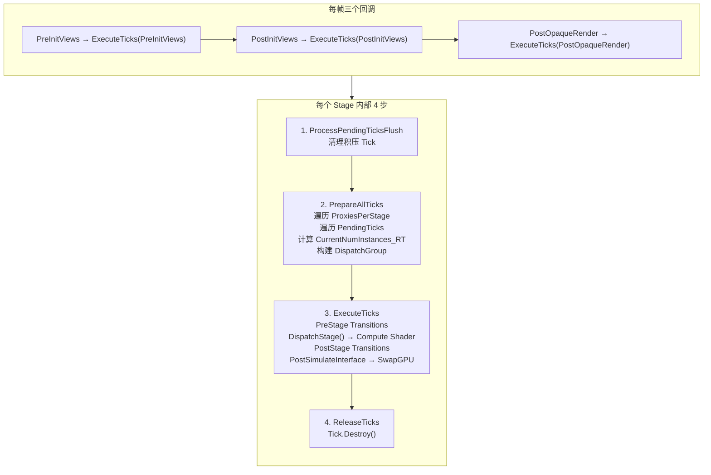
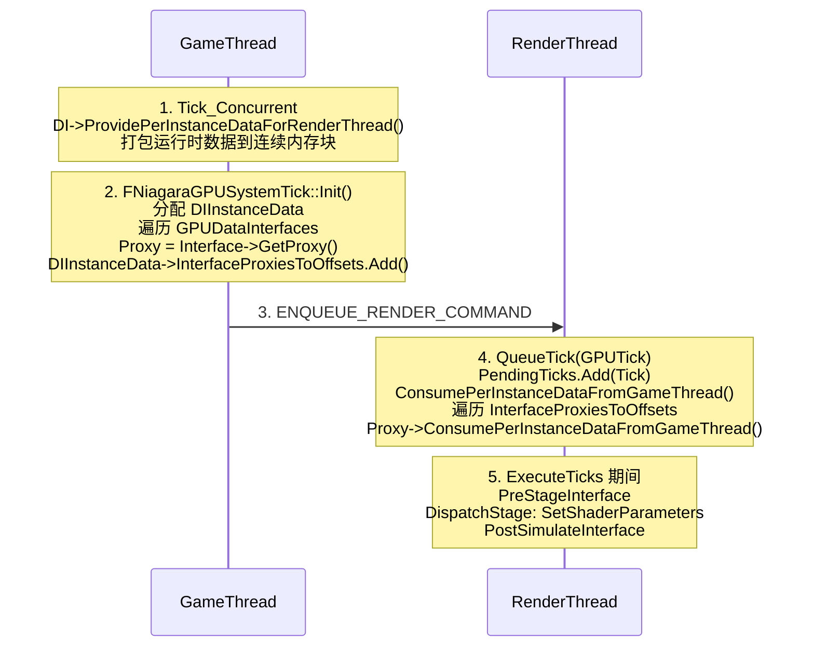
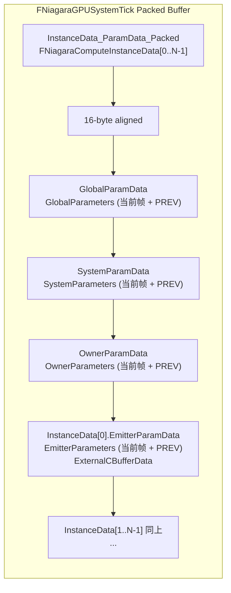
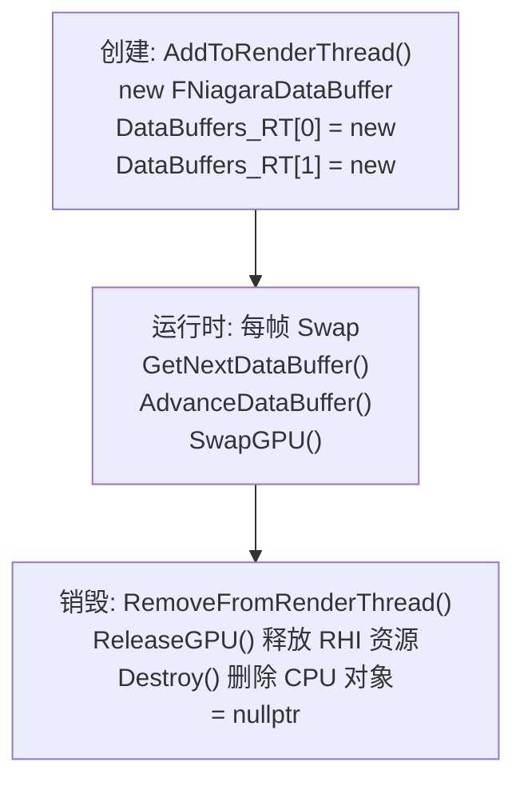
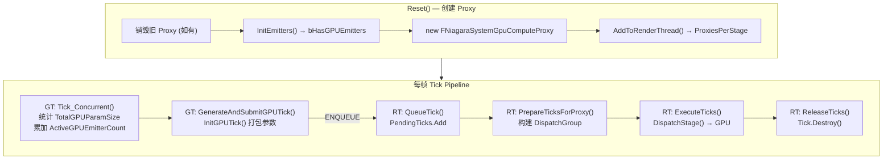

# Niagara GPU Compute Proxy 架构详解

**日期:** 2026-06-30
**分支:** main
**关联 commit:** `16dc333db` - "5.4.1 release"

> `FNiagaraSystemGpuComputeProxy` 的完整架构分析——类定义、生命周期、线程模型、Dispatch Pipeline、设计决策。


## 目录

- [0. 一句话概括](#0-一句话概括)
- [1. 涉及文件 / 关键文件索引](#1-涉及文件--关键文件索引)
- [2. 概述：GPU Proxy 是什么](#2-概述gpu-proxy-是什么)
- [3. 核心数据结构](#3-核心数据结构)
- [4. 完整生命周期](#4-完整生命周期)
- [5. Reset 中创建 GPU Proxy 的深层原因](#5-reset-中创建-gpu-proxy-的深层原因)
- [6. 线程模型与跨线程通信](#6-线程模型与跨线程通信)
- [7. Compute Dispatch Pipeline 详解](#7-compute-dispatch-pipeline-详解)
- [8. Tick Stage 决策逻辑](#8-tick-stage-决策逻辑)
- [9. Data Interface Per-Instance 数据传递](#9-data-interface-per-instance-数据传递)
- [10. 资源管理：GPU Buffer 生命周期](#10-资源管理gpu-buffer-生命周期)
- [11. 设计决策深入分析](#11-设计决策深入分析)
- [12. 完整数据流图](#12-完整数据流图)


---

## 0. 一句话概括

`FNiagaraSystemGpuComputeProxy` = **SystemInstance 在 RT 的锚点** + **GT→RT 的 Tick 队列** + **GPU 状态上下文容器**。GT 创建并拥有其 `TUniquePtr` 所有权，RT 执行其全部核心工作（注册、QueueTick、ReleaseTicks），最终 RT 通过 `delete this` 自销毁。


---

## 1. 涉及文件 / 关键文件索引

| 文件 | 符号（函数/类/字段） | 职责 |
| --- | --- | --- |
| `NiagaraSystemGpuComputeProxy.{h,cpp}` | `FNiagaraSystemGpuComputeProxy` / `AddToRenderThread()` / `QueueTick()` | Proxy 类定义与核心方法 |
| `NiagaraSystemInstance.{h,cpp}` | `SystemGpuComputeProxy` / `GenerateAndSubmitGPUTick()` | Proxy 的创建者与使用者 |
| `NiagaraGpuComputeDispatch.{h,cpp}` | `AddGpuComputeProxy()` / `PrepareTicksForProxy()` | Proxy 的注册目标与调度消费者 |
| `NiagaraComputeExecutionContext.h` | `FNiagaraComputeExecutionContext` / `DataBuffers_RT[]` | GPU Emitter 运行时状态 |
| `NiagaraGPUSystemTick.{h,cpp}` | `FNiagaraGPUSystemTick` / `Init()` / `Destroy()` | 单帧 Tick 数据包 |
| `NiagaraDataInterface.h` | `ConsumePerInstanceDataFromGameThread()` | DI 实例数据 GT→RT 传递 |

---

## 2. 概述：GPU Proxy 是什么

`FNiagaraSystemGpuComputeProxy` 是 `FNiagaraSystemInstance` 在 **渲染线程** 的"镜像"代理对象。它的存在理由根植于 Unreal Engine 的核心架构约束：

> **粒子模拟的 Compute Shader 调度必须在渲染线程执行，但 SystemInstance 的管理（创建、重置、参数绑定）发生在游戏线程。**

GPU Proxy 解决了这个线程边界问题——它是 Niagara GPU 粒子系统中 **唯一合法的 GT→RT 通信通道**。

**一句话定位：GPU Proxy = 渲染线程锚点 + 跨线程 Tick 队列 + GPU 状态上下文容器。**

### 关键类关系

本图说明：Proxy 所属的类层次——SystemInstance 拥有 Proxy，Proxy 注册到 Dispatch。




---

## 3. 核心数据结构

### 3.1 FNiagaraSystemGpuComputeProxy — 完整成员

```cpp
// NiagaraSystemGpuComputeProxy.h
class FNiagaraSystemGpuComputeProxy
{
private:
    FNiagaraSystemInstance*                 DebugOwnerInstance;          // GT 实例指针(仅Debug)
    FNiagaraGpuComputeDispatchInterface*    DebugOwnerComputeDispatchInterface; // 所属Dispatch接口
    
    int32                                   ComputeDispatchIndex;       // 在 ProxiesPerStage[] 中的索引
    FVector3f                               SystemLWCTile;              // LargeWorldCoordinates 偏移
    
    FNiagaraSystemInstanceID                SystemInstanceID;           // 唯一标识符
    ENiagaraGpuComputeTickStage::Type        ComputeTickStage;           // Compute Shader 执行阶段
    uint32  bRequiresGlobalDistanceField : 1;
    uint32  bRequiresDepthBuffer : 1;
    uint32  bRequiresEarlyViewData : 1;
    uint32  bRequiresViewUniformBuffer : 1;
    uint32  bRequiresRayTracingScene : 1;
    
    FShaderResourceViewRHIRef               StaticFloatBuffer;          // System级静态浮点常量
    
    TArray<FNiagaraComputeExecutionContext*> ComputeContexts;           // 每个GPU发射器的执行上下文
    TArray<FNiagaraGPUSystemTick>           PendingTicks;               // GPU Tick 队列(RT侧)
};
```

### 3.2 FNiagaraComputeExecutionContext — GPU 发射器的核心状态

这是 Proxy 持有的最重要的数据。**每个 GPU 发射器对应一个 Context**：

```cpp
// NiagaraComputeExecutionContext.h
struct FNiagaraComputeExecutionContext
{
    // === 数据集 ===
    FNiagaraDataSet*                MainDataSet;          // 粒子属性数据集
    UNiagaraScript*                 GPUScript;            // GT侧Compute脚本
    FNiagaraShaderScript*           GPUScript_RT;         // RT侧Shader引用

    // === RT 数据缓冲区（双缓冲）===
    FNiagaraDataBuffer*             DataBuffers_RT[2];    // 双缓冲, GPU Compute读写目标
    FNiagaraDataBufferRef           DataToRender;         // 当前可用于渲染的数据
    FNiagaraDataBufferRef           TranslucentDataToRender;
    FNiagaraDataBufferRef           MultiViewPreviousDataToRender;

    // === 粒子计数管理 ===
    uint32                          CountOffset_RT;       // GPUInstanceCountManager 中的偏移
    uint32                          CurrentNumInstances_RT;
    uint32                          CurrentMaxInstances_RT;
    uint32                          CurrentMaxAllocateInstances_RT;
    uint32                          BufferSwapsThisFrame_RT;
    
    struct EmitterInstanceReadback {                     // GPU→CPU 粒子计数回读
        uint32 GPUCountOffset;
        uint32 CPUCount;
    };

    // === GT 侧 Spawn 信息 (通过 FNiagaraGPUSystemTick 传递到 RT) ===
    FNiagaraGpuSpawnInfo            GpuSpawnInfo_GT;
    bool                            bResetPending_GT;
    uint32                          ParticleCountReadFence;
    uint32                          ParticleCountWriteFence;

    // === Sim Stage 执行数据 ===
    FNiagaraSimStageExecutionDataPtr SimStageExecData;

    // === Data Interface ===
    FNiagaraScriptInstanceParameterStore CombinedParamStore;
    TArray<FNiagaraDataInterfaceProxy*> DataInterfaceProxies;
    bool                            HasInterpolationParameters;
};
```

### 3.3 FNiagaraGPUSystemTick — 单帧 GPU Tick 的数据包

这是 GT 每帧发送给 RT 的 "快递包裹"，包含一次 Tick 所需的一切：

```cpp
// NiagaraGPUSystemTick.h
class FNiagaraGPUSystemTick
{
public:
    FNiagaraSystemInstanceID                SystemInstanceID;
    FNiagaraSystemGpuComputeProxy*          SystemGpuComputeProxy;
    FNiagaraComputeDataInterfaceInstanceData* DIInstanceData;  // Data Interface 的 Per-Instance 数据块
    uint8*                                  InstanceData_ParamData_Packed; // FNiagaraComputeInstanceData + 参数数据
    uint8*                                  GlobalParamData;      // 全局参数 (DeltaSeconds, Time...)
    uint8*                                  SystemParamData;      // System 参数
    uint8*                                  OwnerParamData;       // Owner(Actor/Component) 参数
    uint32                                  InstanceCount;        // GPU 发射器数量
    uint32                                  TotalDispatches;      // 总 Dispatch 次数
    bool                                    bIsFinalTick;
    bool                                    bHasInterpolatedParameters;

    TArray<FUniformBufferRHIRef>            ExternalUnformBuffers_RT; // 外部CB(如 Material Parameters)
};
```


---

## 4. 完整生命周期

### 4.1 创建 (Construction)

**触发点**: `FNiagaraSystemInstance::Reset()` 的第 860-863 行

```cpp
// NiagaraSystemInstance.cpp · Reset() — 创建 Proxy
if (bHasGPUEmitters && !SystemGpuComputeProxy.IsValid())
{
    SystemGpuComputeProxy.Reset(new FNiagaraSystemGpuComputeProxy(this));
    SystemGpuComputeProxy->AddToRenderThread(GetComputeDispatchInterface());
}
```

**构造函数做的事** (`NiagaraSystemGpuComputeProxy.cpp · FNiagaraSystemGpuComputeProxy()`):

1. **保存系统实例引用与 LWC Tile**: `DebugOwnerInstance`, `SystemLWCTile`
2. **收集所有 GPU 发射器的 ComputeContext**: 遍历 `OwnerInstance->GetEmitters()`，对每个发射器调用 `GetGPUContext()`，将返回的 `FNiagaraComputeExecutionContext*` 存入 `ComputeContexts`
3. **判定 ComputeTickStage**: 根据系统所需的渲染特性（Global Distance Field、Depth Buffer、Ray Tracing 等）确定 Compute Shader 在渲染管线中的执行时机
4. **设置 StaticFloatBuffer**: 通过 ENQUEUE_RENDER_COMMAND 将 System 的静态浮点常量缓冲区传递到 RT

### 4.2 注册到 Render Thread (AddToRenderThread)

```cpp
// NiagaraSystemGpuComputeProxy.cpp · AddToRenderThread()
void FNiagaraSystemGpuComputeProxy::AddToRenderThread(FNiagaraGpuComputeDispatchInterface* ComputeDispatchInterface)
{
    check(IsInGameThread());
    DebugOwnerComputeDispatchInterface = ComputeDispatchInterface;
    
    ENQUEUE_RENDER_COMMAND(AddProxyToComputeDispatchInterface)(
        [this, ComputeDispatchInterface](FRHICommandListImmediate& RHICmdList)
        {
            // 1. 注册到 DispatchInterface 的按Stage分类的Proxy数组
            ComputeDispatchInterface->AddGpuComputeProxy(this);
            
            // 2. 初始化每个 ComputeContext 的 RT 状态
            for (FNiagaraComputeExecutionContext* ComputeContext : ComputeContexts)
            {
                ComputeContext->bHasTickedThisFrame_RT = false;
                ComputeContext->CurrentNumInstances_RT = 0;
                ComputeContext->CurrentMaxInstances_RT = 0;
                ComputeContext->EmitterInstanceReadback.CPUCount = 0;
                ComputeContext->EmitterInstanceReadback.GPUCountOffset = INDEX_NONE;
                
                // 3. 分配 GPU 数据缓冲区
                for (int i=0; i < UE_ARRAY_COUNT(ComputeContext->DataBuffers_RT); ++i)
                {
                    ComputeContext->DataBuffers_RT[i] = new FNiagaraDataBuffer(ComputeContext->MainDataSet);
                }
            }
        }
    );
}
```

`AddGpuComputeProxy()` 在 `FNiagaraGpuComputeDispatch` 中将 Proxy 插入正确的 Tick Stage 数组并更新 RenderFeature 计数：

```cpp
// NiagaraGpuComputeDispatch.cpp · AddGpuComputeProxy()
void FNiagaraGpuComputeDispatch::AddGpuComputeProxy(FNiagaraSystemGpuComputeProxy* ComputeProxy)
{
    const ENiagaraGpuComputeTickStage::Type TickStage = ComputeProxy->GetComputeTickStage();
    ComputeProxy->ComputeDispatchIndex = ProxiesPerStage[TickStage].Num();
    ProxiesPerStage[TickStage].Add(ComputeProxy);
    
    NumProxiesThatRequireGlobalDistanceField += ComputeProxy->RequiresGlobalDistanceField() ? 1 : 0;
    NumProxiesThatRequireDepthBuffer         += ComputeProxy->RequiresDepthBuffer() ? 1 : 0;
    NumProxiesThatRequireEarlyViewData       += ComputeProxy->RequiresEarlyViewData() ? 1 : 0;
    NumProxiesThatRequireRayTracingScene     += ComputeProxy->RequiresRayTracingScene() ? 1 : 0;
}
```

### 4.3 运行时 Tick 循环 (Per-Frame Operation)

每帧的数据流：

本图说明：GT 侧打包 Tick → RT 侧 Prepare/Execute/Release 的完整时序。



### 4.4 销毁 (Destruction)

**路径 1 — DeallocateSystemInstance** (`NiagaraSystemInstance.cpp &#183; DeallocateSystemInstance()`):

```cpp
if (SystemInstanceAllocation->SystemGpuComputeProxy)
{
    FNiagaraSystemGpuComputeProxy* Proxy = SystemInstanceAllocation->SystemGpuComputeProxy.Release();
    Proxy->RemoveFromRenderThread(SystemInstanceAllocation->GetComputeDispatchInterface(), true);
}
```

**路径 2 — Reset() 中的旧 Proxy 清理** (第 792-798 行):

```cpp
if (SystemGpuComputeProxy.IsValid())
{
    if (IsComplete() || (Mode != EResetMode::ResetSystem))
    {
        FNiagaraSystemGpuComputeProxy* Proxy = SystemGpuComputeProxy.Release();
        Proxy->RemoveFromRenderThread(GetComputeDispatchInterface(), true);
    }
}
```

**路径 3 — Complete() 中的清理** (第 692-693 行):

```cpp
FNiagaraSystemGpuComputeProxy* Proxy = SystemGpuComputeProxy.Release();
Proxy->RemoveFromRenderThread(GetComputeDispatchInterface(), true);
```

**RemoveFromRenderThread 的 RT 侧逻辑** (`NiagaraSystemGpuComputeProxy.cpp · RemoveFromRenderThread()`):

```cpp
void FNiagaraSystemGpuComputeProxy::RemoveFromRenderThread(
    FNiagaraGpuComputeDispatchInterface* ComputeDispatchInterface, bool bDeleteProxy)
{
    ENQUEUE_RENDER_COMMAND(RemoveFromRenderThread)(
        [this, ComputeDispatchInterface, bDeleteProxy](FRHICommandListImmediate& RHICmdList)
        {
            // 1. 从 DispatchInterface 的 ProxiesPerStage 中注销
            ComputeDispatchInterface->RemoveGpuComputeProxy(this);
            
            // 2. 释放所有待处理的 Tick
            ReleaseTicks(ComputeDispatchInterface->GetGPUInstanceCounterManager(),
                         TNumericLimits<int32>::Max(), true);
            
            // 3. 清理每个 ComputeContext 的RT资源
            for (FNiagaraComputeExecutionContext* ComputeContext : ComputeContexts)
            {
                ComputeContext->ResetInternal(ComputeDispatchInterface);
                
                // 4. 释放GPU数据缓冲区
                for (int i = 0; i < UE_ARRAY_COUNT(ComputeContext->DataBuffers_RT); ++i)
                {
                    ComputeContext->DataBuffers_RT[i]->ReleaseGPU();
                    ComputeContext->DataBuffers_RT[i]->Destroy();
                    ComputeContext->DataBuffers_RT[i] = nullptr;
                }
            }
            
            // 5. 析构句柄自删除 (必须在 RT 执行)
            if (bDeleteProxy)
            {
                delete this;  // ~FNiagaraSystemGpuComputeProxy() { check(IsInRenderingThread()); }
            }
        }
    );
}
```


---

## 5. Reset 中创建 GPU Proxy 的深层原因

### 5.1 为什么必须"先销毁旧、再创建新"

Reset 函数的执行顺序至关重要，注释中明确标出：

```cpp
// Remove any existing proxy from the dispatcher
// This MUST be done before the emitters array is re-initialized  ← 关键约束!
if (SystemGpuComputeProxy.IsValid()) { ... Release + RemoveFromRenderThread ... }

// ... LWC Tile, ResetInternal / ReInitInternal ...

// 之后才创建新 Proxy
if (bHasGPUEmitters && !SystemGpuComputeProxy.IsValid()) { ... Reset + AddToRenderThread ... }
```

**原因分析**:

| 原因 | 详情 |
|------|------|
| **旧 Context 指针失效** | `ReInitInternal()` 调用 `Emitters.Reset()` + `InitEmitters()` 会销毁并重建所有 `FNiagaraEmitterInstance`。旧 Proxy 持有的 `FNiagaraComputeExecutionContext*` 指针全部变成悬空指针 |
| **GPU 资源需重建** | ComputeContext 的 `DataBuffers_RT[2]`、`CountOffset_RT`、`CurrentNumInstances_RT` 等都是上一轮模拟的状态。Reset 意味"从零开始"，必须分配全新的 GPU Buffers |
| **发射器拓扑可能改变** | `ReInitInternal` 重新执行 `InitEmitters()`，可能新增/删除发射器或改变 SimTarget。新 Proxy 在构造函数中重新遍历 Emitters 收集 Context |
| **Render Feature 需求可能变化** | 新发射器组合可能需要/不需要 Global Distance Field、Depth Buffer 等，影响 TickStage 判定和 Dispatch 计数 |
| **Proxy 生命周期不可复用** | `RemoveFromRenderThread(true)` 最终在 RT 上 `delete this`。如果 GT 不等待 RT 完成就复用，可能 double-free 或 use-after-free |
| **StaticFloatBuffer 需更新** | System 的静态常量数据可能已变更 |

### 5.2 bHasGPUEmitters 的判定时机

在 `InitEmitters()` 中（第 2142-2197 行），遍历所有 EmitterHandle：

```cpp
bHasGPUEmitters = false;
for (const FNiagaraEmitterHandle& EmitterHandle : EmitterHandles)
{
    EmitterInstance->Init(EmitterIdx);
    if (EmitterEnabled && bAllowComputeShaders)
    {
        bHasGPUEmitters |= EmitterInstance->GetSimTarget() == ENiagaraSimTarget::GPUComputeSim;
    }
}
```

这意味着**只要系统中有任何一个 GPU 发射器，Proxy 就会被创建**。即使多发射器混合（CPU + GPU），Proxy 也只需要一个。

### 5.3 为什么需要 ActiveGPUEmitterCount 和 TotalGPUParamSize

这两个字段在 `Tick_Concurrent()` 中每帧重新计算（第 2511-2595 行），用于 **GPUTick 数据打包**：

```cpp
TotalGPUParamSize = 0;
ActiveGPUEmitterCount = 0;

for (const FNiagaraEmitterExecutionIndex& EmitterExecIdx : EmitterExecutionOrder)
{
    if (Emitter.GetSimTarget() == GPUComputeSim)
    {
        // 只计入那些实际要Tick的GPU发射器 (排除 Inactive)
        ActiveGPUEmitterCount++;
        TotalCombinedParamStoreSize += InterpFactor * GPUContext->GetConstantBufferSize();
    }
}

TotalGPUParamSize = InterpFactor * (
    sizeof(FNiagaraGlobalParameters) +
    sizeof(FNiagaraSystemParameters) +
    sizeof(FNiagaraOwnerParameters) +
    ActiveGPUEmitterCount * sizeof(FNiagaraEmitterParameters)
) + TotalCombinedParamStoreSize;
```

这些值被 `FNiagaraGPUSystemTick::Init()` 用来分配精确大小的 packed buffer。


---

## 6. 线程模型与跨线程通信

### 6.1 线程边界

本图说明：GT 侧与 RT 侧的数据分离——同一类在不同线程持有不同字段。

```mermaid
%%{init: {'flowchart': {'wrappingWidth': 400}}}%%
flowchart LR
    subgraph GT["Game Thread"]
        SI["FNiagaraSystemInstance<br/>SystemGpuComputeProxy<br/>(TUniquePtr 所有权)"]
        CTX_GT["FNiagaraComputeExecutionContext<br/>GPUScript (UObject)<br/>GpuSpawnInfo_GT<br/>bResetPending_GT"]
        TICK_GT["FNiagaraGPUSystemTick<br/>Init() 打包 GT 数据"]
    end
    subgraph RT["Render Thread"]
        PROXY["FNiagaraSystemGpuComputeProxy<br/>DebugOwnerInstance (仅 Debug)"]
        CTX_RT["FNiagaraComputeExecutionContext<br/>GPUScript_RT (Shader)<br/>DataBuffers_RT[2]<br/>CountOffset_RT"]
        TICK_RT["FNiagaraGPUSystemTick<br/>QueueTick() 入队<br/>Destroy() 释放"]
        DISPATCH["FNiagaraGpuComputeDispatch<br/>ProxiesPerStage[]<br/>PrepareTicksForProxy()<br/>ExecuteTicks()"]
    end
    GT -->|"ENQUEUE_RENDER_COMMAND"| RT
```



### 6.2 关键线程安全约定

| 约定 | 代码体现 |
|------|---------|
| **GT 拥有 Proxy 的所有权** | `TUniquePtr<FNiagaraSystemGpuComputeProxy>` 在 `FNiagaraSystemInstance` 中 |
| **RT 可以删除 Proxy** | `RemoveFromRenderThread(..., true)` 最后执行 `delete this`，析构函数 `check(IsInRenderingThread())` |
| **GT 不能访问 Proxy 的 RT 数据** | `PendingTicks`, `ComputeContexts` 中的 RT 字段只能在 RT 访问 |
| **Context 数据分 GT/RT 两边** | `GpuSpawnInfo_GT` / `bResetPending_GT` (GT写) vs `DataBuffers_RT` / `CountOffset_RT` (RT写) |
| **Tick 数据单向流动** | GT 通过 `ENQUEUE_RENDER_COMMAND` 发送 Tick，RT 消费后 `Destroy()` |

### 6.3 ENQUEUE_RENDER_COMMAND 的使用模式

Proxy 的所有跨线程操作都通过 `ENQUEUE_RENDER_COMMAND`：

```cpp
// Pattern 1: 注册
ENQUEUE_RENDER_COMMAND(AddProxyToComputeDispatchInterface)(
    [this, ComputeDispatchInterface](FRHICommandListImmediate& RHICmdList) { ... });

// Pattern 2: 提交 Tick
ENQUEUE_RENDER_COMMAND(FNiagaraGiveSystemInstanceTickToRT)(
    [RT_Proxy=SystemGpuComputeProxy.Get(), GPUTick](FRHICommandListImmediate& RHICmdList) mutable
    { RT_Proxy->QueueTick(GPUTick); });

// Pattern 3: 注销
ENQUEUE_RENDER_COMMAND(RemoveFromRenderThread)(
    [this, ComputeDispatchInterface, bDeleteProxy](FRHICommandListImmediate& RHICmdList) { ... });

// Pattern 4: 清空 Tick
ENQUEUE_RENDER_COMMAND(ClearTicksFromProxy)(
    [this, ComputeDispatchInterface](FRHICommandListImmediate& RHICmdList) { ... });
```


---

## 7. Compute Dispatch Pipeline 详解

### 7.1 整体调度流程

本图说明：Dispatch 按 Stage 回调 → 每个 Stage 内部 4 步流程。



### 7.2 PrepareTicksForProxy 详解

```cpp
// NiagaraGpuComputeDispatch.cpp · PrepareTicksForProxy()
void FNiagaraGpuComputeDispatch::PrepareTicksForProxy(
    FRHICommandListImmediate& RHICmdList,
    FNiagaraSystemGpuComputeProxy* ComputeProxy,
    FNiagaraGpuDispatchList& GpuDispatchList)
{
    // Step 1: 重置每个 ComputeContext 的 RT 状态
    for (FNiagaraComputeExecutionContext* ComputeContext : ComputeProxy->ComputeContexts)
    {
        ComputeContext->CurrentMaxInstances_RT = 0;
        ComputeContext->CurrentMaxAllocateInstances_RT = 0;
        ComputeContext->BufferSwapsThisFrame_RT = 0;
        ComputeContext->FinalDispatchGroup_RT = INDEX_NONE;
    }

    // Step 2: 设置最后一个 Tick 的 bIsFinalTick 标志
    const int32 NumTicksToProcess = FMath::Min(ComputeProxy->PendingTicks.Num(), MaxTicksToFlush);
    ComputeProxy->PendingTicks[NumTicksToProcess - 1].bIsFinalTick = true;

    // Step 3: 处理每个 Tick, 构建 DispatchInstances
    for (int32 iTick = 0; iTick < NumTicksToProcess; ++iTick)
    {
        FNiagaraGPUSystemTick& Tick = ComputeProxy->PendingTicks[iTick];
        
        for (FNiagaraComputeInstanceData& InstanceData : Tick.GetInstances())
        {
            // 处理 Reset: 清零粒子计数
            if (InstanceData.bResetData)
            {
                ComputeContext->CurrentNumInstances_RT = 0;
                if (ComputeContext->CountOffset_RT != INDEX_NONE)
                {
                    GpuDispatchList.CountsToRelease.Add(ComputeContext->CountOffset_RT);
                    ComputeContext->CountOffset_RT = INDEX_NONE;
                }
            }
            
            // 跳过无效 Context
            if (!ComputeContext->GPUScript_RT->IsShaderMapComplete_RenderThread()) continue;
            if (InstanceData.TotalDispatches == 0) continue;
            
            // 计算新粒子数
            const uint32 PrevNumInstances = ComputeContext->CurrentNumInstances_RT;
            ComputeContext->CurrentNumInstances_RT = 
                FMath::Min(PrevNumInstances + SpawnRateInstances + EventSpawnTotal, MaxBufferInstances);
            
            // 分配 Dispatch Group
            // ...构造 FNiagaraGpuDispatchInstance 加入 DispatchGroup
        }
    }
}
```

### 7.3 ExecuteTicks 核心循环

```cpp
// NiagaraGpuComputeDispatch.cpp · ExecuteTicks()
void FNiagaraGpuComputeDispatch::ExecuteTicks(FRDGBuilder& GraphBuilder, ...)
{
    // 1. 建立 SimulationSceneViews (供 Data Interface Shader 参数设置)
    SimulationSceneViews = Views;
    
    // 2. 获取 Scene Textures UniformBuffer
    SceneTexturesUniformParams = GetOrCreateSceneTextureUniformBuffer(...);
    
    // 3. 遍历每一个 DispatchGroup
    for (const FNiagaraGpuDispatchGroup& DispatchGroup : DispatchList.DispatchGroups)
    {
        // 3a. Pre-Stage: 收集Transitions + 调用 PreStageInterface
        for (FNiagaraGpuDispatchInstance& Instance : DispatchGroup.DispatchInstances)
        {
            PreStageInterface(GraphBuilder, ...);  // Data Interface Pre-Stage 回调
        }
        
        // 3b. 执行 GPU Transitions + Initialize IDToIndex Tables
        GraphBuilder.AddPass(...);
        
        // 3c. Execute Stage: 逐个 Dispatch Compute Shader
        for (FNiagaraGpuDispatchInstance& Instance : DispatchGroup.DispatchInstances)
        {
            if (Instance.bResetData && SimStageData.bFirstStage)
                ResetDataInterfaces(GraphBuilder, ...);
            DispatchStage(GraphBuilder, ...);  // ← 实际提交 Compute Shader Dispatch!
        }
        
        // 3d. Post-Stage: 清理 Transitions + PostStageInterface + PostSimulateInterface
        GraphBuilder.AddPass(...);
        for (FNiagaraGpuDispatchInstance& Instance : DispatchGroup.DispatchInstances)
        {
            PostStageInterface(GraphBuilder, ...);
            if (SimStageData.bLastStage)
                PostSimulateInterface(GraphBuilder, ...);
            // Swap GPU Buffer → SetDataToRender
            FinalSimStageDataBuffer->SwapGPU(CurrentData);
        }
    }
}
```

### 7.4 DispatchStage — 最终提交 Compute Shader

`DispatchStage()` 负责：
1. 设置 Shader Parameters (从 `FNiagaraComputeInstanceData` 中提取)
2. 绑定 Data Interface 的 Shader 参数 (UAVs, SRVs, Textures...)
3. 根据 Dispatch Type (1D/2D/3D) 计算 Dispatch 线程组数
4. 调用 `GraphBuilder.AddPass()` 提交 Compute Shader Dispatch


---

## 8. Tick Stage 决策逻辑

### 8.1 判定规则

```cpp
// NiagaraSystemGpuComputeProxy.cpp · TickStage 判定逻辑
if (bRequiresGlobalDistanceField || bRequiresDepthBuffer || bRequiresRayTracingScene)
{
    ComputeTickStage = ENiagaraGpuComputeTickStage::PostOpaqueRender;
}
else if (bRequiresEarlyViewData)
{
    ComputeTickStage = ENiagaraGpuComputeTickStage::PostInitViews;
}
else if (bRequiresViewUniformBuffer)
{
    ComputeTickStage = ENiagaraGpuComputeTickStage::PostOpaqueRender;
}
else
{
    ComputeTickStage = ENiagaraGpuComputeTickStage::PreInitViews;
}
```

### 8.2 各 Stage 含义与渲染管线位置

| Stage | 管线位置 | 可用资源 | 典型用例 |
|-------|---------|---------|---------|
| **PreInitViews** | 最早，View 初始化之前 | 最少（无 SceneTextures / GBuffer / Depth / GDF） | 不需要场景信息的纯模拟 |
| **PostInitViews** | View 初始化完成后 | Early View Data 可用 | 需要 View Uniform Buffer 但不需深度/GBuffer |
| **PostOpaqueRender** | 不透明几何体渲染完成后 | 全部可用（GBuffer、Depth、GDF、Ray Tracing Scene） | 碰撞查询、距离场采样、深度碰撞 |

### 8.3 Stage 对 Proxy 管理的影响

- `ProxiesPerStage` 是一个长度为 `ENiagaraGpuComputeTickStage::Max (=3)` 的数组
- 同一 Stage 的所有 Proxy 的 Tick 被批量处理——这是性能优化的关键
- 不同 Stage 的 Proxy 在不同渲染阶段被唤醒，互不阻塞


---

## 9. Data Interface Per-Instance 数据传递

### 9.1 整体流程

这是 Proxy 最复杂的职责之一。Data Interface（DI）是 Niagara 与外部数据源（Skeletal Mesh、Texture、Distance Field 等）的桥梁。它们的运行时数据需要在 GT→RT 之间传递。

本图说明：Data Interface 的 Per-Instance 数据从 GT 打包到 RT 消费的 5 步流程。



### 9.2 内存布局

```
FNiagaraGPUSystemTick 的 Packed Buffer 布局:
本图说明：`FNiagaraGPUSystemTick` 的 Packed Buffer 内存布局。


```


---

## 10. 资源管理：GPU Buffer 生命周期

### 10.1 DataBuffers_RT 的完整生命周期

本图说明：DataBuffers_RT 从创建到销毁的三阶段生命周期。



### 10.2 GPUInstanceCountManager 计数管理

粒子计数通过 `FNiagaraGPUInstanceCountManager` 管理：

- `CountOffset_RT`: 在 InstanceCountBuffer 中的偏移，由 Manager 分配
- `PrepareTicksForProxy` 中将旧 offset 加入 `CountsToRelease` 列表 (供后续复用)
- `ExecuteTicks` 完成后，`ReleaseTicks` 调用 `ClearGPUInstanceCount()` 清零


---

## 13. 完整数据流图

本图说明：Proxy 从创建到每帧运行的完整时序——两个阶段合为一图。




---

## 12. 关键设计理由总结

| # | 设计决策 | 原因 |
|---|---------|------|
| 1 | **每 System Instance 一个 Proxy，而非每 Emitter** | 减少 Dispatch 注册开销，多个 GPU 发射器共享同一个 Tick 调度。Proxy 的 `ComputeContexts` 数组容纳所有 GPU 发射器 |
| 2 | **Proxy 生命周期 = System Instance 在 Active 状态的周期** | 非 Active 状态时无 Tick 需要提交，Proxy 无存在意义。`Reset(ReInit)` 是 Active 周期的起点 |
| 3 | **Proxy 在 GT 创建但在 RT 析构** | `TUniquePtr` 的所有权在 GT，但真正的资源释放（GPU Buffers）必须在 RT 完成。通过 `RemoveFromRenderThread(true)` + `delete this` 实现 |
| 4 | **Reset 时先销毁旧 Proxy 再创建新的，而非复用** | Emitter 可能完全重建、Context 指针失效、GPU 资源需重新分配、RenderFeature 可能改变。复用无法安全处理这些情况 |
| 5 | **PendingTicks 队列设计** | RT 可能在多帧后才处理 GT 提交的 Tick（例如编辑器失焦时）。队列解耦了 GT 提交频率和 RT 执行频率，`ProcessPendingTicksFlush` 防止无限积压 |
| 6 | **Tick Stage 在构造时判定且不可变** | System 需要的渲染资源在运行时不会改变（由 System Asset 定义），生命周期内固定是安全的 |
| 7 | **ComputeContext 的 GT/RT 双端状态分离** | `GpuSpawnInfo_GT` / `bResetPending_GT` 在 GT 写入，`DataBuffers_RT` / `CountOffset_RT` 在 RT 写入，避免跨线程竞争 |
| 8 | **DI Data 通过 Packed Buffer 而非逐个传递** | 减少内存分配次数。`FNiagaraGPUSystemTick::Init()` 中一次性 `malloc` 分配整块 buffer，所有 DI 数据紧凑排列 |
| 9 | **必须等待 Concurrent Tick 完成后才能 Reset** | `WaitForConcurrentTickAndFinalize()` 确保没有正在进行的异步 Tick 在使用将被销毁的数据 |
| 10 | **Proxy 必须最后创建（在 Emitter Init 之后）** | 需要已经初始化完毕的 `ComputeContext` 来收集 GPU 发射器信息，这些信息在 `InitEmitters()` 中才确定 |
