# Niagara GPU Compute Shader 架构详解

**日期:** 2026-06-29
**分支:** main
**关联 commit:** `16dc333db` - "5.4.1 release"

> 从零开始理解 Niagara 的 GPU 粒子模拟——节点图如何变成 Compute Shader，五个角色如何协作，每帧 Tick 如何经历 GT→RT→GPU 三个阶段。

---

## 目录

- [0. 一句话概括](#0-一句话概括)
- [1. 涉及文件 / 关键文件索引](#1-涉及文件--关键文件索引)
- [2. 前置知识：CPU 和 GPU 的区别](#2-前置知识cpu-和-gpu-的区别)
- [3. 为什么 Niagara 需要 GPU 模拟](#3-为什么-niagara-需要-gpu-模拟)
- [4. 什么是 Compute Shader](#4-什么是-compute-shader)
- [5. Niagara 节点图如何变成 Compute Shader](#5-niagara-节点图如何变成-compute-shader)
- [6. 核心概念：Simulation Stage](#6-核心概念simulation-stage)
- [7. GPU 管线的五个角色（概述）](#7-gpu-管线的五个角色概述)
- [8. 完整运行时流程：创建 → Tick → 销毁](#8-完整运行时流程创建--tick--销毁)
- [9. FNiagaraSystemGpuComputeProxy 深度剖析](#9-fniagarasystemgpucomputeproxy-深度剖析)
- [10. DispatchStage 源码逐行解读](#10-dispatchstage-源码逐行解读)
- [11. GPU 线程视角：一个粒子的一生](#11-gpu-线程视角一个粒子的一生)
- [12. 双缓冲与乒乓交换](#12-双缓冲与乒乓交换)
- [13. 完整数据流图](#13-完整数据流图)
- [14. 常见疑问解答](#14-常见疑问解答)

---

## 0. 一句话概括

Niagara GPU 粒子模拟 = **SystemInstance（GT 打包）→ Proxy（RT 缓存）→ Dispatch（按 Stage 调度）→ Shader（GPU 执行）→ DataBuffer（双缓冲存储）**。整条链路的核心在 `DispatchStage()` 函数，它为每个 Sim Stage 绑定 SRV/UAV/CBV 后调用 `DispatchComputeShader()` 启动数千 GPU 线程并行计算。

---

## 1. 涉及文件 / 关键文件索引

| 文件 | 符号（函数/类/字段） | 职责 |
| --- | --- | --- |
| `NiagaraSystemInstance.{h,cpp}` | `GenerateAndSubmitGPUTick()` / `SystemGpuComputeProxy` | GT 侧发起 GPU Tick |
| `NiagaraSystemGpuComputeProxy.{h,cpp}` | `FNiagaraSystemGpuComputeProxy` / `QueueTick()` | RT 锚点，GT→RT 通道 |
| `NiagaraGpuComputeDispatch.{h,cpp}` | `FNiagaraGpuComputeDispatch` / `DispatchStage()` | Compute Shader 调度中枢 |
| `NiagaraShader.h` | `FNiagaraShader` / `FParameters` | 编译好的 GPU 程序和参数布局 |
| `NiagaraDataSet.h` | `FNiagaraDataBuffer` / `GPUBufferFloat` | GPU 粒子属性双缓冲存储 |
| `NiagaraComputeExecutionContext.h` | `FNiagaraComputeExecutionContext` / `GPUScript_RT` | GPU Emitter 运行时状态 |
| `NiagaraGPUSystemTick.{h,cpp}` | `FNiagaraGPUSystemTick` / `Init()` | 单帧 Tick 数据包 |
| `NiagaraShared.h` | `FNiagaraShaderScript` / `GetShader()` | Shader 编译产物容器 |
| `SceneVisibility.cpp` | `PreInitViews()` / `PostInitViews()` 回调点 | 引擎回调入口 |
| `DeferredShadingRenderer.cpp` | `PostRenderOpaque()` 回调点 | 引擎回调入口 |

---

## 2. 前置知识：CPU 和 GPU 的区别

在理解 Compute Shader 之前，需要先理解 CPU 和 GPU 的本质区别。

| | CPU | GPU |
|---|---|---|
| **核心数** | 少 (8~32个) | 多 (几千个) |
| **单核速度** | 快 (高主频) | 慢 (低主频) |
| **适合做什么** | 复杂逻辑、分支判断、顺序执行 | 简单计算、大规模并行、相同操作 |
| **类比** | 一个博士生解一道微分方程 | 10000个小学生每人做一道加法 |

GPU 的设计哲学是：**用数量弥补质量**。几千个慢速核心同时工作，总吞吐量远超 CPU。

粒子模拟恰好匹配 GPU 的特征——每个粒子的行为是**相同**的（都是那套 Spawn/Update 脚本），但输入数据**不同**（每个粒子的位置、速度、颜色各不一样）。这就是所谓 SPMD（Single Program, Multiple Data —— 同一套程序，不同的数据）。

---

## 3. 为什么 Niagara 需要 GPU 模拟

### CPU 模拟的瓶颈

Niagara 的 CPU 模拟路径使用 Niagara VM（虚拟机）执行字节码。对于少量粒子（几百到几千），这完全够用。但当粒子数量达到数万甚至数十万时：

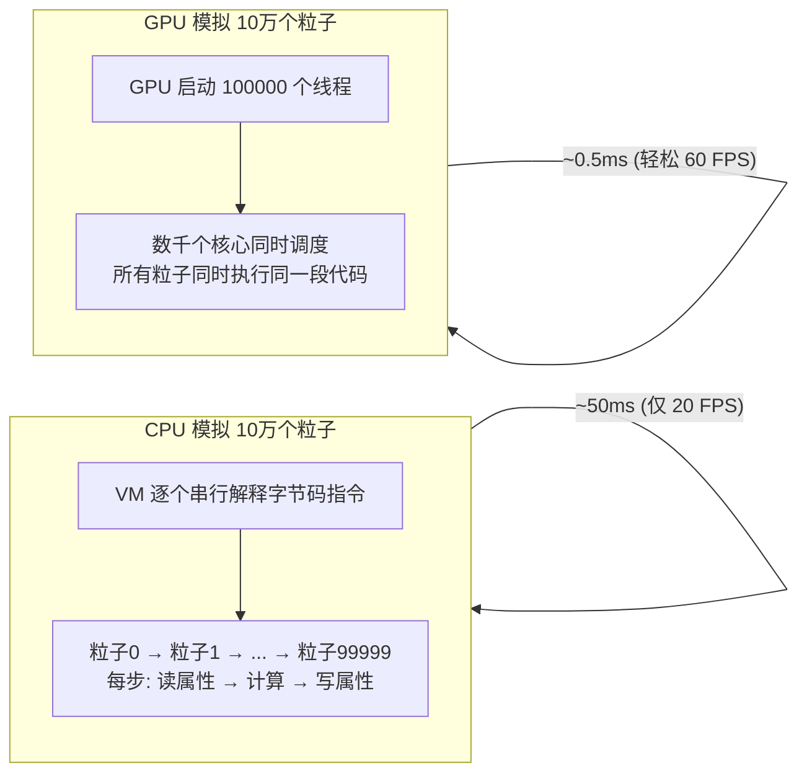

### CPU vs GPU 模拟路径对比

**图 2.1：CPU vs GPU 模拟路径**

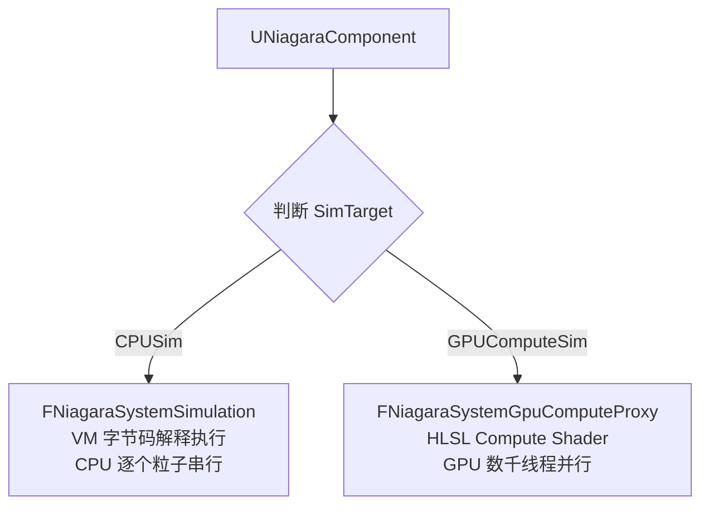

Niagara 同时支持两种路径。同一个 System 中可以混合 CPU 和 GPU 发射器——CPU 发射器走 `FNiagaraSystemSimulation` 批量执行字节码，GPU 发射器走 Compute Shader 在 GPU 上并行执行。

---

## 4. 什么是 Compute Shader

### 4.1 概念

GPU 上运行的程序主要有两种类型：

**图 3.1：GPU 程序分类**

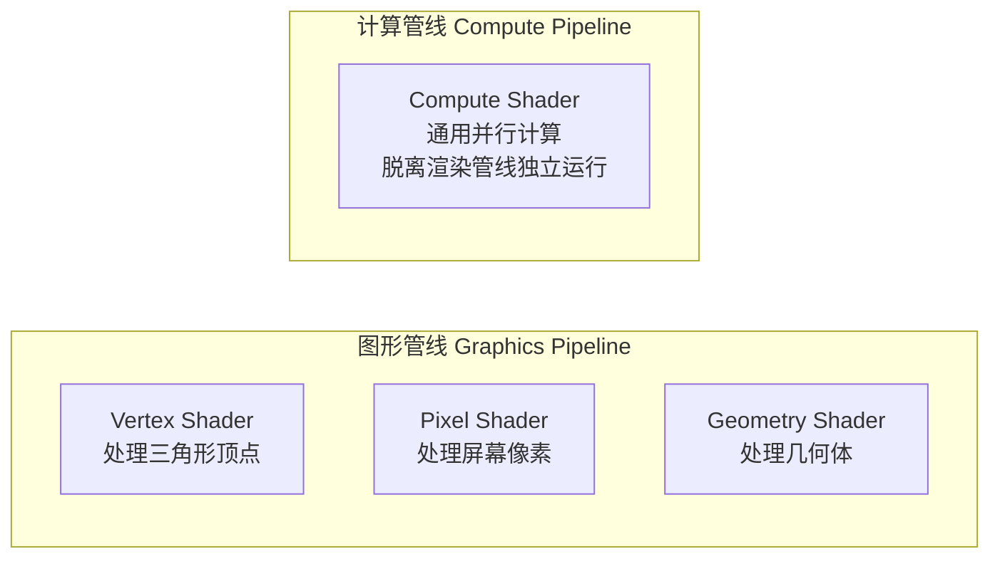

**Compute Shader 是脱离传统渲染管线独立运行的 GPU 程序**。它不需要三角形、不需要顶点、不需要光栅化。你直接告诉 GPU "启动 N 个线程，每个线程执行这段代码"。

### 4.2 线程模型

Compute Shader 的线程结构分为三层：

**图 3.2：Compute Shader 线程层级**

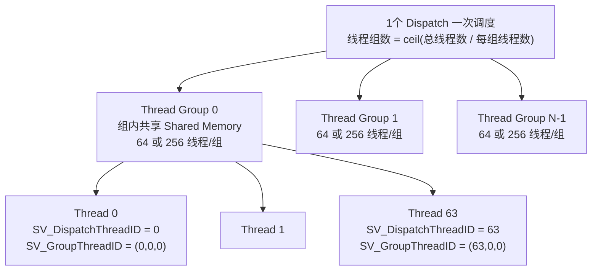

**关键理解**：同一个 Thread Group 内的线程可以通过 Shared Memory 高效通信。不同 Thread Group 之间互相独立，无法在 Dispatch 期间同步。

### 4.3 Dispatch 是什么

"Dispatch" 就是告诉 GPU "请启动 X 个线程组，每组有 Y 个线程，让它们都执行这个 Compute Shader"。

```cpp
// 概念上等价于：
RHICmdList.DispatchComputeShader(
    ThreadGroupCountX,   // 如 47 组
    ThreadGroupCountY,   // 如 1  (1D dispatch)
    ThreadGroupCountZ    // 如 1
);
// 总计: 47 × 1 × 1 × 64线程/组 = 3008 个线程同时执行
```

---

## 5. Niagara 节点图如何变成 Compute Shader

### 5.1 编译流程

Niagara 编辑器中的可视化节点图，在底层经历了两次编译：

**图 4.1：节点图到 GPU 原生指令的编译流程**

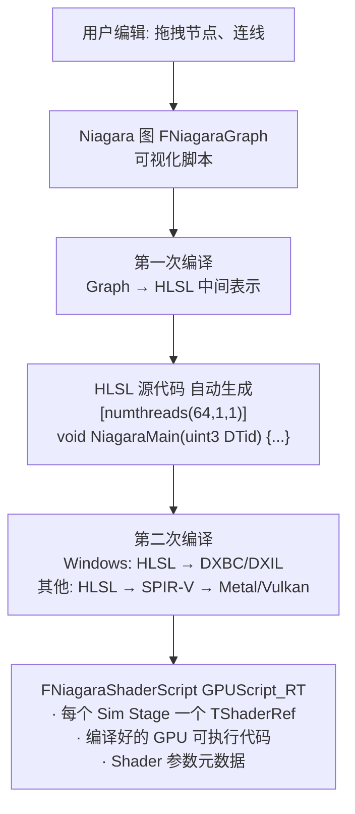

### 5.2 FNiagaraShaderScript 的结构

`FNiagaraShaderScript` 是 Niagara 将**节点图编译为 GPU 可执行代码**的最终产物。它是一个**容器**，里面装着每个 Simulation Stage 对应的一个编译好的 Compute Shader。

**源码定义**（`NiagaraShared.h · FNiagaraShaderScript（类定义）`）：

```cpp
class FNiagaraShaderScript
{
    // ===== 两个 ShaderMap 指针 (双份, 对应 GT 和 RT 的访问) =====
    FNiagaraShaderMap* GameThreadShaderMap;        // GT 可读 (编译/检查用)
    FNiagaraShaderMap* RenderingThreadShaderMap;   // RT 可读 (Dispatch 时用)

    // ===== Permutation 数量 = 编译的 Shader 个数 = Sim Stage 数量 =====
    int32 NumPermutations;

    // ===== Shader 参数的元数据 =====
    TSharedPtr<FNiagaraShaderScriptParametersMetadata> ScriptParametersMetadata;
    TSharedPtr<FNiagaraShaderScriptParametersMetadata> ScriptParametersMetadata_RT;

    // ===== 编译输出 =====
    FString HlslOutput;     // 自动生成的 HLSL 源代码

    // ===== 核心方法 =====
    FNiagaraShaderRef GetShader(int32 PermutationId) const;         // RT 调用
    FNiagaraShaderRef GetShaderGameThread(int32 PermutationId) const; // GT 调用
};
```

#### 5.2.1 "每个 Sim Stage 一个 TShaderRef" 的含义

一个 GPU Emitter 有几个 Sim Stage，`FNiagaraShaderScript` 就包含几个编译好的 Shader。`NumPermutations` 直接取自 VM 脚本的 Sim Stage 数量：

```cpp
// NiagaraShared.cpp · FNiagaraShaderScript — NumPermutations 设置 — NumPermutations 的设置
TConstArrayView<FSimulationStageMetaData> SimulationStages =
    BaseVMScript->GetSimulationStageMetaData();
NumPermutations = SimulationStages.Num();  // 有多少个 Stage, 就编译多少个 Shader
```

以火焰粒子 Emitter（4 个 Sim Stage）为例：

本图说明：`FNiagaraShaderScript` 内部按 Sim Stage 索引存储编译好的 Shader。

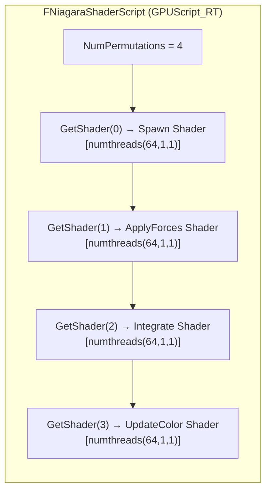

在 `DispatchStage()` 中按 Stage 索引取出（`NiagaraGpuComputeDispatch.cpp · DispatchStage() — GetShader()`）：

```cpp
const TShaderRef<FNiagaraShader> ComputeShader =
    InstanceData.Context->GPUScript_RT->GetShader(SimStageData.StageIndex);
    //                                               ^^^^^^^^^^^^^^^^^^^^^^^^
    //                           Stage 0 → Spawn Shader / Stage 1 → Update Shader / ...
```

#### 5.2.2 `TShaderRef<FNiagaraShader>` 是什么

`TShaderRef<FNiagaraShader>` 是一个**带引用计数的 Shader 指针包装**。它指向 `FNiagaraShaderMap` 内部存储的编译好的 Shader 对象：

本图说明：`TShaderRef` → `FNiagaraShader` 的包含关系。

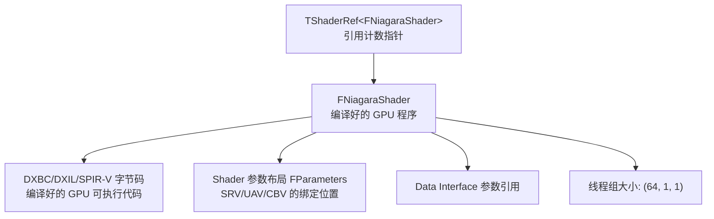

`FNiagaraShaderMap` 是 `TShaderMap` 的派生类（`NiagaraShared.h · FNiagaraShaderMap（类定义）`），内部存储了所有 Permutation 的 Shader。`GetShader(i)` 从 `FShaderMapContent` 中按索引查找对应的 `FNiagaraShader` 实例。

#### 5.2.3 "Shader 参数元数据" 的作用

`FNiagaraShaderScriptParametersMetadata` 描述的是**参数到寄存器的映射关系**，告诉 CPU 端每个参数绑定到哪个 slot：

| 参数类型 | 绑定位置 | 元数据记录什么 |
|---|---|---|
| SRV (只读 Buffer) | `t0`, `t1`, ... | 哪个寄存器、Buffer 的字节步长 |
| UAV (可读写 Buffer) | `u0`, `u1`, ... | 哪个寄存器、允许的访问模式 |
| CBV (常量缓冲区) | `b0`, `b1`, ... | 哪个寄存器、结构体成员偏移 |
| Sampler | `s0`, `s1`, ... | 采样器类型 |

在 `DispatchStage()` 中，CPU 按元数据描述的布局填入参数：

```cpp
// CPU 端: 按元数据描述的布局填入参数
FParameters* DispatchParams = ...;
DispatchParams->InputFloat      = SourceBuffer.SRV;   // 元数据说 SRV 在 t0
DispatchParams->RWOutputFloat   = DestBuffer.UAV;     // 元数据说 UAV 在 u0
DispatchParams->GlobalParameters.DeltaTime = 0.016f;  // 元数据说 CBV 在 b0

// RHI 按元数据把值写入 GPU 寄存器
SetShaderParameters(RHICmdList, ComputeShader, *DispatchParams);
RHICmdList.DispatchComputeShader(47, 1, 1);
```

#### 5.2.4 `GPUScript_RT` 的命名含义

它是 `FNiagaraComputeExecutionContext` 的成员（`NiagaraComputeExecutionContext.h · GPUScript_RT（成员）`）：

```cpp
class FNiagaraShaderScript* GPUScript_RT;
```

- **GPU Script** — 这是 GPU 版本的"脚本"（对应 CPU 端的 VM 字节码脚本）
- **`_RT`** 后缀 — 表示此指针**只在渲染线程访问**（UE 的命名惯例，类似 `DataBuffers_RT`、`CurrentNumInstances_RT`）

每个 GPU Emitter 的 `FNiagaraComputeExecutionContext` 持有一个 `GPUScript_RT`，指向该 Emitter 专属的 `FNiagaraShaderScript`。

#### 5.2.5 完整编译流程

本图说明：从 Niagara 节点图到 GPU Dispatch 的三阶段编译与运行流程。

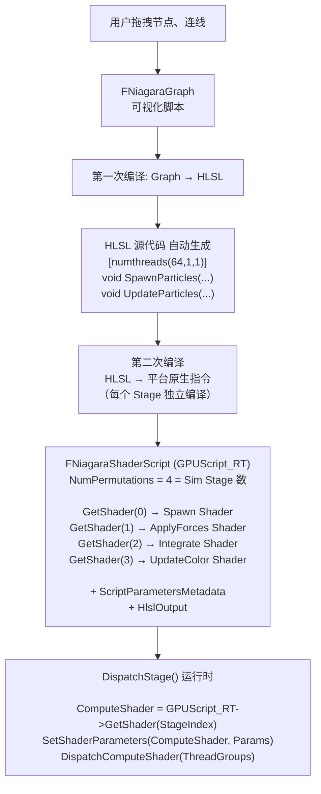

#### 5.2.6 与 CPU 模拟路径的对比

| | CPU 模拟路径 | GPU 模拟路径 |
|---|---|---|
| **编译产物** | VM 字节码 → `FNiagaraScript` | HLSL → Shader → `FNiagaraShaderScript` |
| **执行方式** | `FNiagaraScriptExecutionContext` 逐条解释字节码 | `DispatchComputeShader()` GPU 数千线程并行 |
| **"脚本"对象** | `FNiagaraScript` (持有字节码) | `FNiagaraShaderScript` (持有编译好的 Shader) |
| **参数绑定** | VM 寄存器直接读写 | SRV/UAV/CBV → GPU 寄存器绑定 |

---

## 6. 核心概念：Simulation Stage

### 6.1 什么是 Sim Stage

一个 Niagara GPU 发射器被拆分为若干 **Simulation Stage**（模拟阶段）。每个 Stage 对应至少一次 Compute Shader Dispatch。

**图 5.1：火焰粒子 Emitter 的 Sim Stage 示例**

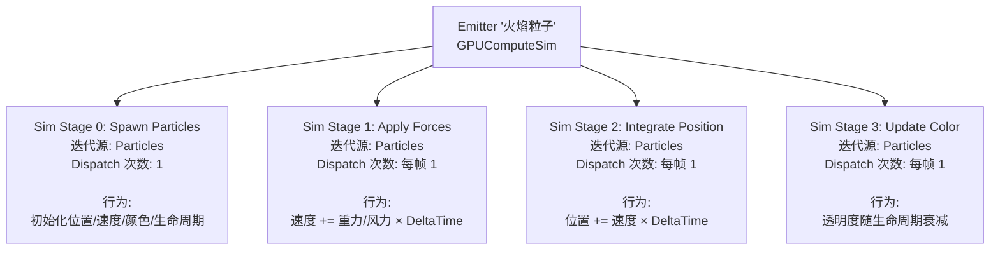

### 6.2 三种迭代源类型

`DispatchStage()` 根据 `IterationSourceType` 决定如何计算线程数：

| 迭代源类型 | 含义 | 线程数如何确定 |
|---|---|---|
| `Particles` | 一个粒子对应一个 GPU 线程 | 线程数 = 当前粒子总数 |
| `DataInterface` | 由数据接口控制（如 Grid 3D Texture） | 由数据接口提供元素数量和维度 |
| `DirectSet` | 固定数量，用户手动指定 | 用户在编辑器中指定具体数值 |

```cpp
// NiagaraGpuComputeDispatch.cpp · DispatchStage() — 计算 Dispatch 数量 (简化)
switch (SimStageData.StageMetaData->IterationSourceType)
{
    case Particles:
        // 3000 个粒子 → 3000 个线程 → ceil(3000/64) = 47 个线程组
        DispatchCount = (3000, 1, 1);
        DispatchNumThreads = (64, 1, 1);  // Niagara 默认每组 64 个线程
        break;

    case DataInterface:
        // 例如 Skeletal Mesh 数据接口: 线程数 = 骨骼数量
        DispatchCount = DispatchArgs.ElementCount;
        DispatchNumThreads = StageMetaData->GpuDispatchNumThreads;
        break;

    case DirectSet:
        // 用户在编辑器中直接写了 "1024"
        DispatchCount = (1024, 1, 1);
        DispatchNumThreads = (64, 1, 1);
        break;
}
```

### 6.3 Stage 之间的数据流动

Stage 按顺序执行。当前 Stage 的输出 Buffer 是下一个 Stage 的输入 Buffer：

**图 5.2：Stage 间数据流动**

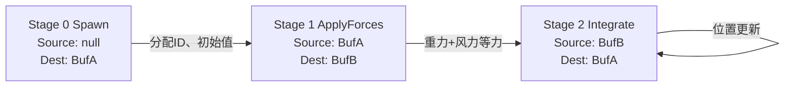

> **注意**：本章讲的 "Stage" 是 **SimStage**（模拟阶段），指一个 Emitter 内部 Spawn → Update → Integrate 的计算步骤划分。第 7 章会出现另一个 "Stage"——**TickStage**（渲染管线阶段），指引擎在 PreInitViews / PostInitViews / PostOpaqueRender 等不同时刻回调 Niagara。两个 "Stage" 是完全不同的概念，后续会明确区分。

---


## 7. GPU 管线的五个角色（概述）

在深入源码之前，先认识 Niagara GPU 粒子模拟涉及的五个主要角色，以及它们在整体架构中的位置。本章只做**概述**——每个角色长什么样、放在哪里、职责是什么。详细的运行时流程见第 8 章，Proxy 的深度剖析见第 9 章。

**图 6.0：五个角色在架构中的位置**

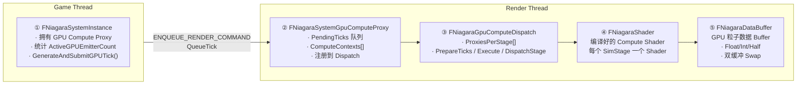

五个角色按数据流向串联：**SystemInstance**（GT）打包每帧数据 → **Proxy**（RT 锚点）接收并缓存 → **Dispatch**（RT 调度器）统一调度 → **Shader**（编译好的 GPU 代码）执行 → **DataBuffer**（GPU Buffer）存储粒子属性。


### 角色 ①：FNiagaraSystemInstance — 游戏线程发起者

**职责**：统计 GPU 发射器、打包每帧 Tick 数据、提交到渲染线程。

**文件位置**：`NiagaraSystemInstance.h` / `.cpp`

**关键成员**（GPU 相关）：

```cpp
// NiagaraSystemInstance.h · SystemGpuComputeProxy（成员）
TUniquePtr<FNiagaraSystemGpuComputeProxy> SystemGpuComputeProxy;  // Proxy 所有权

// NiagaraSystemInstance.h · GPU 统计瞬态成员 — 每帧重新计算的瞬态统计
uint32 TotalGPUParamSize = 0;      // GPU 参数缓冲区总大小
uint32 ActiveGPUEmitterCount = 0;  // 活跃 GPU 发射器数量

// NiagaraSystemInstance.h · NeedsGPUTick()
bool NeedsGPUTick() const { return ActiveGPUEmitterCount > 0 && !IsComplete(); }
```

**核心方法**：

| 方法 | 位置 | 作用 |
|---|---|---|
| `Tick_Concurrent()` | `NiagaraSystemInstance.cpp` | 遍历发射器，统计 `ActiveGPUEmitterCount` 和 `TotalGPUParamSize` |
| `GenerateAndSubmitGPUTick()` | `NiagaraSystemInstance.cpp` | 创建 `FNiagaraGPUSystemTick`，通过 `ENQUEUE_RENDER_COMMAND` 推送到 RT |
| `InitGPUTick()` | `NiagaraSystemInstance.cpp` | 用 `TotalGPUParamSize` 分配堆内存，填入 Global/System/Owner/Emitter 参数 |

**一句话总结**：此角色的核心工作是"每帧告诉 GPU 要做什么"——统计有多少个 GPU 发射器、它们需要多少参数内存、然后把所有数据打包成一个 `FNiagaraGPUSystemTick` 对象发往渲染线程。详细流程见第 8 章。

**为什么叫"发起者"？**

这个称呼不是指"它启动了 GameThread 本身"，而是指在 GPU 粒子模拟的整个 GT→RT→GPU 流水线中，`FNiagaraSystemInstance` 是 **GameThread 侧唯一主动触发 GPU Tick 的角色**。其他四个角色（Proxy、Dispatch、Shader、DataBuffer）都在 RenderThread 上被动等待，只有 SystemInstance 在 GT 上**主动决定**"这帧有 GPU 工作要做"并**主动推送**数据。

**发起 GPU Tick 的精确代码路径**：

从引擎主循环到跨线程数据移交，完整的调用链只涉及两个函数：

本图说明：GT 侧 GPU Tick 发起的完整调用链。

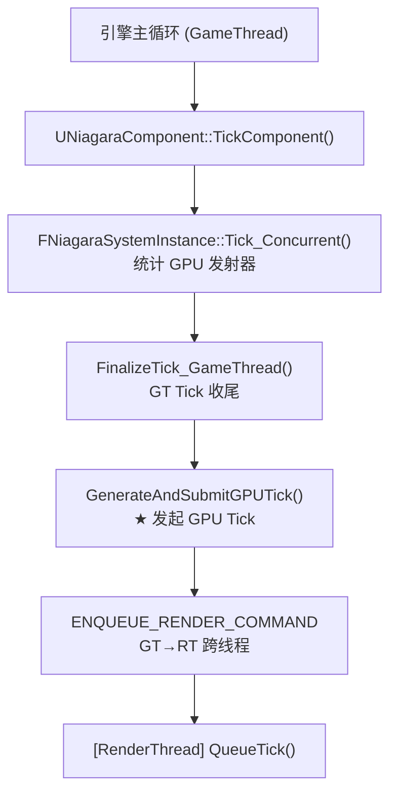

**触发条件**（`NiagaraSystemInstance.cpp · FinalizeTick_GameThread()`）：

```cpp
ENiagaraGPUTickHandlingMode Mode = Sim->GetGPUTickHandlingMode();
if (Mode == ENiagaraGPUTickHandlingMode::GameThread ||
    (Mode == ENiagaraGPUTickHandlingMode::GameThreadBatched && bEnqueueGPUTickIfNeeded))
{
    GenerateAndSubmitGPUTick();  // ★ 行 2727 — 整个 GPU 管线的 GT 侧起点
}
```

这里有两个 Tick 模式：

- `GameThread` — SystemInstance 自行在每个 `FinalizeTick_GameThread()` 中独立发起 GPU Tick
- `GameThreadBatched` — 由 `FNiagaraSystemSimulation` 批量管理的 SystemInstance 统一发起（减少 `ENQUEUE_RENDER_COMMAND` 的次数）

**`GenerateAndSubmitGPUTick()` 内部**（`NiagaraSystemInstance.cpp · GenerateAndSubmitGPUTick()`）：

```cpp
void FNiagaraSystemInstance::GenerateAndSubmitGPUTick()
{
    if (NeedsGPUTick())                    // 行 2747: 守卫检查
    {
        ensure(!IsComplete());
        FNiagaraGPUSystemTick GPUTick;     // 栈上创建
        InitGPUTick(GPUTick);             // 行 2751: 打包所有参数（内部 calloc/malloc）

        // ★ 行 2757-2761: GT→RT 的数据移交点
        ENQUEUE_RENDER_COMMAND(FNiagaraGiveSystemInstanceTickToRT)(
            [RT_Proxy = SystemGpuComputeProxy.Get(), GPUTick]
            (FRHICommandListImmediate& RHICmdList) mutable
            {
                RT_Proxy->QueueTick(GPUTick);  // 行 2760 — RT 侧接收
            }
        );
    }
}
```

**`NeedsGPUTick()` 守卫**（`NiagaraSystemInstance.h · NeedsGPUTick()`）：

```cpp
FORCEINLINE bool NeedsGPUTick() const
{
    return ActiveGPUEmitterCount > 0   // 有活跃的 GPU 发射器
        && !IsComplete();              // System 还没结束
}
```

**为什么是"发起者"而非"中转站"？**

对比 Pipeline 中其他角色的被动性：

| 角色 | 谁调用它 | 主动性 |
|---|---|---|
| **① SystemInstance** | `UNiagaraComponent::TickComponent()` | **主动**：自己统计、自己打包、自己 `ENQUEUE` |
| ② Proxy | SystemInstance 通过 `ENQUEUE` 间接调用 `QueueTick()` | 被动：等着 GT 推送 Tick 到 RT |
| ③ Dispatch | 引擎渲染管线回调（`PreInitViews` / `PostInitViews` / `PostRenderOpaque`） | 被动：引擎什么时候回调，它什么时候干活 |
| ④ Shader | Dispatch 的 `DispatchStage()` 中 `GetShader()` | 被动：只是一个被绑定的 GPU 程序 |
| ⑤ DataBuffer | Dispatch 的 `DispatchStage()` 中 `SetShaderParameters()` | 被动：只是一个被读写的 GPU Buffer |

SystemInstance 是唯一**主动决定"要不要做"**（`NeedsGPUTick()`）并**主动"去做"**（`GenerateAndSubmitGPUTick()`）的角色。整个 GPU 管线的每一帧，都从 `NiagaraSystemInstance.cpp · FinalizeTick_GameThread() — GenerateAndSubmitGPUTick()` 这一行 `GenerateAndSubmitGPUTick()` 开始。


### 角色 ②：FNiagaraSystemGpuComputeProxy — 渲染线程锚点

**职责**：作为 SystemInstance 在 RT 的"镜像"，接收 Tick、缓存到队列、注册到 Dispatcher、管理 GPU 资源生命周期。

**文件位置**：`NiagaraSystemGpuComputeProxy.h` / `.cpp`

**关键成员**：

```cpp
// NiagaraSystemGpuComputeProxy.h · FNiagaraSystemGpuComputeProxy（类定义）
class FNiagaraSystemGpuComputeProxy
{
    FNiagaraSystemInstanceID         SystemInstanceID;    // 唯一标识
    ENiagaraGpuComputeTickStage::Type ComputeTickStage;   // 在哪个渲染阶段执行
    int32                             ComputeDispatchIndex; // 在 ProxiesPerStage[] 中的下标

    uint32 bRequiresGlobalDistanceField : 1;  // 渲染特性需求标记
    uint32 bRequiresDepthBuffer : 1;
    uint32 bRequiresEarlyViewData : 1;
    uint32 bRequiresViewUniformBuffer : 1;
    uint32 bRequiresRayTracingScene : 1;

    FShaderResourceViewRHIRef                 StaticFloatBuffer;   // System 级静态常量
    TArray<FNiagaraComputeExecutionContext*>  ComputeContexts;     // 每个 GPU 发射器一个
    TArray<FNiagaraGPUSystemTick>             PendingTicks;        // GT→RT 的 Tick 队列
};
```

**核心方法**：

| 方法 | 调用线程 | 作用 |
|---|---|---|
| `AddToRenderThread()` | GT | 注册到 Dispatcher 的 `ProxiesPerStage[]`，分配 `DataBuffers_RT[0/1]` |
| `QueueTick()` | RT | Tick 入队到 `PendingTicks`，消费 Data Interface 实例数据 |
| `ReleaseTicks()` | RT | 释放已完成的 Tick，清除 GPU Instance Count |
| `RemoveFromRenderThread()` | GT→RT | 注销、释放 GPU Buffer、`delete this` 自销毁 |

**一句话总结**：Proxy 是 GT→RT 通信的唯一合法通道。GT 创建它，RT 使用它，最后 RT 销毁它。详细剖析见第 9 章。


### 角色 ③：FNiagaraGpuComputeDispatch — Compute Shader 调度中枢

**职责**：按渲染阶段分组管理所有 Proxy，在每个阶段回调中批量执行 `PrepareTicks → ExecuteTicks → DispatchStage`。

**文件位置**：`NiagaraGpuComputeDispatch.h` / `.cpp`（`Private` 目录，不对外暴露）；公开接口 `NiagaraGpuComputeDispatchInterface.h`

**关键成员**：

```cpp
// NiagaraGpuComputeDispatch.h · ProxiesPerStage[] + DispatchListPerStage[]
TArray<FNiagaraSystemGpuComputeProxy*>
    ProxiesPerStage[ENiagaraGpuComputeTickStage::Max];  // 按 Stage 分组的 Proxy 列表

FNiagaraGpuDispatchList
    DispatchListPerStage[ENiagaraGpuComputeTickStage::Max]; // 每个 Stage 的 Dispatch 列表
```

**核心方法**：

| 方法 | 作用 |
|---|---|
| `AddGpuComputeProxy()` | 将 Proxy 插入对应 TickStage 的 `ProxiesPerStage[]` |
| `PrepareTicksForProxy()` | 消费 Proxy 的 `PendingTicks`，计算粒子数，构建 `DispatchGroup` |
| `ExecuteTicks()` | 在 RDG 中遍历 DispatchGroup，对每个 SimStage 调用 `DispatchStage()` |

**渲染管线回调时机**：

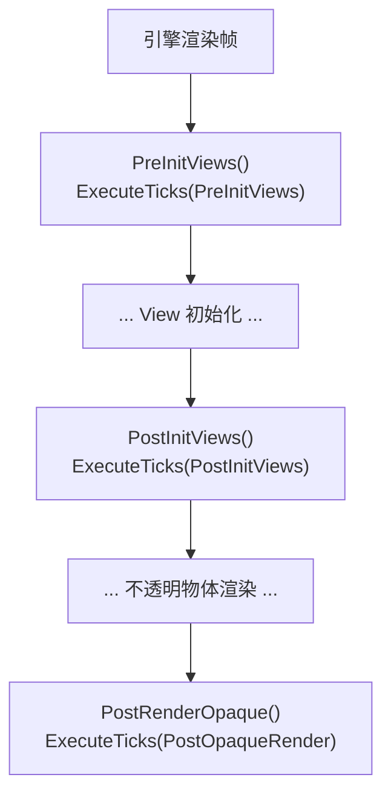

**为什么叫"渲染管线回调"？**

因为这三个函数**不是 Niagara 自己调用的——是引擎渲染器在固定时机调用的**。

`FNiagaraGpuComputeDispatchInterface` 继承自 `FFXSystemInterface`（`NiagaraGpuComputeDispatchInterface.h · 类继承 FFXSystemInterface`）：

```cpp
class FNiagaraGpuComputeDispatchInterface : public FFXSystemInterface
```

引擎渲染器（`FDeferredShadingSceneRenderer` / `FMobileSceneRenderer`）持有一个 `FXSystem` 指针（类型 `FFXSystemInterface*`），在渲染帧的固定位置依次调用三个方法：

```cpp
// SceneVisibility.cpp · PreInitViews() 回调点 — 可见性检查之前
FXSystem->PreInitViews(GraphBuilder, bAllowGPUParticleUpdate, AllFamilies, &ViewFamily);

// SceneVisibility.cpp · PostInitViews() 回调点 — View 初始化完成之后
FXSystem->PostInitViews(GraphBuilder, GetSceneViews(), !bAllowHitProxies);

// DeferredShadingRenderer.cpp · PostRenderOpaque() 回调点 — 不透明物体渲染之后
FXSystem->PostRenderOpaque(GraphBuilder, Views, SceneUniformBuffer, bAllowGPUParticleUpdate);
```

这三个调用分布在完全不同的文件里（`SceneVisibility.cpp` + `DeferredShadingRenderer.cpp`），由**不同的人**（引擎渲染团队）在**不同的年代**编写，Niagara 完全没有控制权。Niagara 只是实现了 `FFXSystemInterface` 要求的三个虚函数：

```
引擎渲染器 (调用者)                Niagara (被调用者)
─────────────────────────          ─────────────────────────
FXSystem->PreInitViews()     →     FNiagaraGpuComputeDispatch::PreInitViews()
FXSystem->PostInitViews()    →     FNiagaraGpuComputeDispatch::PostInitViews()
FXSystem->PostRenderOpaque() →     FNiagaraGpuComputeDispatch::PostRenderOpaque()
```

这就是"回调"的含义——**控制权在调用者手里，被调用者被动响应**。Niagara 从不说"我现在要执行 GPU 粒子了"，而是引擎说"到你了"，Niagara 才干活。这是好莱坞原则（"Don't call us, we'll call you"）在引擎架构中的体现。

**对比**：`FNiagaraSystemInstance::GenerateAndSubmitGPUTick()` **不是**回调——它是 GT 上主动发起的，SystemInstance 自己决定"这帧需要 GPU Tick"然后主动 `ENQUEUE`。

Proxy 在构造时根据 RenderFeature 需求被分入对应的 TickStage。需要 Global Distance Field / Depth / RayTracing 的归入 `PostOpaqueRender`；需要 EarlyViewData 的归入 `PostInitViews`；都不需要的归入 `PreInitViews`（最早执行）。

**渲染线程怎么知道使用哪个 Proxy？**

答案：**渲染线程不做选择——它按 TickStage 批量处理该 Stage 下的所有 Proxy**。每个引擎渲染回调只处理自己 Stage 的 DispatchList。

关键点：这里的 "Stage" 是 **TickStage**（渲染管线阶段），不是 SimStage（模拟阶段）。一个 Proxy 覆盖一个 System 的**所有** GPU 发射器的**所有** SimStage。

每帧的完整执行流程：

本图说明：PrepareAllTicks 只调用一次（在 PreInitViews），ExecuteTicks 在每个回调各执行一次。

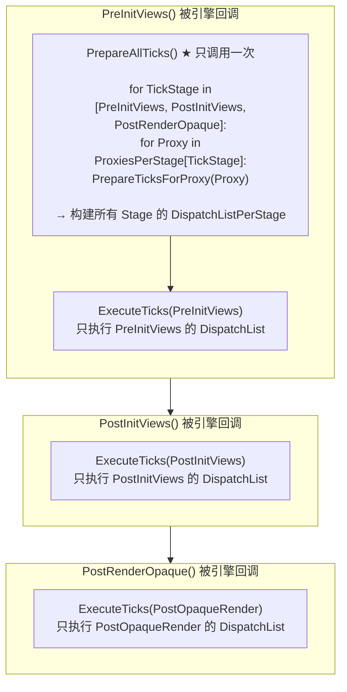

关键源码（`NiagaraGpuComputeDispatch.cpp · PreInitViews() — Prepare + Execute`）：

```cpp
// PreInitViews() 中 — Prepare 遍历所有 Stage, Execute 只执行当前 Stage
UpdateInstanceCountManager(GraphBuilder.RHICmdList);
PrepareAllTicks(GraphBuilder.RHICmdList);                              // 行 1931 ★
//   ↑ 内部: for 所有 TickStage { for ProxiesPerStage[TickStage] { ... } }
ExecuteTicks(GraphBuilder, Views, ENiagaraGpuComputeTickStage::PreInitViews); // 行 1940
//                                ^^^^^^^^^^^^^^^^^^^^^^^^^^^^^^^^^^^
//                                只执行 PreInitViews 的 DispatchList
```

```cpp
// PostInitViews() 中 — 只 Execute，不再 Prepare
ExecuteTicks(GraphBuilder, Views, ENiagaraGpuComputeTickStage::PostInitViews);  // 行 1982
```

所以渲染线程的逻辑是：

- **Prepare 一次**（在最早的回调 PreInitViews 中）：把所有 Proxy 的 PendingTicks 按 Stage 分好，构建好 DispatchList
- **Execute 三次**（每个回调各一次）：只执行自己 Stage 的 DispatchList

这解释了为什么 Proxy 在构造时就确定 `ComputeTickStage`——它决定了自己在哪个渲染回调中被 Execute，从而确保自己需要的渲染资源（DistanceField、DepthBuffer 等）在该时刻已经可用。

**一句话总结**：Dispatch 是 GPU 管线的"指挥中心"。按渲染阶段分组 → 批量 Prepare → 批量 Execute。详见第 8.2 节（Tick 流程中的 Phase 2+3）和第 10 章（`DispatchStage()` 逐行解读）。

**Dispatcher 与 Proxy 如何联系起来？**

`ProxiesPerStage[]` 是两者之间的**唯一连接点**。Proxy 被插入到这个数组中，Dispatch 遍历这个数组来处理每个 Proxy。两者的关系可以类比为：

```
Proxy                    = 病人（携带自己的病历 PendingTicks）
ProxiesPerStage[]        = 挂号分诊台（按科室/Stage 分组的候诊列表）
ComputeDispatchIndex     = 挂号单上的序号
Dispatch                 = 医生（按 Stage 轮询，逐个叫号处理）
```

**连接建立 — `AddGpuComputeProxy()`**（`NiagaraGpuComputeDispatch.cpp · AddGpuComputeProxy()`）：

```cpp
void FNiagaraGpuComputeDispatch::AddGpuComputeProxy(FNiagaraSystemGpuComputeProxy* ComputeProxy)
{
    // 1. Proxy 自报所属 TickStage
    const ENiagaraGpuComputeTickStage::Type TickStage = ComputeProxy->GetComputeTickStage();

    // 2. 双向绑定：Proxy 记住自己在数组中的位置
    ComputeProxy->ComputeDispatchIndex = ProxiesPerStage[TickStage].Num();

    // 3. Dispatch 将 Proxy 指针存入对应 Stage 的数组
    ProxiesPerStage[TickStage].Add(ComputeProxy);

    // 4. 更新全局 RenderFeature 计数（用于快速判断某个 Stage 是否有工作）
    NumProxiesThatRequireGlobalDistanceField += ComputeProxy->RequiresGlobalDistanceField() ? 1 : 0;
    NumProxiesThatRequireDepthBuffer         += ComputeProxy->RequiresDepthBuffer() ? 1 : 0;
    // ...
}
```

这一步建立了**双向索引**：

- Dispatch → Proxy：`ProxiesPerStage[TickStage][ComputeDispatchIndex]` = Proxy 指针
- Proxy → Dispatch：`ComputeDispatchIndex` = Proxy 在数组中的位置（用于 O(1) 删除）

**每帧处理 — `PrepareAllTicks()`**（`NiagaraGpuComputeDispatch.cpp · PrepareAllTicks()`）：

```cpp
void FNiagaraGpuComputeDispatch::PrepareAllTicks(FRHICommandListImmediate& RHICmdList)
{
    for (int iTickStage = 0; iTickStage < ENiagaraGpuComputeTickStage::Max; ++iTickStage)
    {
        // ★ 遍历该 Stage 下的所有 Proxy
        for (FNiagaraSystemGpuComputeProxy* ComputeProxy : ProxiesPerStage[iTickStage])
        {
            // 对每个 Proxy：读取其 PendingTicks 和 ComputeContexts
            // 构建该 Stage 的 DispatchGroup 列表
            PrepareTicksForProxy(RHICmdList, ComputeProxy, DispatchListPerStage[iTickStage]);
        }
    }
}
```

Dispatch 不关心每个 Proxy 具体属于哪个 SystemInstance——它只关心"在这个 Stage 下有多少个 Proxy 有工作要做"。`PrepareTicksForProxy()` 读取 Proxy 的 `PendingTicks` 和 `ComputeContexts` 来构建 `FNiagaraGpuDispatchGroup`：

```cpp
// NiagaraGpuComputeDispatch.cpp · PrepareTicksForProxy()
void FNiagaraGpuComputeDispatch::PrepareTicksForProxy(
    FRHICommandListImmediate& RHICmdList,
    FNiagaraSystemGpuComputeProxy* ComputeProxy,
    FNiagaraGpuDispatchList& GpuDispatchList)
{
    // 1. 重置每个 ComputeContext 的 RT 状态
    for (FNiagaraComputeExecutionContext* ComputeContext : ComputeProxy->ComputeContexts)
    {
        ComputeContext->CurrentMaxInstances_RT = 0;
        ComputeContext->BufferSwapsThisFrame_RT = 0;
    }

    // 2. 没有待处理 Tick 则跳过
    if (ComputeProxy->PendingTicks.Num() == 0) return;

    // 3. 遍历每个 PendingTick，处理 bResetData、计算粒子数、构建 DispatchGroup
    for (int32 iTickToProcess = 0; iTickToProcess < NumTicksToProcess; ++iTickToProcess)
    {
        FNiagaraGPUSystemTick& Tick = ComputeProxy->PendingTicks[iTickToProcess];
        // ... 处理 Tick 中的每个 InstanceData，构建 DispatchGroup ...
    }
}
```

**连接断开 — `RemoveGpuComputeProxy()`**（`NiagaraGpuComputeDispatch.cpp · RemoveGpuComputeProxy()`）：

```cpp
void FNiagaraGpuComputeDispatch::RemoveGpuComputeProxy(FNiagaraSystemGpuComputeProxy* ComputeProxy)
{
    const int32 TickStage = int32(ComputeProxy->GetComputeTickStage());
    const int32 ProxyIndex = ComputeProxy->ComputeDispatchIndex;  // ← O(1) 定位

    // RemoveAtSwap: 用最后一个元素替换被删除的位置，O(1) 删除
    ProxiesPerStage[TickStage].RemoveAtSwap(ProxyIndex);

    // 被 swap 过来的 Proxy 需要更新它的 ComputeDispatchIndex
    if (ProxiesPerStage[TickStage].IsValidIndex(ProxyIndex))
    {
        ProxiesPerStage[TickStage][ProxyIndex]->ComputeDispatchIndex = ProxyIndex;
    }
    ComputeProxy->ComputeDispatchIndex = INDEX_NONE;  // Proxy 标记为已注销

    // 更新全局计数
    NumProxiesThatRequireGlobalDistanceField -= ComputeProxy->RequiresGlobalDistanceField() ? 1 : 0;
    // ...
}
```

**Proxy 与 Dispatch 的分工**：

本图说明：Proxy 与 Dispatch 各司其职，通过 ProxiesPerStage 连接。

```mermaid
%%{init: {'flowchart': {'wrappingWidth': 400}}}%%
flowchart LR
    subgraph Proxy["FNiagaraSystemGpuComputeProxy"]
        direction TB
        P1["① 持有 PendingTicks<br/>(GT 推送的数据)"]
        P2["② 持有 ComputeContexts<br/>(GPU 发射器状态)"]
        P3["③ QueueTick()<br/>接收 GT 数据入队"]
        P4["④ ReleaseTicks()<br/>释放已完成的 Tick"]
        P5["⑤ 生命周期管理<br/>AddToRenderThread / RemoveFromRenderThread"]
        P1 --> P2 --> P3 --> P4 --> P5
    end
    subgraph Dispatch["FNiagaraGpuComputeDispatch"]
        direction TB
        D1["① 持有 ProxiesPerStage[]<br/>(所有 Proxy 的索引)"]
        D2["② PrepareAllTicks()<br/>遍历 ProxiesPerStage<br/>→ PrepareTicksForProxy"]
        D3["③ ExecuteTicks()<br/>消费 DispatchList<br/>→ DispatchStage()"]
        D4["④ AddGpuComputeProxy()<br/>RemoveGpuComputeProxy()<br/>维护 ProxiesPerStage"]
        D1 --> D2 --> D3 --> D4
    end
    Proxy <-->"ProxiesPerStage<br/>(唯一的连接点)"--> Dispatch
```

**完整的连接生命周期**：

本图说明：Proxy 与 Dispatch 从建立连接到断开连接的 5 步时序。

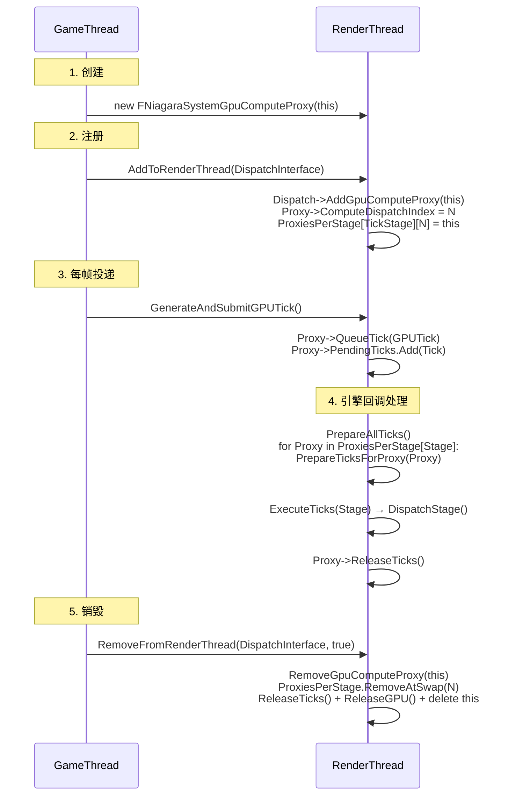

**一句话总结**：Dispatch 不拥有 Proxy，Proxy 也不调用 Dispatch。两者通过 `ProxiesPerStage[]` 这个**静态索引数组**解耦——Proxy 只负责"我被分到哪个 Stage"和"我有哪些 Tick"，Dispatch 只负责"这个 Stage 下有哪些 Proxy"和"遍历它们处理 Tick"。`ComputeDispatchIndex` 保证了 O(1) 的插入和删除。

**`Proxy::AddToRenderThread` vs `Dispatch::AddGpuComputeProxy` — 到底谁操作了 ProxiesPerStage？**

这两个函数名字相似，容易混淆。但只有**一个**真正操作了 `ProxiesPerStage[]`。

**`Proxy::AddToRenderThread()`**（`NiagaraSystemGpuComputeProxy.cpp · AddToRenderThread()`）——外层"总管家"：

```cpp
void FNiagaraSystemGpuComputeProxy::AddToRenderThread(
    FNiagaraGpuComputeDispatchInterface* ComputeDispatchInterface)
{
    check(IsInGameThread());  // GT 调用

    ENQUEUE_RENDER_COMMAND(AddProxyToComputeDispatchInterface)(
        [this, ComputeDispatchInterface](FRHICommandListImmediate& RHICmdList)
        {
            // ① 委托 Dispatch 注册到 ProxiesPerStage
            ComputeDispatchInterface->AddGpuComputeProxy(this);

            // ② 初始化每个 GPU 发射器的 RT 状态
            for (FNiagaraComputeExecutionContext* ComputeContext : ComputeContexts)
            {
                ComputeContext->bHasTickedThisFrame_RT = false;
                ComputeContext->CurrentNumInstances_RT = 0;
                ComputeContext->CurrentMaxInstances_RT = 0;

                // ③ 分配双缓冲 DataBuffer
                for (int i = 0; i < 2; ++i)
                {
                    ComputeContext->DataBuffers_RT[i] =
                        new FNiagaraDataBuffer(ComputeContext->MainDataSet);
                }
            }
        }
    );
}
```

**`Dispatch::AddGpuComputeProxy()`**（`NiagaraGpuComputeDispatch.cpp · AddGpuComputeProxy()`）——内层"注册专员"：

```cpp
void FNiagaraGpuComputeDispatch::AddGpuComputeProxy(
    FNiagaraSystemGpuComputeProxy* ComputeProxy)
{
    const ENiagaraGpuComputeTickStage::Type TickStage = ComputeProxy->GetComputeTickStage();
    ComputeProxy->ComputeDispatchIndex = ProxiesPerStage[TickStage].Num();
    ProxiesPerStage[TickStage].Add(ComputeProxy);  // ★ 唯一操作 ProxiesPerStage 的地方

    // 更新全局 RenderFeature 计数
    NumProxiesThatRequireGlobalDistanceField += ComputeProxy->RequiresGlobalDistanceField() ? 1 : 0;
    NumProxiesThatRequireDepthBuffer         += ComputeProxy->RequiresDepthBuffer() ? 1 : 0;
    // ...
}
```

**两张表说清区别**：

| | `Proxy::AddToRenderThread` | `Dispatch::AddGpuComputeProxy` |
|---|---|---|
| **调用线程** | GT | RT（在 ENQUEUE lambda 内） |
| **操作 ProxiesPerStage？** | **不直接**——委托给 Dispatch | **是**——唯一操作 ProxiesPerStage 的代码 |
| **还做什么？** | 初始化 ComputeContext RT 状态、分配双缓冲 DataBuffer | 设置 ComputeDispatchIndex、更新 RenderFeature 计数 |
| **谁调用它？** | `SystemInstance::Reset()` 行 863 | `Proxy::AddToRenderThread()` 的 RT lambda 行 79 |

**调用层次一目了然**：

本图说明：AddToRenderThread 是"总管家"，内部委托 Dispatch 做注册。

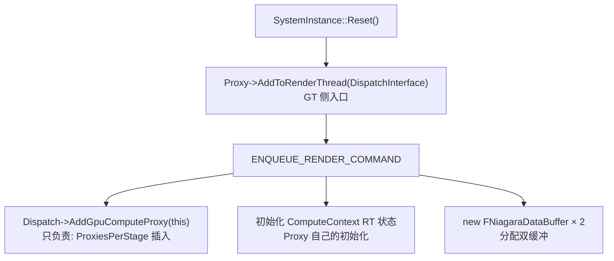

`Proxy::AddToRenderThread` 是"总管家"——初始化 Proxy 在 RT 上的一切，包括委托 Dispatch 做注册。`Dispatch::AddGpuComputeProxy` 只管一件事——把 Proxy 指针放进 `ProxiesPerStage[]` 的正确槽位。**只有后者操作 ProxiesPerStage**。


### 角色 ④：FNiagaraShader — 编译好的 GPU Compute Shader

**职责**：承载编译好的 GPU 可执行代码 + 参数布局定义。每个 Emitter 的每个 Sim Stage 对应一个独立的 `FNiagaraShader` 实例。

**文件位置**：`NiagaraShader.h`（`NiagaraShader` 模块）

**核心结构**——`FParameters`（`NiagaraShader.h · FParameters（参数结构体）`）：

```cpp
BEGIN_SHADER_PARAMETER_STRUCT(FParameters, )
    // 缓冲区控制
    SHADER_PARAMETER(uint32, ComponentBufferSizeRead)
    SHADER_PARAMETER(uint32, ComponentBufferSizeWrite)
    SHADER_PARAMETER(uint32, SimStart)              // 0=Update, 1=Reset

    // 输入 Buffer (SRV = 只读)
    SHADER_PARAMETER_SRV(Buffer<float>, InputFloat)
    SHADER_PARAMETER_SRV(Buffer<int>,   InputInt)

    // 输出 Buffer (UAV = 可读写)
    SHADER_PARAMETER_UAV(RWBuffer<float>, RWOutputFloat)
    SHADER_PARAMETER_UAV(RWBuffer<int>,   RWOutputInt)

    // 实例计数
    SHADER_PARAMETER_UAV(RWBuffer<uint>, RWInstanceCounts)

    // 内置参数结构体 (CBV = 常量缓冲区)
    SHADER_PARAMETER_STRUCT_INCLUDE(FGlobalParameters,  GlobalParameters)   // DeltaTime 等
    SHADER_PARAMETER_STRUCT_INCLUDE(FSystemParameters,  SystemParameters)   // SystemAge 等
    SHADER_PARAMETER_STRUCT_INCLUDE(FOwnerParameters,   OwnerParameters)    // Transform 等
    SHADER_PARAMETER_STRUCT_INCLUDE(FEmitterParameters, EmitterParameters)  // NumParticles 等
END_SHADER_PARAMETER_STRUCT()
```

**一句话总结**：`FNiagaraShader` 不仅是 GPU 代码——它还是 CPU 端和 GPU 端之间的"接口契约"。`FParameters` 定义了哪些数据绑定到哪些寄存器，每个 Stage 的 Shader 通过 `GPUScript_RT->GetShader(StageIndex)` 获取。编译流程详见第 5 章。


### 角色 ⑤：FNiagaraDataBuffer — GPU 粒子属性存储

**职责**：GPU 端粒子数据的实际载体。每个 `FNiagaraComputeExecutionContext` 持有两个（双缓冲），分别作为当前帧的"输入"和"输出"。

**文件位置**：`NiagaraDataSet.h · FNiagaraDataBuffer（类定义）`

**关键成员**：

```cpp
class FNiagaraDataBuffer
{
    // 三种精度的 GPU Buffer
    FRWBuffer GPUBufferFloat;  // float 属性: Position, Velocity, Color 等
    FRWBuffer GPUBufferInt;    // int32 属性: ParticleID, State 等
    FRWBuffer GPUBufferHalf;   // half(16位) 属性: 压缩存储的数据

    FRWBuffer GPUIDToIndexTable;  // 粒子 ID → 数组索引 映射表

    uint32 GPUInstanceCountBufferOffset; // 在全局 InstanceCountBuffer 中的偏移
    uint32 NumInstances;                // 当前活跃粒子数
    uint32 NumInstancesAllocated;       // 已分配的 Buffer 容量

    // 每粒子数据步长
    uint32 FloatStride;   // 每个粒子占用的 float 数量
    uint32 Int32Stride;   // 每个粒子占用的 int32 数量
    uint32 HalfStride;    // 每个粒子占用的 half 数量
};
```

**三种精度 Buffer 的设计理由**：

| Buffer | 精度 | 存储内容 | 为什么 |
|---|---|---|---|
| `GPUBufferFloat` | 32-bit | Position、Velocity、Color、Age | 核心模拟需要高精度 |
| `GPUBufferInt` | 32-bit | ParticleID、UniqueID、ExecutionState | 整数属性 |
| `GPUBufferHalf` | 16-bit | 可压缩的浮点属性 | 节省一半带宽和显存 |

**核心方法**：`AllocateGPU()` 分配、`SwapGPU()` 交换双缓冲、`ReleaseGPU()` 释放。

**一句话总结**：`FNiagaraDataBuffer` 是 GPU 粒子数据的"原子单位"。双缓冲通过 `SwapGPU()` 实现——上一帧的输出变成下一帧的输入，确保任何时刻不会有同一个 Buffer 同时被读和写。详见第 12 章。

**五个角色的协作关系**：

本图说明：GT→RT→GPU 的完整数据流，五个角色按箭头顺序协作。

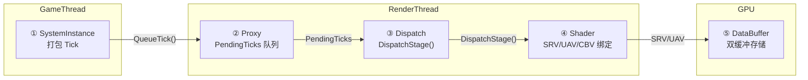

第 8 章将把这五个角色串起来，展示从创建到每帧 Dispatch 的完整运行时流程。

---

## 8. 完整运行时流程：创建 → Tick → 销毁

### 8.1 创建阶段

当 `UNiagaraComponent::Activate()` 触发 System 初始化时，GPU 管线也随之建立。

**图 7.1：GPU 管线创建流程**

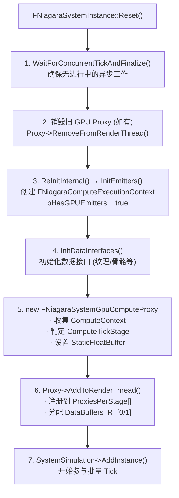

**关键源码**（`NiagaraSystemInstance.cpp · Reset() — 创建 Proxy`）：

```cpp
// Reset() 末尾 — 创建 Proxy 并立即推到 RT 注册
if (bHasGPUEmitters && !SystemGpuComputeProxy.IsValid())
{
    SystemGpuComputeProxy.Reset(new FNiagaraSystemGpuComputeProxy(this));
    SystemGpuComputeProxy->AddToRenderThread(GetComputeDispatchInterface());
}
```

`AddToRenderThread()` 内部通过 `ENQUEUE_RENDER_COMMAND` 执行三件事：
1. `Dispatch->AddGpuComputeProxy(this)` — 将 Proxy 插入 `ProxiesPerStage[TickStage]` 数组
2. 为每个 GPU 发射器初始化 RT 状态（`bHasTickedThisFrame_RT = false`、`CurrentNumInstances_RT = 0`）
3. 分配双缓冲 `DataBuffers_RT[0]` 和 `DataBuffers_RT[1]`（`NiagaraSystemGpuComputeProxy.cpp · AddToRenderThread()`）

> **注意**：在创建新 Proxy 之前，如果已有旧 Proxy（如 ReInit 场景），会先走销毁流程。但如果 System 未 Complete 且是 `ResetSystem` 模式，则不销毁——GPU 资源可以复用。


### 8.2 每帧 Tick 流程

这是 GPU 粒子模拟的"主循环"。每帧分为三个阶段，跨越两个线程。

**图 7.2：三阶段 Tick 流水线**

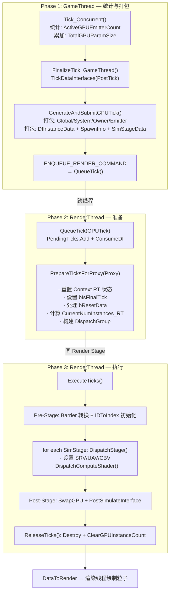


### 8.2.1 Phase 1 — GameThread：统计与打包

**Step 1.1 — `Tick_Concurrent()` 统计 GPU 发射器**（`NiagaraSystemInstance.cpp · Tick_Concurrent()`）：

```cpp
void FNiagaraSystemInstance::Tick_Concurrent()
{
    // 每帧重置统计值
    TotalGPUParamSize = 0;
    ActiveGPUEmitterCount = 0;

    for (const FNiagaraEmitterExecutionIndex& EmitterExecIdx : EmitterExecutionOrder)
    {
        FNiagaraEmitterInstance& Emitter = Emitters[EmitterExecIdx.EmitterIndex].Get();
        if (Emitter.GetSimTarget() == ENiagaraSimTarget::GPUComputeSim)
        {
            FNiagaraComputeExecutionContext* GPUContext = Emitter.GetGPUContext();
            if (GPUContext && 需要Tick)
            {
                TotalCombinedParamStoreSize += InterpFactor * GPUContext->GetConstantBufferSize();
                ActiveGPUEmitterCount++;
            }
        }
    }

    if (ActiveGPUEmitterCount)
    {
        // 计算公式见下文
        TotalGPUParamSize = InterpFactor * (...);
    }
}
```

`TotalGPUParamSize` 的计算公式：

```
TotalGPUParamSize = InterpFactor × (
    sizeof(FNiagaraGlobalParameters)    // DeltaTime, Time 等
  + sizeof(FNiagaraSystemParameters)    // SystemAge, TickCount 等
  + sizeof(FNiagaraOwnerParameters)     // Transform, LWCTile 等
  + ActiveGPUEmitterCount × sizeof(FNiagaraEmitterParameters)
  + Σ(GPUContext->GetConstantBufferSize())
)
```

`InterpFactor` 为 2 当且仅当有 GPU 发射器需要跨帧参数插值。

**Step 1.2 — `GenerateAndSubmitGPUTick()` 打包并提交**（`NiagaraSystemInstance.cpp · GenerateAndSubmitGPUTick()`）：

```cpp
void FNiagaraSystemInstance::GenerateAndSubmitGPUTick()
{
    if (NeedsGPUTick())
    {
        FNiagaraGPUSystemTick GPUTick;        // 栈上创建
        InitGPUTick(GPUTick);                 // 内部 calloc/malloc 分配堆内存，填入所有参数

        // ★ 关键：值拷贝捕获 GPUTick，所有权转移给 RT lambda
        ENQUEUE_RENDER_COMMAND(FNiagaraGiveSystemInstanceTickToRT)(
            [RT_Proxy = SystemGpuComputeProxy.Get(), GPUTick]
            (FRHICommandListImmediate& RHICmdList) mutable
            {
                RT_Proxy->QueueTick(GPUTick);  // RT 侧入队
            }
        );
    }
}
```

**Tick 与 Proxy 的协作方式**（类比快递）：

| | FNiagaraGPUSystemTick | FNiagaraSystemGpuComputeProxy |
|---|---|---|
| **类比** | 快递包裹（一帧一包裹） | 收件地址（整个生命周期不变） |
| **创建时机** | 每帧 `FinalizeTick_GameThread()` 中栈上创建 | `Reset()` 中 `new` 创建 |
| **销毁时机** | `ReleaseTicks()` → `Tick.Destroy()`（RT 释放） | `RemoveFromRenderThread()` → `delete this`（RT 自毁） |
| **持有数据** | 本帧的 Global/System/Owner/Emitter 参数、DI 数据 | ComputeContext 指针、PendingTicks 队列、GPU Buffer 引用 |
| **线程归属** | GT 创建 → RT 消费 → RT 销毁 | GT 创建并拥有所有权，核心工作全在 RT |

Lambda capture 中 `GPUTick` 是**值拷贝**（无 `&`），这意味着 GT 栈上的 Tick 被拷贝到 lambda 闭包中，所有权完全转移给 RT。GT 函数返回后可以立即销毁栈上的原始对象，不会影响 RT 侧的数据。


### 8.2.2 Phase 2 — RenderThread：准备（Prepare）

当引擎渲染管线回调到对应 Stage 时，`FNiagaraGpuComputeDispatch::PrepareTicksForProxy()` 消费 Proxy 的 `PendingTicks` 队列：

1. 重置所有 ComputeContext 的 RT 状态（`CurrentMaxInstances_RT = 0`、`BufferSwapsThisFrame_RT = 0`）
2. 设置最后一个 PendingTick 的 `bIsFinalTick = true` 标记
3. 遍历每个 `FNiagaraGPUSystemTick`，处理 `bResetData`（清零粒子计数）、跳过无效 Context
4. 计算 `CurrentNumInstances_RT = PrevNum + SpawnRateInstances + EventSpawnTotal`
5. 构造 `FNiagaraGpuDispatchGroup`（含 `DispatchInstances` 和 `FreeIDUpdates`）

这个过程不涉及 GPU——纯粹是 CPU 端的数据整理和计数计算。


### 8.2.3 Phase 3 — RenderThread：执行（Execute + Dispatch）

`FNiagaraGpuComputeDispatch::ExecuteTicks()` 在 RDG（Render Dependency Graph）中执行真正的 Compute Shader：

1. **Pre-Stage**：调用数据接口的 `PreStageInterface()`，进行 GPU 资源 Barrier 转换（Buffer → UAV）
2. **核心循环**：遍历每个 `FNiagaraGpuDispatchInstance`，对每个 SimStage 调用 `DispatchStage()`
   - 设置 SRV（读取粒子数据）、UAV（写入粒子数据）、CBV（常量参数）
   - 调用 `DispatchComputeShader(ThreadGroupCountX, ThreadGroupCountY, ThreadGroupCountZ)`
3. **Post-Stage**：调用 `PostStageInterface()`、`PostSimulateInterface()`，执行 `SwapGPU`（交换双缓冲）
4. **清理**：`ReleaseTicks()` 释放 Tick 的堆内存、清除 GPU Instance Count

`DispatchStage()` 的逐行解读见第 10 章。


### 8.3 销毁阶段

当 System 完成或被释放时，GPU 管线随之拆除。

**图 7.3：GPU 管线销毁流程**

```mermaid
%%{init: {'flowchart': {'wrappingWidth': 400}}}%%
flowchart TD
    A["Complete() / DeallocateSystemInstance()"] --> B["Release Proxy UniquePtr"]
    B --> C["Proxy->RemoveFromRenderThread(true)<br/>ENQUEUE to RT"]
    C --> D["RT: RemoveGpuComputeProxy<br/>从 ProxiesPerStage[] 注销"]
    D --> E["RT: ReleaseTicks()<br/>释放所有待处理 Tick"]
    E --> F["RT: ReleaseGPU + Destroy<br/>DataBuffers_RT[0] & [1]"]
    F --> G["RT: delete this<br/>★ 在 RenderThread 上自销毁!"]
```

**关键源码**（`NiagaraSystemInstance.cpp · Complete() — 销毁 Proxy`）：

```cpp
// Complete() 中销毁 Proxy
if (SystemGpuComputeProxy)
{
    FNiagaraSystemGpuComputeProxy* Proxy = SystemGpuComputeProxy.Release();
    Proxy->RemoveFromRenderThread(GetComputeDispatchInterface(), true);
    // 此后 SystemGpuComputeProxy 为 nullptr，SystemInstance 不再持有 Proxy
}
```

**为什么 Proxy 在 GT 创建却在 RT 销毁？** GPU 资源（RHI Buffer、UAV、SRV）的释放必须在 RenderThread 上进行。`RemoveFromRenderThread(true)` 通过 `ENQUEUE_RENDER_COMMAND` 将释放和 `delete this` 推迟到 RT，此时所有 GPU 资源已安全释放、Proxy 已从 `ProxiesPerStage[]` 注销。

**SystemInstance 中所有触及 Proxy 的位置汇总**：

| 位置 | 函数 | 操作 |
|---|---|---|
| `NiagaraSystemInstance.cpp · Reset() — 创建 Proxy` | `Reset()` | 创建 Proxy + `AddToRenderThread()` |
| `NiagaraSystemInstance.cpp · Reset() — 销毁旧 Proxy` | `Reset()` | 销毁旧 Proxy（ReInit 场景） |
| `NiagaraSystemInstance.cpp · ReInitInternal() — ClearTicksFromRenderThread()` | `ReInitInternal()` | `ClearTicksFromRenderThread()` — 仅释放 Tick，不销毁 Proxy |
| `NiagaraSystemInstance.cpp · GenerateAndSubmitGPUTick() — ENQUEUE 点` | `GenerateAndSubmitGPUTick()` | 每帧 `ENQUEUE_RENDER_COMMAND → QueueTick()` |
| `NiagaraSystemInstance.cpp · Complete() — 销毁 Proxy` | `Complete()` | 销毁 Proxy |
| `NiagaraSystemInstance.cpp · DeallocateSystemInstance()` | `DeallocateSystemInstance()` | 批量释放路径中的销毁 |

第 7 章认识了五个角色，本章展示了它们如何协同工作。下一章将对其中最复杂也最精妙的角色——`FNiagaraSystemGpuComputeProxy`——做深度剖析。

---


## 9. FNiagaraSystemGpuComputeProxy — 渲染线程锚点

第 7 章角色② 概览了 Proxy 的身份和成员。Proxy 是五个角色中最复杂的一个，它的完整分析（类定义、5 个核心方法源码、`TUniquePtr` 所有权模型、生命周期状态机、线程安全约束、4 个关键设计决策）见独立文档：

> [`niagara_gpu_compute_proxy_and_dispatch_architecture.md`](./niagara_gpu_compute_proxy_and_dispatch_architecture.md) — `FNiagaraSystemGpuComputeProxy` 架构详解

本节仅保留必要的概述，确保阅读连贯。

### 9.1 成员与职责回顾

| 成员 | 用途 |
|---|---|
| `SystemInstanceID` | 唯一标识此 Proxy 属于哪个 SystemInstance |
| `ComputeTickStage` | 决定在 PreInitViews / PostInitViews / PostOpaqueRender 哪个回调中执行 |
| `ComputeDispatchIndex` | 在 `ProxiesPerStage[]` 中的下标（O(1) 定位） |
| `bRequires*` 标记位 | 5 个位域，决定 `ComputeTickStage` 的分配 |
| `StaticFloatBuffer` | System 级静态常量 SRV（构造时一次性推到 RT） |
| `ComputeContexts[]` | 每个 GPU 发射器一个，存储 RT 侧状态和双缓冲 |
| `PendingTicks[]` | GT→RT 的 Tick 队列，所有操作仅在 RT |

### 9.2 核心方法一览

| 方法 | 调用线程 | 作用 |
|---|---|---|
| `AddToRenderThread()` | GT | `ENQUEUE` 到 RT：注册到 `ProxiesPerStage[]` + 初始化 RT 状态 + 分配双缓冲 |
| `QueueTick()` | RT | Tick 入队到 `PendingTicks`，消费 Data Interface 实例数据 |
| `ReleaseTicks()` | RT | 释放已完成的 Tick，清除 GPU Instance Count |
| `RemoveFromRenderThread()` | GT→RT | 注销、释放 GPU Buffer、`delete this` 自销毁 |

### 9.3 所有权模型

`FNiagaraSystemInstance` 通过 `TUniquePtr` 独占所有权。`Release()` 交出裸指针后所有权完全转移给 RT lambda 中的 `delete this`。Proxy 持有的 `DebugOwnerInstance` 是**裸指针，仅 Debug 用途**——绝不在 RT 侧解引用。

### 9.4 线程安全

GT 侧方法（`AddToRenderThread`、`RemoveFromRenderThread`、`ClearTicksFromRenderThread`）是"命令发起者"，实际工作全在 RT 执行。`PendingTicks` 只在 RT 访问（无需锁），`ComputeContexts` 创建后不可变。

---

Proxy 是 Niagara GPU 管线中最精妙的设计——"GT 拥有、RT 执行、RT 自杀"。完整深度分析见 [`niagara_gpu_compute_proxy_and_dispatch_architecture.md`](./niagara_gpu_compute_proxy_and_dispatch_architecture.md)。
## 10. DispatchStage 源码逐行解读

这是整个 GPU 粒子模拟最核心的函数（`NiagaraGpuComputeDispatch.cpp · DispatchStage()`）。下面逐步骤解读它的工作：

### 10.1 准备源和目标缓冲区

```cpp
// NiagaraGpuComputeDispatch.cpp · DispatchStage() — 准备源/目标缓冲区

// 设置源缓冲区的粒子数量
if (SimStageData.Source != nullptr)
{
    SimStageData.Source->SetNumInstances(SimStageData.SourceNumInstances);
    SimStageData.Source->SetGPUInstanceCountBufferOffset(SimStageData.SourceCountOffset);
}

// 设置目标缓冲区的粒子数量
if (SimStageData.Destination != nullptr)
{
    SimStageData.Destination->SetNumInstances(SimStageData.DestinationNumInstances);
    SimStageData.Destination->SetGPUInstanceCountBufferOffset(SimStageData.DestinationCountOffset);

    // 第一个 Stage 需要知道要 Spawn 多少新粒子
    if (SimStageData.bFirstStage)
    {
        InstancesToSpawn = DestinationNumInstances - SourceNumInstances;
    }
    SimStageData.Destination->SetNumSpawnedInstances(InstancesToSpawn);
}
```

**为什么重要**：GPU 上的 Compute Shader 需要知道"总共有多少个粒子"以及"其中多少个是新 Spawn 的"。前者用于遍历索引，后者用于决定哪些粒子执行 Spawn 逻辑（初始化属性）。

### 10.2 计算 Dispatch 数量

```cpp
// NiagaraGpuComputeDispatch.cpp · DispatchStage() — 计算 Dispatch 数量

switch (SimStageData.StageMetaData->IterationSourceType)
{
    case Particles:
        // 3000个粒子 → ceil(3000÷64)=47组，每组64线程 → 总共3008线程
        DispatchCount = FIntVector(DestinationNumInstances, 1, 1);
        DispatchNumThreads = FNiagaraShader::GetDefaultThreadGroupSize(OneD);  // (64,1,1)
        break;

    case DataInterface:
        // 由数据接口提供 dispatch 参数
        if (bGpuIndirectDispatch)
        {
            // Indirect: GPU 自己从 buffer 读 dispatch 数量
            // 什么都不做，等后面用 DispatchIndirect
        }
        else
        {
            DispatchCount = DispatchArgs.ElementCount;  // CPU 端设置
        }
        break;

    case DirectSet:
        DispatchCount = SimStageData.DispatchArgs.ElementCount;  // 用户指定
        // 如果是 NumGroups 模式，需要乘以每组的线程数
        if (GpuDirectDispatchElementType == NumGroups)
            DispatchCount *= DispatchNumThreads;
        break;
}
```

**理解要点**：`DispatchCount` 是线程数，`DispatchNumThreads` 是每组线程数。`ThreadGroupCount = ceil(DispatchCount / DispatchNumThreads)`。计算完成后，如果总线程数 ≤ 0 且不是 Indirect Dispatch，则直接返回（无工作可做）。

### 10.3 设置 Dispatch Parameters

```cpp
// NiagaraGpuComputeDispatch.cpp · DispatchStage() — 设置参数

// 1. 通用控制参数
DispatchParameters->SimStart            = bResetData ? 1U : 0U;
DispatchParameters->EmitterTickCounter  = TickCounter;
DispatchParameters->NumSpawnedInstances = InstancesToSpawn;
DispatchParameters->FreeIDList          = GPUFreeIDs SRV;  // 空闲粒子ID链表

// 2. Spawn 信息 (数组转浮点，GPU 用 asint() 读整数)
FMemory::Memcpy(&DispatchParameters->EmitterSpawnInfoOffsets, ...);
FMemory::Memcpy(&DispatchParameters->EmitterSpawnInfoParams, ...);

// 3. 实例计数 Buffer (GPU 可读写的粒子计数器)
DispatchParameters->RWInstanceCounts = InstanceCountBuffer.UAV;

// 4. 输入 Buffer (只读: 上一 Stage 的粒子数据)
DispatchParameters->InputFloat  = Source->GetGPUBufferFloat().SRV;  // 位置/速度/颜色等浮点属性
DispatchParameters->InputHalf   = Source->GetGPUBufferHalf().SRV;   // 半精度属性
DispatchParameters->InputInt    = Source->GetGPUBufferInt().SRV;    // ID/状态等整数属性

// 5. 输出 Buffer (GPU 可读写: 本 Stage 计算结果的写入目标)
DispatchParameters->RWOutputFloat     = Destination->GetGPUBufferFloat().UAV;
DispatchParameters->RWOutputHalf      = Destination->GetGPUBufferHalf().UAV;
DispatchParameters->RWOutputInt       = Destination->GetGPUBufferInt().UAV;
DispatchParameters->RWIDToIndexTable  = Destination->GetGPUIDToIndexTable().UAV;

// 6. 全局/系统/Owner/Emitter 参数 (Uniform Buffer 或 CBV)
Tick.GetGlobalParameters(&DispatchParameters->GlobalParameters);   // DeltaTime 等
Tick.GetSystemParameters(&DispatchParameters->SystemParameters);
Tick.GetOwnerParameters(&DispatchParameters->OwnerParameters);
Tick.GetEmitterParameters(&DispatchParameters->EmitterParameters);

// 7. 视角/场景纹理 (如果 Shader 需要)
DispatchParameters->View              = ViewUniformBuffer;
DispatchParameters->SceneTextures     = SceneTexturesUniformParams;
```

**关键概念**：

| 术语 | 全称 | 含义 | GPU 访问方式 |
|---|---|---|---|
| **SRV** | Shader Resource View | GPU 只读视图 | `InputFloat[Index]` 只读 |
| **UAV** | Unordered Access View | GPU 可读写视图 | `RWOutputFloat[Index] = value` 可写 |
| **CBV** | Constant Buffer View | GPU 常量缓冲区 | 一次性设置，所有线程共享 |

### 10.4 获取 Shader 并设置数据接口参数

```cpp
// NiagaraGpuComputeDispatch.cpp · DispatchStage() — 获取 Shader

// 从 Context 中取出编译好的 Shader
const TShaderRef<FNiagaraShader> ComputeShader =
    InstanceData.Context->GPUScript_RT->GetShader(SimStageData.StageIndex);

// 设置每个 Data Interface 的 Shader 参数
// 例如: SkeletalMesh DI → 骨骼矩阵 SRV
//       Texture DI → 纹理 SRV + 采样器
//       Grid3D DI → Grid UAV
//       DistanceField DI → 距离场纹理 SRV
SetDataInterfaceParameters(GraphBuilder, Tick, InstanceData, ComputeShader,
    SimStageData, ..., DispatchParameters);
```

### 10.5 提交 GPU Dispatch（Direct 路径）

```cpp
// NiagaraGpuComputeDispatch.cpp · DispatchStage() — Direct Dispatch+

// 计算线程组数
const FIntVector ThreadGroupCount(
    DivideAndRoundUp(DispatchCount.X, DispatchNumThreads.X),  // 如 3000/64 = 47
    DivideAndRoundUp(DispatchCount.Y, DispatchNumThreads.Y),  // 1
    DivideAndRoundUp(DispatchCount.Z, DispatchNumThreads.Z)   // 1
);

// 如果 1D Dispatch 的组数超过了 GPU 硬件限制 (通常 65535)
if (DispatchType == OneD && GroupCount > MaxGroupsPerDimension)
{
    // 扩展到 Y 维度: 47组 → 太小，不触发此逻辑
    // 但当粒子数 > 65535 × 64 = 4,194,240 时会触发
    DispatchCount.Y = DivideAndRoundUp(GroupCount, MaxGroupsPerDimension);
    DispatchCount.X = DivideAndRoundUp(GroupCount, DispatchCount.Y) * ThreadsPerGroup;
}

// 在 RDG 中添加一个 Compute Pass
GraphBuilder.AddPass(
    RDG_EVENT_NAME("NiagaraGpuSim %s Stage(%s %u) Iteration(%u) NumThreads(%dx%dx%d)",
        EmitterName, StageName, StageIndex, IterationIndex,
        ThreadCount.X, ThreadCount.Y, ThreadCount.Z
    ),
    ERDGPassFlags::Compute | ERDGPassFlags::NeverCull,  // NeverCull = 即使无输出也不优化掉
    [](FRHICommandListImmediate& RHICmdList)
    {
        SetComputePipelineState(RHICmdList, RHIComputeShader);  // 绑定 Shader
        SetShaderParameters(BatchedParameters, ...);             // 绑定所有参数
        RHICmdList.DispatchComputeShader(                       // ★ 提交 Dispatch!
            ThreadGroupCount.X, ThreadGroupCount.Y, ThreadGroupCount.Z);
    }
);
```

**到这一步，GPU 开始执行！** 几千个线程同时运行 Niagara 生成的 HLSL 代码。

### 10.6 Indirect Dispatch 路径

当 IterationSource 是 DataInterface 且 `bGpuIndirectDispatch = true` 时：

```cpp
// NiagaraGpuComputeDispatch.cpp · DispatchStage() — Indirect 路径 (简化)

DispatchParameters->IndirectDispatchArgs = IndirectBuffer SRV;

GraphBuilder.AddPass(...,
    [](FRHICommandListImmediate& RHICmdList)
    {
        // Indirect Dispatch: GPU 自己从 Buffer 中读取 dispatch 参数
        // 适合 GPU 自身不知道确切粒子数的场景 (如 GPU Event Spawn)
        RHICmdList.DispatchIndirectComputeShader(
            IndirectArgsBuffer, IndirectOffset);
    }
);
```

**区别**：Direct Dispatch 的线程数由 CPU 决定（已知粒子数）。Indirect Dispatch 的线程数由上个 Compute Shader 写入到一个 Buffer，GPU 从这个 Buffer 读取——CPU 不需要知道确切数量。这减少了一次 GPU→CPU 回读的开销。

---

## 11. GPU 线程视角：一个粒子的一生

假设有一个火焰粒子系统，只有一个 GPU Emitter，当前有 3000 个活跃粒子。下面从一个 GPU 线程的视角看发生了什么：

**图 10.1：GPU 线程 #1527 的粒子生命周期**

```mermaid
%%{init: {'flowchart': {'wrappingWidth': 400}}}%%
flowchart TD
    Start["GPU 线程 #1527<br/>SV_DispatchThreadID = (1527,0,0)<br/>粒子索引: 1527"] --> S0

    subgraph S0["Sim Stage 0: Spawn (仅新粒子)"]
        Spawn["if IsNewlySpawned(Index):<br/><br/>Position = Emitter.Position<br/>Velocity = RandomVelocity()<br/>Color = (1.0, 0.5, 0.1) 火焰橙<br/>UniqueID = AllocateID()<br/>Lifetime = Random(1.0~3.0)<br/>Age = 0, Size = Random(0.1~0.3)"]
    end

    S0 -->|"Buffer Swap"| S1

    subgraph S1["Sim Stage 1: Apply Forces (所有粒子)"]
        Forces["读 Input: Position, Velocity, Age<br/><br/>Velocity += DeltaTime × (Gravity + Wind + Turbulence)<br/><br/>写 Output: 新 Velocity"]
    end

    S1 -->|"Buffer Swap"| S2

    subgraph S2["Sim Stage 2: Integrate (所有粒子)"]
        Integrate["Position += Velocity × DeltaTime<br/>Age += DeltaTime<br/><br/>if Age >= Lifetime:<br/>  FreeID(UniqueID) 放回空闲列表<br/>  MarkAsDead(Index)"]
    end

    S2 -->|"SwapGPU"| Render["Post-Stage: DataToRender<br/>Position = (123.4, 56.7, 89.0)<br/>Color = (1.0, 0.5, 0.1)<br/>Size = 0.2"]

    Render --> Next["下一帧: 重复 Stage 1 → 2<br/>直到 Age >= Lifetime → 粒子死亡"]
```

---

## 12. 双缓冲与乒乓交换

### 12.1 为什么需要双缓冲

Compute Shader 不能同时读写同一个 Buffer——这会导致数据竞争。解决方案是**双缓冲**（又名 Ping-Pong Buffer）：

```cpp
FNiagaraComputeExecutionContext::DataBuffers_RT[2]
```

**图 11.1：双缓冲乒乓交换**

```mermaid
%%{init: {'flowchart': {'wrappingWidth': 400}}}%%
flowchart LR
    subgraph FN["帧 N"]
        A1["Compute Shader<br/>Source: Buffer A ➜ <br/>Dest: Buffer B"] --> A2["SwapGPU<br/>B → DataToRender"]
    end
    subgraph FNP1["帧 N+1"]
        B1["Compute Shader<br/>Source: Buffer B ➜ <br/>Dest: Buffer A"] --> B2["SwapGPU<br/>A → DataToRender"]
    end
    subgraph FNP2["帧 N+2"]
        C1["Compute Shader<br/>Source: Buffer A ➜<br/>Dest: Buffer B"]
    end
    FN --> FNP1 --> FNP2
```

### 12.2 粒子计数管理

GPU 上的粒子计数不通过 CPU 管理。Niagara 使用 `FNiagaraGPUInstanceCountManager`，在 GPU 上维护一个 `InstanceCountBuffer`：

```mermaid
%%{init: {'flowchart': {'wrappingWidth': 400}}}%%
flowchart LR
    subgraph ICB["InstanceCountBuffer (GPU 端)"]
        E0["Emitter0 Count"]
        E1["Emitter1 Count"]
        E2["Emitter2 Count"]
        E3["Emitter3 Count ..."]
    end
    CTX["ComputeContext->CountOffset_RT<br/>从 Manager 分配的唯一偏移"] -->|"如 = 2"| E2
```

每帧在 `PrepareTicksForProxy` 中：
- 做 Reset 时，将旧 `CountOffset_RT` 加入 `CountsToRelease` 释放列表
- 计算新粒子数：`CurrentNumInstances_RT = PrevNum + SpawnRate + EventSpawn`
- Compute Shader 中使用 `RWInstanceCounts` (UAV) 直接读写计数

---

## 13. 完整数据流图

**图 12.1：GT → RT → GPU 全链路数据流**

```mermaid
%%{init: {'flowchart': {'wrappingWidth': 400}}}%%
flowchart TB
    subgraph GT["GameThread"]
        direction TB
        G1["Tick_Concurrent()<br/>ActiveGPUEmitterCount = 2<br/>TotalGPUParamSize = 8192"]
        G2["FinalizeTick_GameThread()<br/>GenerateAndSubmitGPUTick()"]
        G3["FNiagaraGPUSystemTick::Init()<br/>· DIInstanceData<br/>· Global/System/Owner/Emitter Params<br/>· ComputeInstanceData"]
        G1 --> G2 --> G3
    end

    subgraph RT["RenderThread"]
        direction TB
        R1["QueueTick(Tick)<br/>PendingTicks.Add<br/>ConsumePerInstanceData()"]
        R2["PrepareTicksForProxy(Proxy)<br/>· CurrentNumInstances_RT 计算<br/>· 构建 DispatchGroup"]
        R3["ExecuteTicks(GraphBuilder)"]
        R4["PreStage: Transitions → Buffer→UAV"]
        R5["for each SimStage:<br/>DispatchStage()<br/><br/>绑定 InputFloat SRV<br/>绑定 RWOutputFloat UAV<br/>绑定 GlobalParams CBV<br/><br/>DispatchComputeShader()"]
        R6["PostStage + SwapGPU<br/>· Buffer→SRV (可渲染)<br/>· DataToRender = FinalBuffer"]
        R7["ReleaseTicks()<br/>· Tick.Destroy()<br/>· ClearGPUInstanceCount()"]
        R1 --> R2 --> R3 --> R4 --> R5 --> R6 --> R7
    end

    subgraph GPU["GPU"]
        D1["Compute Shader 执行<br/>× N 线程并行"]
    end

    G3 -->|"ENQUEUE_RENDER_COMMAND"| R1
    R5 -->|"RHI Dispatch"| D1
    D1 -->|"结果回写"| R6
    R7 --> Render["渲染线程读取 DataToRender → 绘制粒子"]
```

---

## 14. 常见疑问解答

### Q1: CPU 模拟和 GPU 模拟的代码是同一份吗？

**不是。** Niagara 编辑器中的节点图会被编译为**两份不同的输出**：

- CPU 路径：编译为 Niagara VM 字节码 → 由 `FNiagaraScriptExecutionContext` 解释执行
- GPU 路径：编译为 HLSL 源码 → 由平台 Shader 编译器编译为 GPU 原生指令

两者的逻辑等价，但执行方式完全不同。某些操作（如动态分支、某些 Data Interface）在 GPU 路径上有限制或不同的实现。

### Q2: 为什么 GPU Pipeline 需要双缓冲？

GPU Compute Shader 的 UAV 有一个硬性约束：**你不能在同一个 Dispatch 中同时读写同一个 UAV**。双缓冲确保：

- Buffer A 作为 SRV（只读输入）
- Buffer B 作为 UAV（可写输出）

处理完后 Swap，B 变成下一帧的输入，A 变成输出。这避免了数据竞争，也提高了 GPU 内存访问效率。

### Q3: Stage 之间为什么要分开 Dispatch 而不是合并？

原因有两个：

1. **GPU 线程同步**：同一次 Dispatch 内的线程组之间无法同步。如果 Spawn 和 Update 合并到一个 Dispatch，Update 的线程可能在 Spawn 线程完成初始化之前就读到了未初始化的数据。分开 Dispatch 确保前一个 Stage 的所有写操作完成后，下一个 Stage 才开始读。

2. **UAV 依赖**：RDG (Render Dependency Graph) 需要明确的资源依赖关系。分开 Dispatch 让 UE 的 RDG 系统自动插入必要的 Barrier（资源屏障）。

### Q4: Solo 模式是什么意思？

当 `bIsSolo = true` 时，System 不参与 WorldManager 的批量 Tick 流程。Solo 模式的 Compute Shader 仍然会执行，但调度不通过 WorldManager，而是由 Component 自己手动驱动。Solo 模式主要用于：

- 编辑器预览
- SimCache 回放
- 需要精确控制 Tick 时机的场景

### Q5: 为什么 Proxy 在 GT 创建但在 RT 销毁？

GPU 资源（RHI Buffer、UAV、SRV）的创建和释放必须在 RenderThread 上进行。`TUniquePtr` 的所有权在 GameThread，但真正的删除通过 `ENQUEUE_RENDER_COMMAND` + `delete this` 将对象推送到 RenderThread 后再析构。`FNiagaraSystemGpuComputeProxy` 的析构函数有 `check(IsInRenderingThread())` 来强制执行此约束。

### Q6: 粒子如何在 GPU 上创建和销毁？

**创建**：
- Spawn Stage 中，新粒子从 `FreeIDList` 获取一个唯一 ID
- 初始化其属性（位置、速度、颜色等）
- `RWInstanceCounts` UAV 中的计数增加

**销毁**：
- 当 `Age >= Lifetime` 时，粒子被标记为死亡
- 其 ID 被写回 `FreeIDList`（GPU Free List）
- `RWInstanceCounts` UAV 中的计数递减
- 死亡的粒子在后续渲染中会被跳过（通过 IDToIndex 表过滤）

### Q7: 间接 Dispatch (Indirect Dispatch) 是什么？

正常的 Dispatch 是由 CPU 指定"启动多少个线程组"。间接 Dispatch 是由 GPU 上一个 Compute Shader 的计算结果来决定。使用场景：

```
GPU Event Spawn:
  上一个 Compute Shader 根据碰撞等事件计算出 "需要 Spawn 1500 个新粒子"
  → 写入 IndirectArgsBuffer: (ceil(1500/64), 1, 1)
  → 下一个 DispatchIndirectComputeShader 从 Buffer 读取: 启动 24 个线程组
  → CPU 从未参与，无 GPU→CPU 回读开销
```
