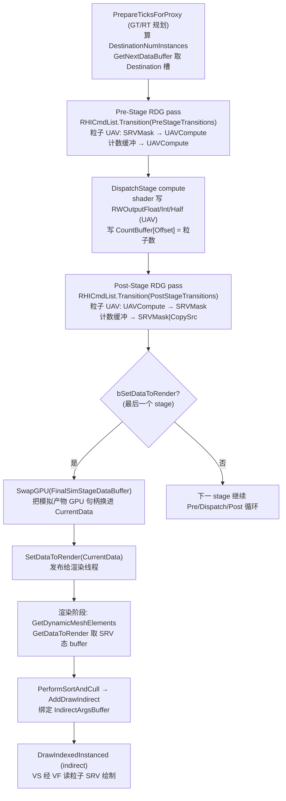
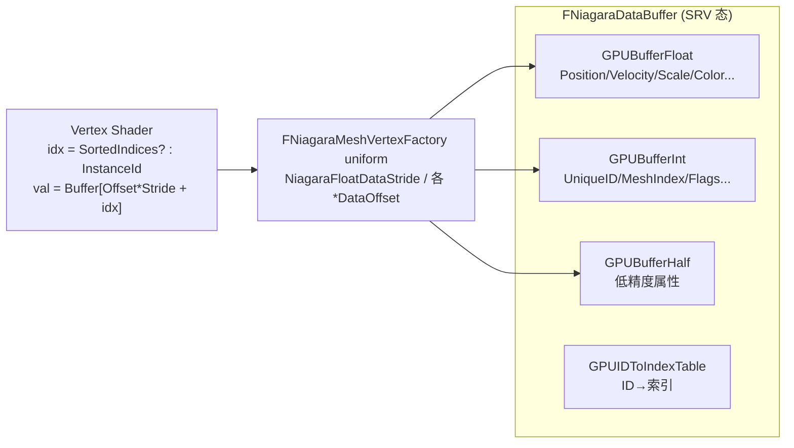
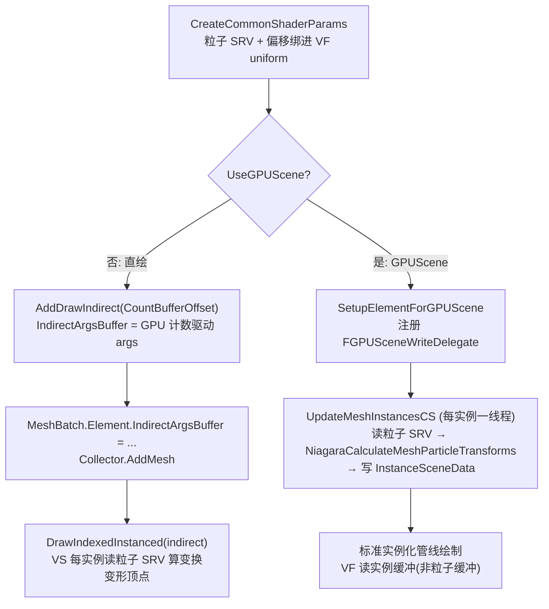

# Niagara GPU 模拟与渲染之间的数据处理逻辑

**日期:** 2026-06-29
**分支:** UE-5.5.4 源码阅读
**关联 commit:** 无（基于 UnrealEngine 5.5.4 官方源码静态分析，未做改动）
**作者:** yangxu.li

> 本文解析 Niagara **GPU 粒子模拟**与**渲染**之间的数据处理链路：compute shader 写完粒子缓冲后，数据如何经过 UAV→SRV 状态转换、buffer 交换、`SetDataToRender` 发布，最终被 Mesh 粒子渲染器的 Vertex Factory 读取并实例化绘制。聚焦三个方面——模拟输出→渲染消费、RDG 资源依赖与 Barrier、缓冲区管理与数据布局；渲染器以 **Mesh 粒子**为主线。读完能回答：一帧里 GPU 模拟写出的粒子数据，是怎么安全地跨过"compute 写 / render 读"这条线，变成屏幕上 N 个实例化 mesh 的。

---

## 0. 一句话概括

粒子数据存在 `FNiagaraDataBuffer`（一组 `FRWBuffer`：Float/Int/Half + IDToIndex 表），compute 阶段以 **UAV** 写、渲染以 **SRV** 读；`FNiagaraGpuComputeDispatch` 在 Pre/Post-Stage RDG pass 里用 `RHICmdList.Transition` 显式做 `SRVMask↔UAVCompute` 翻转，最后一个 stage 命中 `bSetDataToRender` 时把模拟产物 `SwapGPU` 进 `MainDataSet->CurrentData` 并 `SetDataToRender` 发布给渲染线程；Mesh 渲染器 `FNiagaraRendererMeshes` 在 `GetDynamicMeshElements` 里经 `PerformSortAndCull` 拿到排序后的实例数与索引 SRV，`CreateCommonShaderParams` 把粒子 SRV 绑进 `FNiagaraMeshVertexFactory` 的 uniform，最后用 `AddDrawIndirect`（GPU 计数缓冲驱动的 indirect draw）或 GPUScene 实例更新 pass 完成绘制。

---

## 1. 涉及文件 / 关键文件索引

> 文件路径相对 Niagara 插件根 `Engine/Plugins/FX/Niagara/`。

| 文件 | 符号（函数/类/字段） | 职责 |
|---|---|---|
| `Source/Niagara/Classes/NiagaraDataSet.h` | `FNiagaraDataBuffer` | 粒子 GPU 数据容器：`GPUBufferFloat/Int/Half` + `GPUIDToIndexTable` + 计数偏移 + 步长 |
| `Source/Niagara/Classes/NiagaraDataSet.h` | `RegisterTable` / `RegisterTypeOffsets` / `BuildRegisterTable()` | VM 属性编号抽象（"寄存器"）的源码出处；CPU/GPU 共享此编号 |
| `Source/Niagara/Classes/NiagaraDataSet.h` | `FNiagaraDataSet` | buffer 池管理：`CurrentData`/`DestinationData` + `Data[]` 池（2~3 个轮转） |
| `Source/Niagara/Private/NiagaraDataSet.cpp` | `FNiagaraDataBuffer::AllocateGPU()` | 按 `SRVMask` 初始态分配 FRWBuffer（同时建 UAV+SRV） |
| `Source/Niagara/Private/NiagaraDataSet.cpp` | `FNiagaraDataBuffer::SwapGPU()` | 原子交换两个 buffer 的全部 GPU 句柄与元数据（无 GPU 同步） |
| `Source/Niagara/Classes/NiagaraComputeExecutionContext.h` | `FNiagaraComputeExecutionContext` | 每 emitter RT 状态：`DataBuffers_RT[2]` 乒乓 + `DataToRender` 发布槽 |
| `Source/Niagara/Classes/NiagaraComputeExecutionContext.h` | `GPUScript_RT`（`FNiagaraShaderScript*`） | GPU 脚本编译产物是 HLSL compute shader，非 VM 字节码 |
| `Source/Niagara/Classes/NiagaraScript.h` | `UNiagaraScript::IsGPUScript()` | 判定脚本是否 GPU 脚本（`ParticleGPUComputeScript`） |
| `Source/NiagaraEditor/Private/NiagaraHlslTranslator.cpp` | `FNiagaraHlslTranslator` | GPU 脚本翻译成 HLSL（`SimulateMapSpawn`/`MainCS`），翻译器不碰 VectorVM |
| `Source/Niagara/Classes/NiagaraComputeExecutionContext.h` | `SetDataToRender()` / `GetDataToRender()` | 发布与读取本帧渲染数据（含低延迟半透明/多视图变体） |
| `Source/Niagara/Private/NiagaraGpuComputeDispatch.cpp` | `AddDataBufferTransitions()` | 给 Float/Int/Half UAV 生成对称的 Pre/Post 转换信息 |
| `Source/Niagara/Private/NiagaraGpuComputeDispatch.cpp` | Pre/Post-Stage RDG pass（`RHICmdList.Transition`） | 显式做 `SRVMask↔UAVCompute` 翻转 |
| `Source/Niagara/Private/NiagaraGpuComputeDispatch.cpp` | `bSetDataToRender` 握手（行 1001/1004/1311-1318） | 保存原 CurrentData → 模拟完 `SwapGPU` 进它 → `SetDataToRender` 发布 |
| `Source/Niagara/Private/NiagaraGpuComputeDispatch.cpp` | 三种 Destination 分支（行 902-934） | 只读/nullptr、就地更新、`GetNextDataBuffer` 取乒乓新槽，按 `bWritesParticles`/`bPartialParticleUpdate` 分流 |
| `Source/NiagaraShader/Public/NiagaraScriptBase.h` | `FSimulationStageMetaData` | stage 元数据：`bWritesParticles`/`bPartialParticleUpdate` 决定是否取新 Destination 槽 |
| `Source/Niagara/Private/NiagaraGPUInstanceCountManager.cpp` | `FNiagaraGPUInstanceCountManager` | 全局粒子计数缓冲 + indirect draw args 管理 |
| `Source/Niagara/Private/NiagaraGpuScratchPad.h` | `FNiagaraGpuScratchPad` | DI 瞬态缓冲池（按帧分配/重置，直接 RHI 非 RDG） |
| `Source/Niagara/Public/NiagaraRendererMeshes.h` | `FParticleMeshRenderData` | 每帧渲染工作数据：粒子 SRV + 排序索引 SRV + mesh 用位图 + 标志 |
| `Source/Niagara/Private/NiagaraRendererMeshes.cpp` | `FNiagaraRendererMeshes::GenerateDynamicData()` | GT：打包材质 + 参数数据成 `FNiagaraDynamicDataMesh` |
| `Source/Niagara/Private/NiagaraRendererMeshes.cpp` | `FNiagaraRendererMeshes::GetDynamicMeshElements()` | RT 主入口：Prepare→Sort/Cull→建 VF→建 MeshBatch→AddMesh |
| `Source/Niagara/Private/NiagaraRendererMeshes.cpp` | `PerformSortAndCull()` | GPU/CPU 排序+剔除，返回 `NumInstances` + 排序索引 SRV |
| `Source/Niagara/Private/NiagaraRendererMeshes.cpp` | `CreateCommonShaderParams()` | 把粒子 SRV/步长/偏移/默认值绑进 `FNiagaraMeshCommonParameters` |
| `Source/Niagara/Private/NiagaraRendererMeshes.cpp` | `SetupElementForGPUScene()` | GPUScene 路径：注册实例更新 compute pass |
| `Source/Niagara/Private/NiagaraRendererMeshes.cpp` | `AddDrawIndirect` → `IndirectArgsBuffer` | 非 GPUScene 路径：indirect draw args 来自 GPU 计数缓冲 |
| `Source/NiagaraVertexFactories/Public/NiagaraMeshVertexFactory.h` | `FNiagaraMeshVertexFactory` | Mesh 粒子 VF：绑静态 mesh 顶点 + 粒子属性 SRV |
| `Shaders/Private/NiagaraMeshVertexFactory.ush` | `FVertexFactoryInput` / `FVertexFactoryIntermediates` | VS 输入：实例 ID→粒子索引→读 Position/Rotation/Scale |
| `Shaders/Private/NiagaraParticleAccess.ush` | `NiagaraGetVec3()` 等 | 按寄存器偏移 + 步长从粒子 SRV 取属性 |
| `Shaders/Private/NiagaraMeshParticleUtils.ush` | `NiagaraCalculateMeshParticleTransforms()` | 算 LocalToWorld（含 Facing/LockedAxis/LWC） |
| `Shaders/Private/NiagaraUpdateMeshGPUSceneInstances.usf` | `UpdateMeshInstancesCS` | GPUScene 路径：每实例一线程，算变换写进实例缓冲 |

---

## 2. 背景 / 概念

- **GPU 模拟没有 VM，直接跑 HLSL compute shader**：Niagara 的 CPU 模拟与 GPU 模拟是两套独立执行机制。CPU 脚本（`ParticleSpawnScript`/`ParticleUpdateScript`）编译成 VectorVM **字节码**，由 VM 解释器在 CPU 上跑；GPU 脚本（`ParticleGPUComputeScript`，`NiagaraScript::IsGPUScript` 判定）由 `FNiagaraHlslTranslator` 翻译成 HLSL compute shader，编译成 `FNiagaraShader` 后由 GPU 硬件直接执行。本文的"模拟"一律指后者——运行期没有 VM 组件，`FNiagaraComputeExecutionContext::GPUScript_RT` 持的就是编译好的 `FNiagaraShaderScript*`。两者唯一共享的是"属性→编号 + SoA 布局"的数据约定（见下条），执行机制完全不同。

- **GT / RT / GPU 三层分工（理解本文的关键）**：GPU 粒子模拟涉及三个执行主体，分清它们才不会混淆"在哪条线跑"。

  | 层 | 主体 | 干什么 | 碰粒子 buffer 吗 |
  |---|---|---|---|
  | **Game 线程 (GT)** | CPU 主线程 | 决定这帧要不要 tick、参数更新、spawn 规划（`GpuSpawnInfo_GT`）。通过 `ENQUEUE_RENDER_COMMAND` 把工作排进 RT 队列 | 否 |
  | **渲染线程 (RT)** | CPU 渲染线程 | 规划 dispatch、绑 SRV/UAV、发 `DispatchComputeShader` 命令、做 UAV↔SRV transition、调 `GraphBuilder.AddPass`——CPU 侧的"指挥" | 是（持 RHI 句柄） |
  | **GPU** | 显卡硬件 | 真正执行 compute shader 算粒子——算力在 GPU | 是（显存） |

  关键证据：`FNiagaraGpuComputeDispatch::ExecuteTicks` 有 `check(IsInRenderingThread())`（`NiagaraGpuComputeDispatch.cpp:520`）；`FNiagaraDataBuffer::AllocateGPU/SwapGPU/ReleaseGPU` 也都 `check(IsInRenderingThread())`（`NiagaraDataSet.cpp:145/578/969`）；`GetNextDataBuffer`/`GetPrevDataBuffer` 同样 `check(IsInRenderingThread())`（`NiagaraComputeExecutionContext.h:186-187`）。`Source`/`Destination` 这对 buffer（`FNiagaraSimStageData`）也是 RT 专属——GT 不读写它们。

  精确说法：**模拟逻辑在 GPU 上执行（compute shader 在 GPU 跑），但驱动模拟的代码（dispatch、barrier、buffer 管理）在渲染线程上跑**，二者都在 CPU 主线程（GT）之外。GT 只把工作排进渲染命令队列。本文描述的整条链（Prepare→Pre-Stage→Dispatch→Post-Stage→SetDataToRender→渲染消费）全部在 RT 线程的执行流里完成。

  - **执行时机嵌在渲染管线里**：`ENiagaraGpuComputeTickStage`（`NiagaraCommon.h:1841`）三个值 `PreInitViews`/`PostInitViews`/`PostOpaqueRender` **全是渲染管线阶段名**。GPU 模拟在某个渲染阶段（由 emitter 需求决定，如需 GBuffer 碰撞要等 `PostOpaqueRender`）RT 调 `ExecuteTicks(stage)` 下发本阶段 compute dispatch。
  - **与 CPU 粒子模拟对比**：CPU 粒子模拟（VectorVM 字节码）在 GT 或并发任务线程跑，产物在 CPU 内存、渲染时上传 GPU；GPU 粒子模拟在 RT 上由 compute shader 在 GPU 上跑，产物从头到尾在显存、渲染直接读、从不回 CPU（除非调试读回）。

- **UAV 写、SRV 读**：compute shader 用 UAV（Unordered Access View）随机写粒子缓冲，渲染用 SRV（Shader Resource View）只读采样。同一底层 `FBufferRHI` 在 `FRWBuffer` 里同时持有 UAV 与 SRV 句柄，但 RHI 要求显式 `Transition` 在两种访问态间翻转（`SRVMask` ↔ `UAVCompute`），否则是未定义行为。这是"compute 写 / render 读"那条线上的核心同步点。

- **`FNiagaraDataBuffer` = 一组 FRWBuffer**：单个粒子数据集拆成三个按精度分桶的 buffer——`GPUBufferFloat`（Position/Velocity/Scale/Color…）、`GPUBufferInt`（ID/标志/MeshIndex…）、`GPUBufferHalf`（低精度属性），加一个 `GPUIDToIndexTable`（持久 ID→索引映射，用于粒子重排后仍能按 ID 寻址）。每个 buffer 内部按"寄存器×步长"布局：`Buffer[RegisterIdx * Stride + ParticleIndex]`。

- **buffer 池轮转**：`FNiagaraDataSet::Data[]` 持 2~3 个 `FNiagaraDataBuffer`，`CurrentData`（正在被渲染读）与 `DestinationData`（正在被 compute 写）分属不同槽，避免读写同址。RT 侧 `FNiagaraComputeExecutionContext::DataBuffers_RT[2]` 用 `BufferSwapsThisFrame_RT & 1` 乒乓索引做 `GetNextDataBuffer`/`GetPrevDataBuffer`。

- **引用计数防释放**：`FNiagaraDataBuffer` 继承 `FNiagaraSharedObject`，有原子 `ReadRefCount`。渲染线程持 `FNiagaraDataBufferRef`（`TRefCountPtr`）期间，该 buffer 不会被池回收改写；`TryLock()` 用 CAS 抢写锁（`INDEX_NONE` 标记），保证 compute 写的 buffer 不被同时读。

- **间接绘制（indirect draw）**：GPU 模拟后粒子数在 GPU 端才知道（CPU 没读回），所以绘制用 `IndirectArgsBuffer`——args（`IndexCountPerInstance`/`InstanceCount`/`StartIndex`…）由 GPU 计数缓冲填，CPU 不参与。这避免了"读回粒子数再 DrawIndexedInstanced"的 GPU↔CPU 往返。

- **GPUScene 路径 vs 直绘路径**：Mesh 粒子有两条渲染路径。**直绘**：Vertex Factory 在 VS 里每实例读粒子属性、算变换、变形 mesh 顶点。**GPUScene**：先用一个 compute pass 把每粒子的 LocalToWorld 写进引擎 GPUScene 实例缓冲，渲染走标准实例化管线（VF 读实例缓冲而非粒子缓冲）。GPUScene 让 mesh 粒子能享受引擎的实例剔除/LOD/光追/GPU 驱动管线。

---

## 3. 数据流 / 流程图

本图说明：一帧内从 GPU 模拟写 UAV 到渲染读 SRV 的完整时序，标出每步所在文件与关键状态翻转。



本图说明：`FNiagaraDataBuffer` 的三桶布局与 Vertex Factory 的寻址方式。



本图说明：Mesh 粒子的两条渲染路径分流。



---

## 4. 逐项详解（以及"为什么"）

### 4.1 粒子数据容器：`FNiagaraDataBuffer`

`Classes/NiagaraDataSet.h` 定义，继承 `FNiagaraSharedObject`（引用计数）。核心 GPU 成员是四个 `FRWBuffer`：

```cpp
FRWBuffer GPUBufferFloat;        // Position/Velocity/Scale/Color 等浮点属性
FRWBuffer GPUBufferInt;          // UniqueID/MeshIndex/Flags 等整型属性
FRWBuffer GPUBufferHalf;         // 低精度（半精度）属性
FRWBuffer GPUIDToIndexTable;     // 持久 ID → 当前索引 映射
```

`FRWBuffer`（RHI 通用结构）同时持有 `.UAV`（compute 写）与 `.SRV`（render 读）和 `.Buffer`（底层 RHI 句柄）。`AllocateGPU()` 初始化时以 `ERHIAccess::SRVMask` 为初始态（默认可读），步长按 `NiagaraComputeMaxThreadGroupSize` 对齐填充——这是为了让一个线程组内的访问落在对齐边界，利于 GPU 访存合并。

元数据：`GPUInstanceCountBufferOffset`（在全局计数缓冲里的偏移）、`FloatStride/Int32Stride/HalfStride`（每个"寄存器"占多少元素）、`NumInstances`、`GPUDataReadyStage`（数据在哪阶段就绪）。

**"寄存器"与 SoA 布局**：这里的"寄存器"不是 CPU/GPU 硬件寄存器，而是 Niagara VM 层面对粒子属性的**编号抽象**（源码 `FNiagaraDataBuffer::RegisterTable` / `RegisterTypeOffsets`，`NiagaraDataSet.h:254`）。脚本编译期把每个属性编一个号——Position 是第 0 个 float 寄存器、Velocity 第 1 个……运行期属性名不存在了，只剩编号（如 `PositionDataOffset`）。三个 buffer 内部都是 **SoA（Structure of Arrays）**布局：每个属性（寄存器）占一段连续的 `Stride` 字节，里面是该属性**所有粒子**的值紧密排列：

```text
GPUBufferFloat 内存布局（SoA，按属性分块）:
┌──────────────────────────────────────────────────────────┐
│ 寄存器0 Position: 粒0.x 粒0.y 粒0.z | 粒1.x ... | 粒N...  │ ← Stride 字节
│ 寄存器1 Velocity: 粒0.x 粒0.y 粒0.z | 粒1.x ... | 粒N...  │ ← Stride 字节
│ 寄存器2 Scale:    粒0.x 粒0.y 粒0.z | 粒1.x ... | 粒N...  │
│ ...                                                       │
└──────────────────────────────────────────────────────────┘
```

取值即 `Buffer[RegisterIdx * Stride + ParticleIndex]`（`GetComponentPtrFloat` = `基址 + FloatStride * ComponentIdx`，再 `+ InstanceIdx`）。GPU shader 里 `NiagaraGetVec3(RegisterIdx, ParticleIdx)`（`NiagaraParticleAccess.ush`）同理。`Stride` 按 `NiagaraComputeMaxThreadGroupSize` 对齐——`AllocateGPU` 时 `NewFloatStride = GetSafeComponentBufferSize(NumInstances * sizeof(float))`，对齐后一个线程组访问的内存落在边界，利于硬件访存合并。

> **为什么 SoA + 寄存器编号**：① GPU warp 的 32 个连续线程通常处理 32 个**连续粒子**的**同一属性**，SoA 布局下这 32 个值显存连续，一次访存命中——这是粒子模拟性能关键；AoS（每粒子所有属性打包）取 Position 时跨大步距，访存稀疏。② VM 与 GPU 共用编号约定：VM 字节码按编号操作，HLSL 翻译时把同一编号编进 shader（`*DataOffset` 作 uniform 下发），CPU/GPU 一套数据布局两套执行。③ 拆三桶 Float/Int/Half：精度分桶让低精度属性省一半带宽，整型单独存避免浮点 reinterpret；同发射器所有属性共享三 buffer、靠编号寻址，减少 binding 数与切换。

### 4.2 UAV→SRV 转换：Pre/Post-Stage Barrier

`Private/NiagaraGpuComputeDispatch.cpp` 用 `AddDataBufferTransitions()`（行 145）为 Destination buffer 的 Float/Int/Half UAV 生成对称转换：

```cpp
// 讲解性摘录
static void AddDataBufferTransitions(BeforeArr, AfterArr, DestinationData,
    ERHIAccess BeforeState = ERHIAccess::SRVMask,
    ERHIAccess AfterState  = ERHIAccess::UAVCompute)
{
    BeforeArr.Emplace(DestinationData->GPUBufferFloat.UAV, BeforeState, AfterState);
    BeforeArr.Emplace(DestinationData->GPUBufferInt.UAV,   BeforeState, AfterState);
    BeforeArr.Emplace(DestinationData->GPUBufferHalf.UAV,  BeforeState, AfterState);
}
```

执行分两个 RDG pass：
- **Pre-Stage pass**（行 1242-1268）：`RHICmdList.Transition(PreStageTransitions)` 把粒子 UAV `SRVMask → UAVCompute`（准备写），计数缓冲转 `UAVCompute`，并对计数缓冲 `BeginUAVOverlap`（允许 UAV 写重叠以加速）。
- **Post-Stage pass**（行 1283-1291）：`RHICmdList.Transition(PostStageTransitions)` 把粒子 UAV `UAVCompute → SRVMask`（准备读），最后一个 group 时计数缓冲转回 `kCountBufferDefaultState = SRVMask | CopySrc`（可被 shader 读 + 可拷回 CPU），`EndUAVOverlap`。

`GPUIDToIndexTable` 单独 `SRVCompute ↔ UAVCompute`（行 1199-1200）；FreeID 表在 Post 阶段 `SRVCompute → UAVCompute` 供下帧分配（行 1216）。

> **为什么用 RDG pass 包直接 RHI**：Niagara 的粒子 buffer 是直接 RHI 资源（非 RDG 包装），但调度结构用 RDG（`GraphBuilder.AddPass`）以获得正确的 pass 依赖排序与外部访问追踪。`ERDGPassFlags::None` 的 Pre/Post pass 里直接调 `RHICmdList.Transition`，是"RDG 编排 + 直接 RHI 执行"的混合模式。`FRDGExternalAccessQueue`（行 230/1434）告诉 RDG 这些 buffer 在图外被访问，保证依赖正确。

### 4.3 buffer 交换与发布：`bSetDataToRender` 握手

一个 GPU emitter 一帧可跑**多个 simulation stage**（spawn stage + 一个或多个 update stage，每 stage 还可循环 `NumIterations` 次），`NiagaraGpuComputeDispatch.cpp:874` 的两层循环为每对 `(stage, iteration)` 建一次 dispatch、各自配 `Source`/`Destination`。**Destination 是否取新槽按 stage 元数据分三种**（行 902-934）：

- **只读 stage**（`bWritesParticles==false`）：`Destination=nullptr`，不写粒子、不取槽。
- **部分更新**（`bPartialParticleUpdate==true`，写粒子但不杀粒子）：`Destination=SourceData`，就地读写、不取新槽。
- **会改粒子数的 stage**（spawn 新粒子 / kill 粒子，默认 update）：`Destination=GetNextDataBuffer()` 取乒乓池新槽，写完 `AdvanceDataBuffer()` 翻转索引，下一 stage 把它当 Source。需要新槽是因为杀粒子后粒子数变了，老 buffer 还在被 Source 读不能覆盖。

乒乓池 `DataBuffers_RT[2]` 仅两槽靠 `BufferSwapsThisFrame_RT & 1` 切换——stage 串行执行，stage N 写的槽在 stage N+1 当 Source 时旧槽已无人读可被覆盖，故任意多 stage 两槽够用。

**只有最后一个 stage** 命中 `bSetDataToRender`（行 1001 设），把产物"落袋"给渲染。流程：

1. **保存原 CurrentData**（行 1004）：`DataSetOriginalBuffer_RT = MainDataSet->GetCurrentData()`——记住渲染线程上一帧还在读的那个 buffer。
2. **模拟期间**：会改粒子数的 stage 在 `DataBuffers_RT` 乒乓槽上接力写，最后一个写粒子 stage 的产物是 `FinalSimStageDataBuffer`。
3. **发布**（行 1311-1318）：
   ```cpp
   if (DispatchInstance.SimStageData.bSetDataToRender) {
       FNiagaraDataBuffer* CurrentData = ComputeContext->DataSetOriginalBuffer_RT;
       CurrentData->SwapGPU(FinalSimStageDataBuffer);   // GPU 句柄换进 CurrentData
       ComputeContext->SetDataToRender(CurrentData);     // 发布
   }
   ```
4. `SwapGPU`（`NiagaraDataSet.cpp:946`）交换两个 buffer 的**全部** GPU 句柄与元数据（`Swap(GPUBufferFloat, ...)` 等），纯指针交换，无 GPU 同步——因为此时 Post-Stage 已把 UAV 转成 SRV 态，可安全读。

> **为什么要先存原 CurrentData 再 Swap 进它**：渲染线程可能还在读上一帧的 `CurrentData`（引用计数 >0）。不能直接把模拟产物变成新 CurrentData（会让上一帧的 reader 指向被改写的 buffer）。做法是：模拟写在另一个槽，模拟完把 GPU 句柄**换进**原 CurrentData 这个壳——壳的身份不变（reader 仍持它），但内容更新到本帧产物。配合引用计数，正在被读的壳不会被池回收。

### 4.4 跨线程发布：`SetDataToRender` / `GetDataToRender`

`FNiagaraComputeExecutionContext`（`Classes/NiagaraComputeExecutionContext.h`）持多个发布槽：

```cpp
FNiagaraDataBufferRef DataToRender;                       // 主发布槽
FNiagaraDataBufferRef TranslucentDataToRender;            // 低延迟半透明
FNiagaraDataBufferRef MultiViewPreviousDataToRender;      // 多视图一致性
FNiagaraDataBuffer*  DataBuffers_RT[2];                   // 乒乓写槽
uint32               BufferSwapsThisFrame_RT;
```

`SetDataToRender(buf)` 把本帧产物挂到 `DataToRender`；渲染侧 `GetDataToRender(RHICmdList, bIsLowLatencyTranslucent)` 按标志取：低延迟半透明取 `TranslucentDataToRender`，多视图取 `MultiViewPreviousDataToRender`，否则取 `DataToRender`。

`DataBuffers_RT[2]` 乒乓：`GetNextDataBuffer()` = `DataBuffers_RT[BufferSwapsThisFrame_RT & 1]`，`GetPrevDataBuffer()` = 反向槽；每分配一个 Destination 调 `AdvanceDataBuffer()` 自增计数。这样多 stage 写不会撞同槽。

> **为什么有低延迟/多视图变体**：低延迟半透明（如 VR/前沿渲染）需要更早拿到数据；多视图（多 camera）要保证各视图看到一致的粒子态，用 `MultiViewPreviousDataToRender` 保留上一帧直到 `PostOpaqueRender` 再清。`GPUDataReadyStage` 字段标记每个 buffer 在哪个 tick stage 就绪，调度据此决定能否提前读。

### 4.5 全局计数缓冲：`FNiagaraGPUInstanceCountManager`

`Private/NiagaraGPUInstanceCountManager.cpp`。一个全局 `FRWBuffer CountBuffer`，每个 emitter 的 `FNiagaraDataBuffer` 占一个 `GPUInstanceCountBufferOffset` 槽位。compute 阶段把存活粒子数写进 `CountBuffer[Offset]`；indirect draw 的 args 从这个槽读。

状态机：默认 `kCountBufferDefaultState = SRVMask | CopySrc`（可被 shader 读 + 可拷回 CPU 做统计/读回）；Pre-Stage 转 `UAVCompute`（compute 写），最后一个 group 的 Post-Stage 转回默认态。还提供 `AddDrawIndirect(GPUCountBufferOffset, IndexCountPerInstance, StartIndex, ...)`：建一个 indirect args buffer，由一个 compute pass 把 `InstanceCount = CountBuffer[Offset]` 填进 args，返回 `{Buffer, Offset}` 供 `MeshBatchElement.IndirectArgsBuffer` 用。

> **为什么 CPU 不读回粒子数**：读回意味着 GPU→CPU 往返 + CPU 闲置等待，破坏 GPU 驱动渲染的连贯性。indirect draw 让"算粒子数"和"用粒子数绘制"都在 GPU，CPU 只下发 args buffer 的引用。

### 4.6 Mesh 渲染器入口：`GetDynamicMeshElements`

`Private/NiagaraRendererMeshes.cpp:1381`。渲染线程每帧每视图调一次。流程：

1. **`PrepareParticleMeshRenderData`**：校验、拿粒子 SRV（`SourceParticleData->GetGPUBufferFloat().SRV` 等，经 `GetSrvOrDefaultFloat` 兜底空 SRV）、拿 `GPUInstanceCountBufferOffset`。
2. **`CalculateMeshUsed`**：CPU 侧判断哪些 mesh 索引真被粒子用（小粒子数优化，避免为空 mesh 建批次）。
3. **逐 mesh**：
   - 建 `FMeshCollectorResources`（含 `FNiagaraMeshVertexFactory` + uniform buffer）。
   - `SetupVertexFactory`：绑静态 mesh 的 Position/Tangent/Color/UV 顶点缓冲。
   - `PreparePerMeshData`：算剔除球、pivot 偏移、顶点 fetch 参数。
   - **`PerformSortAndCull`**（行 788/1521）：按需跑 GPU 排序/剔除或 CPU 排序，返回 `NumInstances` + 排序索引 SRV（或 null）。
   - **`CreateCommonShaderParams`**（行 832/1528）：建 `FNiagaraMeshCommonParameters`——粒子 Float/Int/Half SRV + 步长、排序索引缓冲 + 偏移、LWC tile、各属性 `*DataOffset`（Position/Rotation/Scale/Velocity/CameraOffset，含 `Prev*`）、默认值、mesh scale/rotation/offset、locked axis。
   - 逐 section **`CreateMeshBatchForSection`**：建 `FMeshBatch`，设 `BatchElement.NumInstances` 或 `IndirectArgsBuffer`，加进 `Collector`。

> **为什么排序与取值分离**：`PerformSortAndCull` 只产出"排序后的实例索引数组"（存进 SRV），Vertex Factory 再据此索引读粒子属性。这样同一份排序结果可服务多个 mesh/section，且排序可纯 GPU 完成（CPU 不读粒子）。

### 4.7 Vertex Factory：粒子 SRV 如何变成实例变换

`FNiagaraMeshVertexFactory`（`NiagaraVertexFactories`）的 uniform 含 `FNiagaraMeshCommonParameters`。VS（`NiagaraMeshVertexFactory.ush`）的 `FVertexFactoryIntermediates`：

```hlsl
// 讲解性示例
uint ParticleIndex = (SortedIndicesOffset != -1)
    ? SortedIndices[SortedIndicesOffset + InstanceId]
    : InstanceId;
float3 Position = NiagaraSafeGetVec3(PositionDataOffset, ParticleIndex, DefaultPosition);
float4 Rotation = NiagaraSafeGetVec4(RotationDataOffset, ParticleIndex, DefaultRotation);
float3 Scale    = NiagaraSafeGetVec3(ScaleDataOffset,    ParticleIndex, DefaultScale);
```

`NiagaraGetVec3(RegisterIdx, ParticleIdx)` = `Buffer[RegisterIdx * Stride + ParticleIdx]`（`NiagaraParticleAccess.ush`）。`RegisterIdx == -1` 时返回默认值（属性未绑）。

`NiagaraCalculateMeshParticleTransforms`（`NiagaraMeshParticleUtils.ush`）把粒子 Position/Rotation/Scale + mesh 的 Scale/Rotation/Offset + Facing 模式 + LockedAxis + LWC tile 算成 `LocalToWorld`，最终 `WorldPosition = MeshVertexPosition * LocalToWorld`（局部 mesh 顶点经粒子变换到世界）。

> **为什么 VF 同时绑静态 mesh 顶点和粒子 SRV**：mesh 粒子 = "一套静态 mesh 几何 + 每粒子一个变换"。VF 的静态顶点流来自 mesh 资源，每实例的变换来自粒子 SRV。InstanceId 是桥梁——第 i 个实例读第 i 个粒子（或经排序索引）。这比"每粒子复制一份 mesh 顶点"省海量带宽。

### 4.8 两条绘制路径

**直绘路径（非 GPUScene）**：
```cpp
auto IndirectDraw = CountManager.AddDrawIndirect(GPUCountBufferOffset,
    Section.NumTriangles * 3 /*IndexCountPerInstance*/, Section.FirstIndex, ...);
BatchElement.IndirectArgsBuffer = IndirectDraw.Buffer;   // 行 1369
BatchElement.IndirectArgsOffset = IndirectDraw.Offset;
```
`DrawIndexedInstanced` 的 `InstanceCount` 从 `IndirectArgsBuffer` 读（= GPU 计数缓冲的粒子数）。VS 每实例读粒子 SRV 算变换变形顶点。

**GPUScene 路径**（`SetupElementForGPUScene`，行 1118）：注册 `FGPUSceneWriteDelegate`，其 lambda 把 `FNiagaraGPUSceneUtils::AddUpdateMeshParticleInstancesPass` 排进 RDG。`UpdateMeshInstancesCS`（`NiagaraUpdateMeshGPUSceneInstances.usf`）每实例一线程：读粒子索引→读粒子 Position/Rotation/Scale→`NiagaraCalculateMeshParticleTransforms` 算 `LocalToWorld`→`InitializeInstanceSceneDataWS`/`WriteInstanceDynamicDataWS` 写进 GPUScene 实例缓冲。之后渲染走标准实例化管线，VF 读实例缓冲（非粒子缓冲），并设 `bForceInstanceCulling`、`EnableInstanceDynamicData(bNeedsPrevTransform)`（运动矢量）。

> **GPUScene 的取舍**：直绘简单、变换在 VS 算，但每视图每实例都要重算变换、不能享受引擎实例剔除/光追。GPUScene 把变换预算成一个 compute pass，渲染走标准管线能 GPU 驱动剔除、LOD、光追，但多一次 compute pass 与实例缓冲写入。大量 mesh 粒子 + 引擎高级特性时 GPUScene 更优。

### 4.9 瞬态 DI 缓冲：`FNiagaraGpuScratchPad`

`Private/NiagaraGpuScratchPad.h`。DI（如排序、碰撞）需要每帧瞬态缓冲，用 ScratchPad 按 Float/UInt 分桶池化：`Alloc(NumElements)` 从池找/建 `FRWBuffer`（默认 `UAVCompute` 态），返回 `{Buffer, Offset}` 帧内有效；`Transition()` 批量改态；`Reset()` 在帧边界清计数（buffer 复用，不销毁）；`Release()` 销毁。非 RDG 跟踪，由 dispatcher 生命周期管理。

> **为什么 DI scratch 不走 RDG**：DI 缓冲生命周期跨多个 stage 且访问模式复杂，RDG 的图式生命周期不直观。用直接 RHI 池 + 显式 Transition 更可控，代价是手动管状态——`CurrentAccess` 字段记上次转换态，新分配自动落该态。

### 4.10 多视图与 GPUDataReadyStage

`MultiViewPreviousDataToRender`（行 1332-1348）：最后一个视图族把新数据 `SetGPUDataReadyStage(First)`；非最后视图族保留旧数据直到 `PostOpaqueRender`（`SetGPUDataReadyStage(PostOpaqueRender)`），并 `SetMultiViewPreviousDataToRender`。这保证多 camera 同帧看到一致粒子态，避免某些视图读半成品。

---

## 5. 关键状态翻转总表

| 资源 | 模拟前(Pre) | 模拟中 | 模拟后(Post) | 谁读 |
|---|---|---|---|---|
| `GPUBufferFloat/Int/Half` (Destination) | `SRVMask` | `UAVCompute` | `SRVMask` | VF / GPUScene CS |
| `GPUIDToIndexTable` | `SRVCompute` | `UAVCompute` | `SRVCompute` | 下帧 ID 分配 |
| `CountBuffer` | `kCountBufferDefaultState` | `UAVCompute` | `kCountBufferDefaultState` (末组) | indirect draw args |
| `FNiagaraDataBuffer` 身份 | Destination 槽 | 被 SwapGPU | 换进 `CurrentData` | `GetDataToRender` |
| 发布槽 `DataToRender` | 上一帧值 | 上一帧值 | 本帧产物 | 渲染线程 |

---

## 6. 设计要点小结

| 设计 | 原因 |
|---|---|
| UAV 写 / SRV 读 + 显式 Transition | RHI 要求；同一 buffer 两种访问态必须翻转，否则未定义 |
| 三桶 Float/Int/Half + 寄存器偏移寻址 | 精度分桶省带宽；单 buffer 多属性减 binding |
| buffer 池 2~3 轮转 + 引用计数 | compute 写与 render 读分槽；reader 持引用期间不被回收 |
| `SwapGPU` 指针交换无同步 | Post-Stage 已转 SRV 态，壳身份不变内容更新 |
| `bSetDataToRender` 只在末 stage | 多 stage 产物层层接力，仅末 stage 落袋发布 |
| indirect draw + GPU 计数缓冲 | 粒子数在 GPU 端，避免 GPU↔CPU 往返 |
| RDG 编排 + 直接 RHI 执行 | 用 RDG 排依赖，buffer 保持直接 RHI 灵活 |
| 排序索引 SRV 与取值分离 | 同一排序服务多 mesh/section，排序纯 GPU |
| GPUScene 可选路径 | 大量粒子 + 引擎高级特性时算变换预算成 pass 更优 |
| `ScratchPad` 非 RDG 池 | DI 瞬态缓冲跨 stage 复杂，直接 RHI + 显式态更可控 |

---

## 附录

### 术语表

| 术语 | 含义 |
|---|---|
| UAV / SRV | Unordered Access View（compute 随机写）/ Shader Resource View（shader 只读） |
| `FRWBuffer` | RHI 通用读写缓冲，同时持 UAV 与 SRV 句柄 |
| `FNiagaraDataBuffer` | 粒子数据容器，含 Float/Int/Half/IDToIndex 四个 FRWBuffer |
| `SRVMask` / `UAVCompute` | RHI 访问态：可被 shader 读 / 可被 compute 写 |
| indirect draw | 绘制参数（含实例数）由 GPU buffer 提供，CPU 不参与 |
| GPUScene | 引擎实例场景数据系统，实例变换预算成缓冲供标准管线 |
| 乒乓缓冲 | 两个槽交替读写，`index & 1` 切换 |
| `GPUDataReadyStage` | 标记 buffer 在哪个 tick stage 就绪可读 |
| LWC | Large World Coordinates，大世界坐标精度方案 |

### 自检命令

```bash
# GPU 模拟无 VM（编译产物是 HLSL compute shader，非字节码）
grep -n "static bool IsGPUScript" \
  Engine/Plugins/FX/Niagara/Source/Niagara/Classes/NiagaraScript.h
grep -n "GPUScript_RT\|FNiagaraShaderScript" \
  Engine/Plugins/FX/Niagara/Source/Niagara/Classes/NiagaraComputeExecutionContext.h
# 翻译器生成 HLSL，不碰 VectorVM（期望 0）
grep -c "VectorVM" \
  Engine/Plugins/FX/Niagara/Source/NiagaraEditor/Private/NiagaraHlslTranslator.cpp

# FNiagaraDataBuffer 定义与 SwapGPU
grep -n "class FNiagaraDataBuffer\|void FNiagaraDataBuffer::SwapGPU" \
  Engine/Plugins/FX/Niagara/Source/Niagara/Classes/NiagaraDataSet.h \
  Engine/Plugins/FX/Niagara/Source/Niagara/Private/NiagaraDataSet.cpp

# UAV↔SRV 转换
grep -n "AddDataBufferTransitions\|PreStageTransitions\|PostStageTransitions\|RHICmdList.Transition" \
  Engine/Plugins/FX/Niagara/Source/Niagara/Private/NiagaraGpuComputeDispatch.cpp

# GT / RT / GPU 三分工（所有 check(IsInRenderingThread)）
grep -n "check(IsInRenderingThread)" \
  Engine/Plugins/FX/Niagara/Source/Niagara/Private/NiagaraGpuComputeDispatch.cpp
grep -n "check(IsInRenderingThread)" \
  Engine/Plugins/FX/Niagara/Source/Niagara/Classes/NiagaraComputeExecutionContext.h
grep -n "check(IsInRenderingThread)" \
  Engine/Plugins/FX/Niagara/Source/Niagara/Private/NiagaraDataSet.cpp
# tick 阶段枚举
grep -A6 "namespace ENiagaraGpuComputeTickStage" \
  Engine/Plugins/FX/Niagara/Source/Niagara/Public/NiagaraCommon.h

# 发布握手
grep -n "bSetDataToRender\|DataSetOriginalBuffer_RT\|SwapGPU\|SetDataToRender" \
  Engine/Plugins/FX/Niagara/Source/Niagara/Private/NiagaraGpuComputeDispatch.cpp \
  Engine/Plugins/FX/Niagara/Source/Niagara/Classes/NiagaraComputeExecutionContext.h

# 三种 Destination 分支（只读 / 就地更新 / 取新槽）
grep -n "bWritesParticles\|bPartialParticleUpdate\|GetNextDataBuffer\|AdvanceDataBuffer" \
  Engine/Plugins/FX/Niagara/Source/Niagara/Private/NiagaraGpuComputeDispatch.cpp
grep -n "struct FSimulationStageMetaData\|bWritesParticles\|bPartialParticleUpdate" \
  Engine/Plugins/FX/Niagara/Source/NiagaraShader/Public/NiagaraScriptBase.h

# 计数缓冲 + indirect draw
grep -n "kCountBufferDefaultState\|AddDrawIndirect\|IndirectArgsBuffer" \
  Engine/Plugins/FX/Niagara/Source/Niagara/Private/NiagaraGPUInstanceCountManager.cpp \
  Engine/Plugins/FX/Niagara/Source/Niagara/Private/NiagaraRendererMeshes.cpp

# Mesh 渲染器主链路
grep -n "PerformSortAndCull\|CreateCommonShaderParams\|SetupElementForGPUScene\|GetDynamicMeshElements\|GenerateDynamicData" \
  Engine/Plugins/FX/Niagara/Source/Niagara/Private/NiagaraRendererMeshes.cpp

# ScratchPad
grep -n "class FNiagaraGpuScratchPad\|struct FScratchBuffer" \
  Engine/Plugins/FX/Niagara/Source/Niagara/Private/NiagaraGpuScratchPad.h
```
