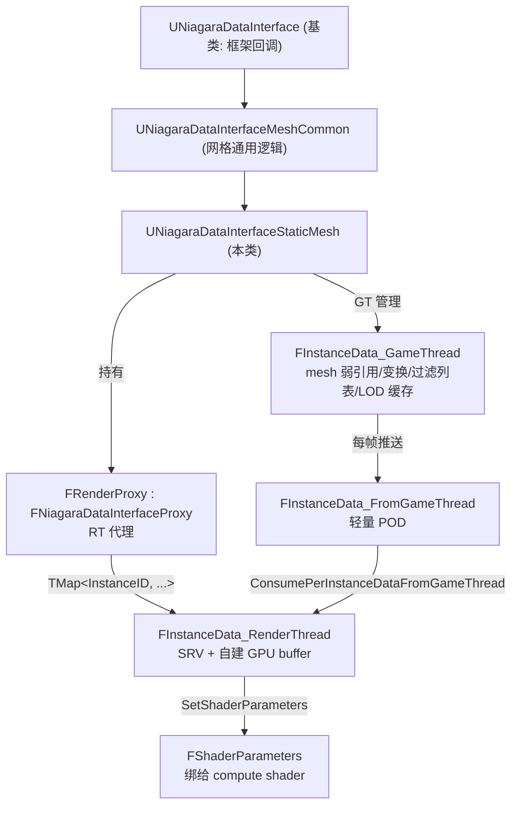
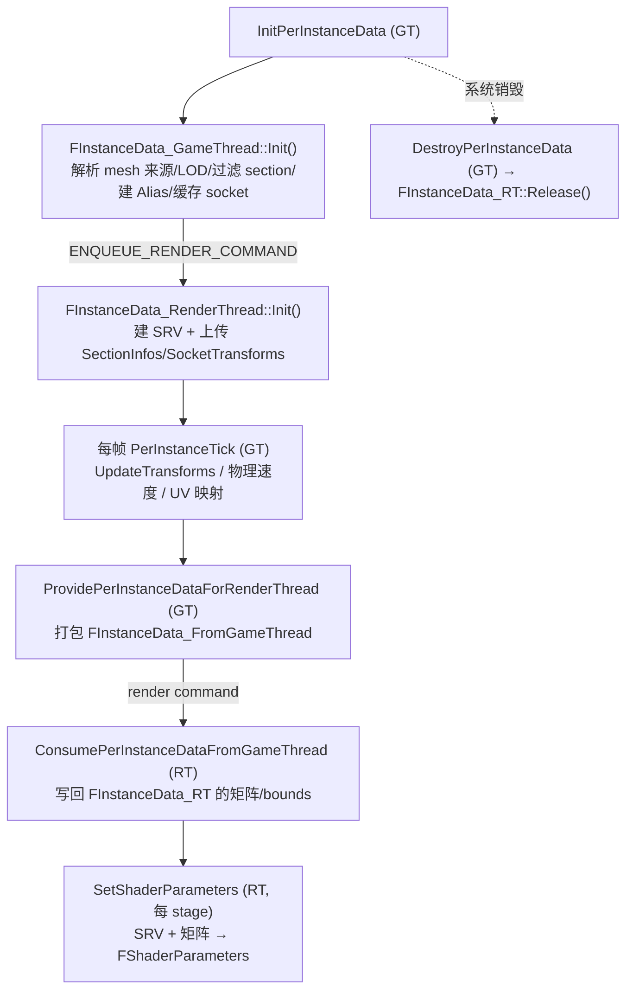

# Niagara Static Mesh DataInterface 类内部实现详解

**日期:** 2026-06-29
**分支:** UE-5.5.4 源码阅读
**关联 commit:** 无（基于 UnrealEngine 5.5.4 官方源码静态分析，未做改动）
**作者:** yangxu.li

> 本文解析 `UNiagaraDataInterfaceStaticMesh` 这个 C++ 类的**内部实现细节**——类层次、三套实例数据结构、GameThread→RenderThread 数据流、面积加权 Alias 表构建、section 过滤、GPU buffer 上传、VM 函数绑定机制。不讲"怎么在 emitter 里用"（那是 [static_mesh_location_gpu_spawn_flow.md](./static_mesh_location_gpu_spawn_flow.md) 的范畴），只讲"这个 DI 类自己是怎么设计的"。

---

## 0. 一句话概括

`UNiagaraDataInterfaceStaticMesh` 继承自 `UNiagaraDataInterface`，通过 `UNiagaraDataInterfaceMeshCommon` 复用网格 DI 通用逻辑；它为每个系统实例维护**三套数据**——`FInstanceData_GameThread`（GT 缓存 mesh 引用/变换/过滤后的 section 列表）、`FInstanceData_FromGameThread`（每帧跨线程搬运的轻量 POD）、`FInstanceData_RenderThread`（RT 持有 SRV + 自建 GPU buffer），渲染线程代理 `FRenderProxy : FNiagaraDataInterfaceProxy` 用一张 `TMap<SystemInstanceID, FInstanceData_RT>` 管理所有实例；CPU 端经 `FStaticMeshCpuHelper` 直接读 `FStaticMeshLODResources`，GPU 端复用 mesh 渲染缓冲的现成 SRV（不拷顶点）并自建 section Alias 表/ socket buffer；同一组函数签名在编译期分叉成 GPU HLSL（`.ush` 模板）与 CPU lambda（`GetVMExternalFunction`）两套实现。

---

## 1. 涉及文件 / 关键文件索引

> 文件路径相对 Niagara 插件根 `Engine/Plugins/FX/Niagara/`。

| 文件 | 符号（函数/类/字段） | 职责 |
|---|---|---|
| `Source/Niagara/Internal/DataInterface/NiagaraDataInterfaceStaticMesh.h` | `UNiagaraDataInterfaceStaticMesh` | DI 类本体：UPROPERTY 配置 + DI 框架回调声明 |
| `Source/Niagara/Internal/DataInterface/NiagaraDataInterfaceStaticMesh.h` | `ENDIStaticMesh_SourceMode` | 枚举：mesh 来源解析策略（Default/Source/AttachParent/DefaultMeshOnly/MeshParameterBinding） |
| `Source/Niagara/Internal/DataInterface/NiagaraDataInterfaceStaticMesh.h` | `FNDIStaticMeshSectionFilter` | USTRUCT：按材质槽过滤 section（`AllowedMaterialSlots`） |
| `Source/Niagara/Private/DataInterface/NiagaraDataInterfaceStaticMesh.cpp` | `FNDISectionInfo` | section 元数据：`(FirstTriangle, NumTriangles, Prob, Alias)` |
| `Source/Niagara/Private/DataInterface/NiagaraDataInterfaceStaticMesh.cpp` | `FNDISectionAreaWeightedSampler` | 继承 `FWeightedRandomSampler`，按 section 面积建 Alias 表 |
| `Source/Niagara/Private/DataInterface/NiagaraDataInterfaceStaticMesh.cpp` | `FGpuInitializeData` | 初始化期的瞬态搬运包：LOD 资源引用 + section/socket 的 `TResourceArray` |
| `Source/Niagara/Private/DataInterface/NiagaraDataInterfaceStaticMesh.cpp` | `FInstanceData_RenderThread` | RT 数据：SRV + 自建 `FReadBuffer`（SectionInfos/SocketTransforms…） |
| `Source/Niagara/Private/DataInterface/NiagaraDataInterfaceStaticMesh.cpp` | `FInstanceData_GameThread` | GT 数据：mesh/组件弱引用、变换矩阵、过滤后 section/socket 列表、LOD 缓存 |
| `Source/Niagara/Private/DataInterface/NiagaraDataInterfaceStaticMesh.cpp` | `FInstanceData_FromGameThread` | 跨线程搬运 POD：变换/旋转/bounds/UV 映射 |
| `Source/Niagara/Private/DataInterface/NiagaraDataInterfaceStaticMesh.cpp` | `FRenderProxy`（`FNiagaraDataInterfaceProxyStaticMesh`） | RT 代理：`TMap<InstanceID, FInstanceData_RT>` + `ConsumePerInstanceDataFromGameThread` |
| `Source/Niagara/Private/DataInterface/NiagaraDataInterfaceStaticMesh.cpp` | `FStaticMeshCpuHelper` | CPU 路径辅助：从 VM 上下文取 GT 数据 + 读 `FStaticMeshLODResources` 做重心插值 |
| `Source/Niagara/Private/DataInterface/NiagaraDataInterfaceStaticMesh.cpp` | `InitPerInstanceData()` / `PerInstanceTick()` / `ProvidePerInstanceDataForRenderThread()` | 生命周期 + GT→RT 推送 |
| `Source/Niagara/Private/DataInterface/NiagaraDataInterfaceStaticMesh.cpp` | `GetVMExternalFunction()` | CPU/VM 函数名→C++ lambda 绑定（`VMGetVertex`/`VMRandomTriangle` 等） |
| `Source/Niagara/Private/DataInterface/NiagaraDataInterfaceStaticMesh.cpp` | `GetFunctionsInternal()` | 注册函数签名（Vertex/Triangle/Socket/Section/Misc/UV/DistanceField） |
| `Source/Niagara/Private/DataInterface/NiagaraDataInterfaceStaticMesh.cpp` | `BuildShaderParameters()` / `SetShaderParameters()` | GPU 参数结构布局 + 每帧绑 SRV/矩阵 |

---

## 2. 背景 / 概念

- **DI = 数据源插件**：Niagara 的 DataInterface 在粒子脚本与外部数据之间做接口。`UNiagaraDataInterfaceStaticMesh` 同时扮演三个角色——函数定义者（`GetFunctionsInternal` 注册签名）、算法实现者（GPU 走 `.ush` 模板、CPU 走 `GetVMExternalFunction` 的 lambda）、数据持有者（GT 缓存 + RT SRV）。

- **每个系统实例一份状态**：同一个 DI 资产被多个系统实例引用时，每个实例有独立的 per-instance data（`InitPerInstanceData` 分配，`DestroyPerInstanceData` 释放）。GT 用 `TMap<InstanceID, FInstanceData_GameThread>`，RT 用代理里的 `TMap<InstanceID, FInstanceData_RenderThread>`。

- **GT/RT 分离**：mesh 的 `FStaticMeshLODResources` 是渲染线程资源，GT 不能直接碰其 RHI 句柄。所以 GT 缓存逻辑数据（变换、过滤列表、CPU 可访问的 LOD），RT 持有 RHI 句柄（SRV）。每帧 GT 通过 `ProvidePerInstanceDataForRenderThread` 把轻量 POD 推到 RT，RT 在 `ConsumePerInstanceDataFromGameThread` 接收。

- **复用而非拷贝**：RT 的 mesh 顶点/索引 SRV **直接复用** `FStaticMeshLODResources` 现成的 RHI SRV（`GetSRV()`），不拷顶点数据。DI 自己只**新建**两类 GPU buffer：section Alias 表和 socket 变换表（mesh 渲染缓冲里没有这些）。

- **Alias Method（Vose）**：按面积加权随机采样 O(1) 算法。每个 section 预算 `Prob`（被选中的概率）和 `Alias`（概率不足时替补的 section）。GPU 查表：随机选 i，再随机 < Prob 则取 i 否则取 Alias。逐三角同理。

---

## 3. 类结构与数据流图

本图说明：`UNiagaraDataInterfaceStaticMesh` 的类层次与三套 per-instance 数据的关系。



本图说明：一个系统实例从 `InitPerInstanceData` 到每帧 `SetShaderParameters` 的生命周期。



---

## 4. 逐项详解（以及"为什么"）

### 4.1 类层次与来源解析

`UNiagaraDataInterfaceStaticMesh : UNiagaraDataInterface`（中间经 `UNiagaraDataInterfaceMeshCommon` 复用网格通用逻辑）。核心 UPROPERTY 配置：

```cpp
ENDIStaticMesh_SourceMode SourceMode = Default;   // mesh 来源解析策略
TSoftObjectPtr<UStaticMesh> PreviewMesh;          // 编辑器预览
TObjectPtr<UStaticMesh> DefaultMesh;              // 烘焙后默认 mesh
TSoftObjectPtr<AActor> SoftSourceActor;           // 场景引用
TObjectPtr<UStaticMeshComponent> SourceComponent; // 运行期 transient
FNDIStaticMeshSectionFilter SectionFilter;        // 材质槽过滤
bool bCaptureTransformsPerFrame = true;           // 是否每帧抓变换(算速度)
bool bUsePhysicsBodyVelocity = false;             // 用物理体速度
bool bAllowSamplingFromStreamingLODs = false;     // 流送 LOD 采样
int32 LODIndex = 0;                               // LOD 索引
FNiagaraUserParameterBinding MeshParameterBinding; // mesh 参数绑定
int32 InstanceIndex = INDEX_NONE;                 // ISM 实例索引
```

`ENDIStaticMesh_SourceMode` 控制怎么找到 mesh（`Default` 走 Source→参数绑定→附加组件→DefaultMesh 的回退链；其余模式限定单一来源）。`FNDIStaticMeshSectionFilter::Init(Owner, bAreaWeighted)` 在 `InitPerInstanceData` 时被调，依据 `AllowedMaterialSlots` 决定哪些 section 进入"过滤集"。

> **为什么有来源解析链**：DI 资产在编辑器里常常只配一个 PreviewMesh，运行期真正要采样的 mesh 可能来自系统附着的组件（如角色身上的武器）。`SourceMode` 让同一份 DI 资产能适配"编辑器预览"与"运行期动态来源"两种场景。

### 4.2 三套 per-instance 数据

#### `FInstanceData_GameThread`（GT 缓存）

GT 侧的"完整逻辑状态"，由 `InitPerInstanceData` 用 placement-new 在 DI 提供的 per-instance 内存块里构造（`PerInstanceDataSize()` 返回其 sizeof）。关键成员：

- **mesh/组件弱引用**：`TWeakObjectPtr<USceneComponent>`、`TWeakObjectPtr<UStaticMesh>`——弱引用避免持有，组件销毁后安全。
- **变换矩阵组**：`Transform` / `TransformInverseTransposed` / `PrevTransform` / `PrevTransformInverseTransposed`（`FMatrix`），加 `Rotation` / `PrevRotation`（`FQuat4f`）、`DeltaSeconds`。当前帧 + 上一帧配对用于算表面速度。
- **实例化数据**：`InstanceIndex`（ISM 用哪个实例）、`ISMTransforms`（缓存所有 ISM 实例变换）、`OwnerToMeshVector`、`SystemInstanceWorldTransform`、`LWCTileOffset`（大世界）。
- **bounds**：`PreSkinnedLocalBoundsCenter/Extents`。
- **section 过滤产物**：`FilteredAndUnfilteredSections`（`TArray<int32>`，前半过滤集后半非过滤集）、`FilteredAndUnfilteredSectionInfos`（对应 `FNDISectionInfo`）、四个计数。
- **socket 缓存**：`CachedSockets`（`TArray<FTransform3f>`）、`FilteredAndUnfilteredSockets`（`TArray<uint16>`）。
- **LOD**：`CachedLODIdx`、`MinLOD`、`LODIndexUserBinding`。
- **状态位**：`bComponentValid` / `bMeshValid` / `bMeshAllowsCpuAccess` / `bIsCpuUniformlyDistributedSampling` / `bIsGpuUniformlyDistributedSampling`。
- **UV 映射**：`UvMapping`（`FStaticMeshUvMappingHandle`）、`UvMappingIndexSet`、`UvMappingUsage`。

关键方法：`Init()`（完整初始化）、`Tick()`（每帧）、`UpdateTransforms()`（刷矩阵）、`GetCurrentLODWithVertexColorOverrides()`（取 LOD 资源 + 编辑器顶点色覆盖）。

#### `FInstanceData_FromGameThread`（跨线程搬运 POD）

每帧由 `ProvidePerInstanceDataForRenderThread` 打包的**轻量 POD**（约 200 字节），只含 RT 需要每帧更新的：变换矩阵（`FMatrix44f`）、旋转（`FQuat4f`）、`DeltaSeconds`、bounds、`OwnerToMeshVector`、`DistanceFieldPrimitiveId`、UV 映射引用。

> **为什么单独有个 POD 而不是直接推 GT 结构**：GT 结构有弱引用、`TArray`、状态位等 RT 不需要且不能跨线程的东西。用一个纯 POD struct 作为"信封"，`PerInstanceDataPassedToRenderThreadSize()` 报其大小，框架据此分配拷贝缓冲——干净、可预测。

#### `FInstanceData_RenderThread`（RT 持有 RHI 句柄）

RT 侧持有真正的 GPU 资源：

```cpp
bool bIsValid, bGpuUniformDistribution;
FMatrix44f Transform, PrevTransform;     // float 精度(GT 是 double FMatrix)
FQuat4f Rotation, PrevRotation;
float DeltaSeconds;
FVector3f PreSkinnedLocalBoundsCenter/Extents, OwnerToMeshVector;
FPrimitiveComponentId DistanceFieldPrimitiveId;

FIntVector NumTriangles;                 // x=总数, y=过滤, z=非过滤
int32 NumVertices, NumUVs;
FShaderResourceViewRHIRef MeshIndexBufferSRV;       // 复用 mesh
FShaderResourceViewRHIRef MeshPositionBufferSRV;    // 复用 mesh
FShaderResourceViewRHIRef MeshTangentBufferSRV;     // 复用 mesh
FShaderResourceViewRHIRef MeshUVBufferSRV;          // 复用 mesh
FShaderResourceViewRHIRef MeshColorBufferSRV;       // 复用 mesh
FShaderResourceViewRHIRef MeshUniformSamplingTriangleSRV;  // 复用 mesh 的 AreaWeightedSectionSamplersBuffer

FIntVector SectionCounts;                // x=总数, y=过滤, z=非过滤
FReadBuffer SectionInfos;                // 自建: FIntVector4 per section
FReadBuffer FilteredAndUnfilteredSections;  // 自建: uint16 索引
FIntVector SocketCounts;
FReadBuffer SocketTransforms;            // 自建: 3 * FVector4f per socket
FReadBuffer FilteredAndUnfilteredSockets;   // 自建: uint16 索引
const FMeshUvMappingBufferProxy* UvMappingBuffer;
```

`Init(RHICmdList, GpuInitializeData)` 在 render command 里构造：mesh buffer 取现成 SRV，section/socket 用 `FReadBuffer::Initialize` 新建（`BUF_Static`，因为资产不变）。`Release()` 释放自建 buffer（mesh SRV 不释放——那是 mesh 自己的）。

### 4.3 GPU 初始化：`FInstanceData_RenderThread::Init()`

这是 RT 侧建 GPU 资源的核心。逻辑：

1. **mesh buffer SRV（复用）**：
   - 索引 SRV：从 `LODResource->IndexBuffer.IndexBufferRHI` 按 16/32 位建 `PF_R16_UINT`/`PF_R32_UINT`。**前提**是该 buffer 带 `ShaderResource` usage，否则 `MeshIndexBufferSRV = nullptr` 并打 log（提示"Enable CPU access to fix"）。
   - 位置/切线/UV SRV：`PositionVertexBuffer.GetSRV()`、`StaticMeshVertexBuffer.GetTangentsSRV()`/`GetTexCoordsSRV()`。
   - 颜色 SRV：编辑器可顶点色覆盖（`OverrideColorBuffer->GetColorComponentsSRV()`），否则 `ColorVertexBuffer.GetColorComponentsSRV()`。
2. **逐三角均匀采样 SRV（复用）**：`bGpuUniformDistribution` 时取 `LODResource->AreaWeightedSectionSamplersBuffer.GetBufferSRV()`（mesh 烘焙好的逐三角 Alias 表）。
3. **section buffer（自建）**：`SectionInfos.Initialize(PF_R32G32B32A32_UINT, sizeof(FIntVector4), Num)`——每个 `FIntVector4` = `(FirstTriangle, NumTriangles, Prob_bits, Alias)`；`FilteredAndUnfilteredSections.Initialize(PF_R16_UINT, ...)`。
4. **socket buffer（自建）**：`SocketTransforms.Initialize(PF_A32B32G32R32F, ...)`，每个 socket 3 个 `FVector4f`（平移/旋转四元数/缩放）；`FilteredAndUnfilteredSockets` 同 section。
5. **计数**：`NumTriangles.X = IndexBuffer.GetNumIndices()/3`，Y/Z 是过滤/非过滤三角数；`NumVertices`、`NumUVs`。
6. **有效性**：`bIsValid = IndexSRV.IsValid() && PositionSRV.IsValid() && TangentSRV.IsValid()`。

> **为什么 mesh buffer 复用而 section/socket 自建**：mesh 的顶点/索引/切线/UV/颜色已经是渲染管线要用的 RHI buffer，复用省一份显存 + 省一次上传。section Alias 表和 socket 变换是 Niagara 专属、mesh 渲染缓冲里没有，只能 DI 自己建。

### 4.4 面积加权 Alias 表构建：`FNDISectionAreaWeightedSampler`

```cpp
struct FNDISectionInfo {
    uint32 FirstTriangle;   // 该 section 在 LOD 索引缓冲里的首三角(FirstIndex/3)
    uint32 NumTriangles;
    float  Prob;            // Alias 概率
    uint32 Alias;           // Alias 替补
};
```

`FNDISectionAreaWeightedSampler : FWeightedRandomSampler`（引擎通用加权采样器），`Init(LODResource, Sections, MeshSectionSamplers, OutSectionInfos)`：

- **有 `MeshSectionSamplers`**（mesh 烘焙了逐三角均匀采样器）：用每个 section 采样器的 `GetTotalWeight()`（=该 section 总面积）作为权重，调 `FWeightedRandomSampler::Initialize()` 建 section 级 Alias 表，把 `Prob`/`Alias` 写进 `OutSectionInfos`。
- **无采样器**（资产未烘焙均匀采样）：所有 `Prob = 1.0f`、`Alias = i`（退化为均匀选 section）。

注意 `MeshSectionSamplers` 来自 `FStaticMeshLODResources::AreaWeightedSectionSamplers`（引擎烘焙时算的，每个 section 一个 `FStaticMeshSectionAreaWeightedTriangleSampler`，含逐三角 Alias）。也就是说 Niagara 的 section 级 Alias 是**在引擎逐三角 Alias 的基础上再聚合一层**——section 按总面积加权选，section 内再用 mesh 的逐三角 Alias 选（见 flow 文档 §4.5 的两级 Alias）。

> **为什么两级**：直接逐三角 Alias 表对大 mesh（百万三角）太大；按 section 分组后 section 级表很小（几十条），section 内逐三角表是 mesh 已烘焙的、可流送。两级把"按面积加权"压成 O(1) 且表规模可控。

### 4.5 section 过滤

`FNDIStaticMeshSectionFilter::AllowedMaterialSlots` 指定哪些材质槽通过。`Init` 阶段：

1. 遍历 LOD 所有 section，看其 `MaterialIndex` 是否在 `AllowedMaterialSlots`。
2. 命中的进 `FilteredAndUnfilteredSections` 前段（`NumFilteredSections` 计数），未命中的进后段。
3. 对过滤集和非过滤集**分别**建 `FNDISectionInfo` Alias 表，拼成 `FilteredAndUnfilteredSectionInfos`（前段过滤、后段非过滤）。

GPU 侧 `FilteredAndUnfilteredSections` 是 `uint16` 索引数组，配合 `SectionCounts` 的 Y/Z（过滤/非过滤计数）让 shader 能只采样过滤集（`RandomFilteredTriangle` 等）。`CanEverReject()` 在 `AllowedMaterialSlots.Num() > 0` 时为真，提示过滤生效。

### 4.6 socket 数据

socket 来自 `UStaticMesh::Sockets`。GT `CachedSockets` 存所有 socket 的 `FTransform3f`，`FilteredAndUnfilteredSockets` 同 section 过滤逻辑（按 `FilteredSockets` UPROPERTY）。GPU `SocketTransforms` 按"每 socket 3 个 `FVector4f`"打包：

```
[平移.xyz(w=0), 旋转四元数.xyzw, 缩放.xyz(w=0), 下一个 socket ...]
```

shader 里 `GetSocketTransformWS` 等函数据此取 socket 世界变换。

### 4.7 CPU 路径：`FStaticMeshCpuHelper`

CPU/VM 执行时，每个 DI 函数调用经 `GetVMExternalFunction` 绑到一个 C++ lambda，lambda 内构造 `FStaticMeshCpuHelper`：

```cpp
FStaticMeshCpuHelper(FVectorVMExternalFunctionContext& Context)
    : InstanceData(Context)   // 从 VM 上下文取 FInstanceData_GameThread
{
    LODResource = InstanceData->GetCurrentLODWithVertexColorOverrides(OverrideVertexColors);
}
```

它提供：
- **顶点/索引访问**：`GetIndexArrayView()`、`GetNumPositionVertices()` 等（检查 `AllowCPUAccess`）。
- **重心插值**：`GetLocalTrianglePosition(BaryCoord, I0, I1, I2)` = 三顶点位置按重心加权；`GetTriangleTangentX/Y/Z` 同理（TBN）。
- **变换**：`TransformPosition` / `TransformUnitVector`（法线/切线）/ `TransformRotation`；以及 `PreviousTransform*` 变体算速度。
- **模板策略**：`TTransformHandler` 默认 `FNDITransformHandlerNoop`（局部空间，不变换），`FNDITransformHandler`（世界空间，套矩阵）。`VMGetVertex<FNDITransformHandler>` 即世界版。

> **为什么 CPU 也实现一套**：编辑器预览、CPU 仿真、SimCache 录制都要在 CPU 跑同样的算法。`FStaticMeshCpuHelper` 直接读 `FStaticMeshLODResources` 的 CPU 侧顶点缓冲（需 mesh 开 `AllowCPUAccess`），与 GPU 路径同算法不同数据源。

### 4.8 VM 函数绑定：`GetVMExternalFunction()`

按 `FName` 把每个 DI 函数绑到 C++ lambda。`FVectorVMExternalFunctionContext` 提供 VM 寄存器访问。绑定分几类：

| 类别 | 函数（FName → 实现） |
|---|---|
| 顶点 | `GetVertex`→`VMGetVertex<Noop>`、`GetVertexWS`→`VMGetVertex<Handler>`、`GetVertexWSInterpolated`→`VMGetVertexInterpolated`、`RandomVertex`、`GetVertexCount`、`GetVertexColor`、`GetVertexUV` |
| 三角 | `GetTriangle`/`GetTriangleWS`/`GetTriangleWSInterpolated`、`RandomTriangle`→`VMRandomTriangle<FNDIRandomHelper>`、`GetTriangleIndices`、`GetTriangleColor`、`GetTriangleUV`，以及 `Filtered`/`Unfiltered` 变体 |
| section | `RandomSection`、`RandomSectionTriangle`、`GetSectionTriangleCount`、`GetFilteredSectionAt` 等 |
| socket | `GetSocketTransform`/`WS`/`WSInterpolated`、`RandomSocket` 及过滤变体 |
| 杂项 | `GetPreSkinnedLocalBounds`、`GetMeshBounds`/`GetMeshBoundsWS`、`GetLocalToWorld`、`GetWorldVelocity`、`GetInstanceIndex`/`SetInstanceIndex` |
| UV 映射 | `GetTriangleCoordAtUV`、`BuildUvMapping` |

`GetVertexWS` vs `GetVertex` 的差异就是模板参数 `FNDITransformHandler` vs `FNDITransformHandlerNoop`——同一份取顶点代码，是否套世界矩阵由 handler 决定，避免重复实现。

### 4.9 函数签名注册：`GetFunctionsInternal()`

```cpp
GetVertexSamplingFunctions();
GetTriangleSamplingFunctions();
GetSocketSamplingFunctions();
GetSectionFunctions();
GetMiscFunctions();
GetUVMappingFunctions();
GetDistanceFieldFunctions();
GetDeprecatedFunctions();
```

每个签名以 `BaseSignature` 为模板：输入首参是 DI 自身类型（`bMemberFunction = true`），`FunctionVersion = EDIFunctionVersion::LatestVersion`（v4，含 socket velocity）。编辑器据此枚举建节点菜单。注册只是声明"有这函数"，实现看编译目标（GPU→`.ush`，CPU→`GetVMExternalFunction`）。

### 4.10 GPU 参数绑定：`BuildShaderParameters` / `SetShaderParameters`

`BuildShaderParameters`（编译期）声明 `FShaderParameters` 结构布局——mesh buffer SRV、section/socket SRV、变换矩阵、bounds、UV 映射等（见 flow 文档 §4.2 的完整列表）。

`SetShaderParameters`（每帧、每 stage，RT）从代理 `TMap` 取 `FInstanceData_RenderThread`，把 SRV/矩阵/计数赋给 `FShaderParameters`，对应 `.ush` 模板声明的 `_PositionBuffer` / `_SectionInfos` / `_InstanceTransform` 等 uniform。

### 4.11 框架集成回调

| 方法 | 何时调 | 做什么 |
|---|---|---|
| `InitPerInstanceData` | 系统实例启动 | 分配 GT 数据、`Init()`、render command 建 RT 数据 |
| `PerInstanceTick` | 每帧 GT | `UpdateTransforms`、物理速度、UV 重缓存；返回是否需 reset |
| `ProvidePerInstanceDataForRenderThread` | 每帧 GT | 打包 `FInstanceData_FromGameThread` 推 RT |
| `DestroyPerInstanceData` | 实例销毁 | 析构 GT 数据 + render command 调 `Release()` |
| `Equals` / `CopyToInternal` | cook/确定性 | 深比较与克隆 |
| `AppendCompileHash` / `ModifyCompilationEnvironment` | shader 编译 | 进编译 hash、设 shader define |
| `RequiresEarlyViewData` | 调度 | 距离场需求时为真 |

### 4.12 控制台变量

```bash
fx.Niagara.FailStaticMeshDataInterface           # 强制 DI 失败(测试)
fx.Niagara.NDIStaticMesh.UseInlineLODsOnly       # 0=流送, 1=仅 inline, 2=默认
```

---

## 5. 设计要点小结

| 设计 | 原因 |
|---|---|
| GT/RT 三套数据结构 | mesh RHI 资源只能 RT 碰；GT 缓存逻辑态，POD 跨线程搬运，RT 持句柄 |
| mesh buffer SRV 复用 | 省显存 + 省上传，复用渲染管线已有 buffer |
| section/socket 自建 buffer | 这两类是 Niagara 专属、mesh 缓冲里没有 |
| 两级 Alias（section + 逐三角） | 大 mesh 上把面积加权压成 O(1) 且表规模可控 |
| CPU/GPU 双实现同签名 | 编辑器预览/SimCache 走 CPU，运行期 GPU；节点图一份编译分叉 |
| `TTransformHandler` 模板策略 | 局部/世界版共享取顶点代码，差异仅变换 |
| section 过滤成前段/后段 | 一份连续数组支持过滤与非过滤两套采样，shader 按计数切片 |
| 弱引用持有 mesh/组件 | 组件销毁安全，不阻止 GC |

---

## 附录

### 术语表

| 术语 | 含义 |
|---|---|
| DI | Data Interface，Niagara 暴露给脚本的外部数据源 |
| per-instance data | 每个系统实例独立的状态，GT/RT 各一份 |
| Alias Method (Vose) | 加权随机采样 O(1) 算法，用 Prob/Alias 两表 |
| `FNDISectionInfo` | section 元数据 `(FirstTriangle, NumTriangles, Prob, Alias)` |
| `FWeightedRandomSampler` | 引擎通用加权采样器基类，建 Alias 表 |
| ISM | Instanced Static Mesh，实例化静态网格 |
| LWC | Large World Coordinates，大世界坐标精度方案 |
| `FReadBuffer` | Niagara 的只读 GPU buffer 封装（SRV） |

### 自检命令

```bash
# 类层次与来源枚举
grep -n "class UNiagaraDataInterfaceStaticMesh\|enum class ENDIStaticMesh_SourceMode" \
  Engine/Plugins/FX/Niagara/Source/Niagara/Internal/DataInterface/NiagaraDataInterfaceStaticMesh.h

# 三套数据结构
grep -n "struct FInstanceData_GameThread\|struct FInstanceData_RenderThread\|struct FInstanceData_FromGameThread\|struct FGpuInitializeData\|struct FNDISectionInfo\|class FNDISectionAreaWeightedSampler\|struct FRenderProxy" \
  Engine/Plugins/FX/Niagara/Source/Niagara/Private/DataInterface/NiagaraDataInterfaceStaticMesh.cpp

# Alias 表构建
grep -n "FWeightedRandomSampler\|GetTotalWeight\|AreaWeightedSectionSamplers" \
  Engine/Plugins/FX/Niagara/Source/Niagara/Private/DataInterface/NiagaraDataInterfaceStaticMesh.cpp

# GPU 初始化（SRV 复用 + 自建 buffer）
grep -n "GetSRV()\|SectionInfos.Initialize\|SocketTransforms.Initialize\|AreaWeightedSectionSamplersBuffer.GetBufferSRV" \
  Engine/Plugins/FX/Niagara/Source/Niagara/Private/DataInterface/NiagaraDataInterfaceStaticMesh.cpp

# VM 函数绑定入口
grep -n "GetVMExternalFunction\|GetFunctionsInternal" \
  Engine/Plugins/FX/Niagara/Source/Niagara/Private/DataInterface/NiagaraDataInterfaceStaticMesh.cpp

# 生命周期回调
grep -n "InitPerInstanceData\|PerInstanceTick\|ProvidePerInstanceDataForRenderThread\|DestroyPerInstanceData" \
  Engine/Plugins/FX/Niagara/Source/Niagara/Private/DataInterface/NiagaraDataInterfaceStaticMesh.cpp
```
