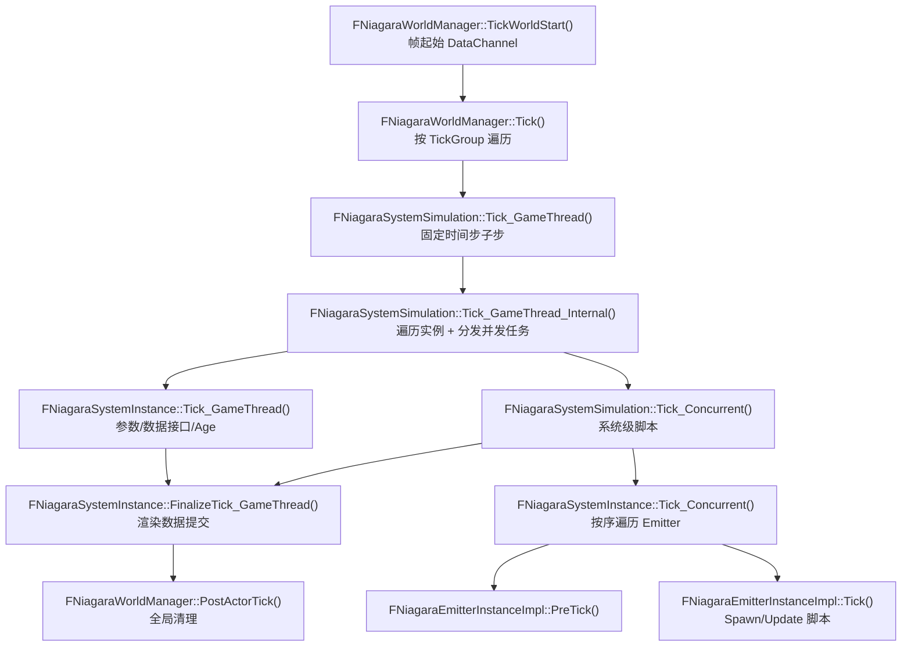
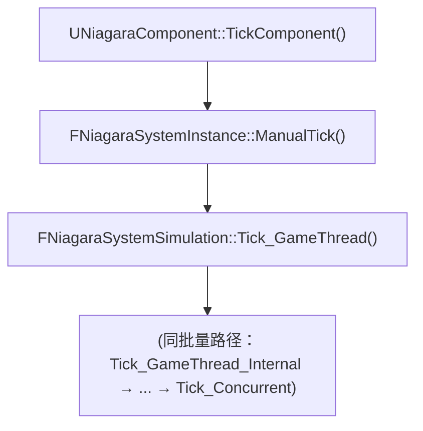

# Niagara 系统 Tick 与执行流程

**日期:** 2026-06-24
**分支:** UE-5.5.4 源码阅读
**关联 commit:** 无（基于 UnrealEngine 5.5.4 官方源码静态分析，未做改动）
**作者:** yangxu.li

> 本文讲 Niagara 从引擎主循环挂接、到单个发射器粒子 Spawn/Update 的整条 CPU 执行链。读完能回答：一帧里 Niagara 由谁、按什么顺序、在哪个线程驱动到 `FNiagaraEmitterInstanceImpl::Tick`。原 `Niagara运行流程.md` 已按 [`documentation_guide.md`](./documentation_guide.md) 重构迁移至此。

---

## 0. 一句话概括

引擎按 TickGroup 调度 `FNiagaraWorldManager::Tick` → 批量驱动 `FNiagaraSystemSimulation::Tick_GameThread` / `Tick_Concurrent` → 逐实例 `FNiagaraSystemInstance::Tick_GameThread` / `Tick_Concurrent` → 逐发射器 `FNiagaraEmitterInstanceImpl::PreTick` / `Tick`；GameThread 负责参数与数据接口绑定，Concurrent 负责粒子模拟，`FinalizeTick_GameThread` 收尾渲染数据。

---

## 1. 涉及文件 / 关键文件索引

| 文件 | 符号（函数/类） | 职责 |
|---|---|---|
| `NiagaraWorldManager.cpp` | `FNiagaraWorldManager::TickWorldStart()` | 绑定 `FWorldDelegates::OnWorldTickStart`，帧起始 DataChannel 处理 |
| `NiagaraWorldManager.cpp` | `FNiagaraWorldManager::PostActorTick()` | Actor Tick 之后的全局清理 |
| `NiagaraWorldManager.cpp` | `FNiagaraWorldManager::Tick()` | **主入口**，按 TickGroup 遍历 SystemSimulation 并驱动其 Tick |
| `NiagaraWorldManager.cpp` | `FNiagaraWorldManagerTickFunction` | 每个 TickGroup 注册的引擎 Tick 函数 |
| `NiagaraSystemSimulation.cpp` | `FNiagaraSystemSimulation::Tick_GameThread()` | 固定时间步子步逻辑，转 `Tick_GameThread_Internal` |
| `NiagaraSystemSimulation.cpp` | `FNiagaraSystemSimulation::Tick_GameThread_Internal()` | 遍历运行/待 Spawn 实例调其 GameThread Tick，分发并发任务 |
| `NiagaraSystemSimulation.cpp` | `FNiagaraSystemSimulation::Tick_Concurrent()` | 系统级 Spawn/Update 脚本，逐实例 `Tick_Concurrent` |
| `NiagaraSystemSimulation.cpp` | `FNiagaraSystemSimulationTickConcurrentTask` | TaskGraph 并发任务（可退化为同步） |
| `NiagaraSystemInstance.cpp` | `FNiagaraSystemInstance::Tick_GameThread()` | 更新实例参数/数据接口、递增 Age 与 TickCount |
| `NiagaraSystemInstance.cpp` | `FNiagaraSystemInstance::Tick_Concurrent()` | 按执行顺序遍历 Emitter，调 PreTick / Tick |
| `NiagaraSystemInstance.cpp` | `FNiagaraSystemInstance::FinalizeTick_GameThread()` | 回 GameThread 提交渲染数据等收尾 |
| `NiagaraSystemInstance.cpp` | `FNiagaraSystemInstance::ManualTick()` | Solo 模式入口，组件直接驱动 |
| `NiagaraEmitterInstanceImpl.cpp` | `FNiagaraEmitterInstanceImpl::PreTick()` | Tick 执行上下文（Spawn/Update/GPU/Events），首帧准备前帧参数 |
| `NiagaraEmitterInstanceImpl.cpp` | `FNiagaraEmitterInstanceImpl::Tick()` | 主 Tick：事件/Spawn、CPU 粒子模拟（Spawn+Update 脚本）、生命周期 |
| `NiagaraEmitterInstanceImpl.cpp` | `FNiagaraEmitterInstanceImpl::PostTick()` | 后处理清理 |
| `NiagaraComponent.cpp` | `UNiagaraComponent::TickComponent()` | Solo 模式组件驱动入口 |

---

## 2. 背景 / 概念

- **TickGroup 分组调度**：Niagara 支持多个 TickGroup，系统可配置在不同引擎阶段执行；WorldManager 为每个 TickGroup 注册一个 `FNiagaraWorldManagerTickFunction`。
- **GameThread / Concurrent 分离**：参数绑定、数据接口更新必须在 GameThread；粒子模拟可并发执行。
- **批量管理**：同一 `UNiagaraSystem` 资产的所有实例由同一个 `FNiagaraSystemSimulation` 批量调度，减少调度开销。
- **Solo 模式**：独立 Tick 的系统不走 WorldManager 批量路径，由组件直接 `ManualTick` 驱动。

---

## 3. 数据流 / 流程图

本图说明：WorldManager 批量路径下，一帧内从 TickGroup 调度到发射器 Tick 的调用链。



本图说明：Solo 模式（组件驱动）入口与批量路径汇合。



---

## 4. 各层级详解

### 4.1 世界管理器 `FNiagaraWorldManager`

引擎按 TickGroup 顺序调度每个 `FNiagaraWorldManagerTickFunction`。第一个 TickGroup 时处理 Scalability、参数集合、视图缓存等全局逻辑；对每个 TickGroup 遍历对应的 `SystemSimulations` 调 `Sim->Tick_GameThread()`。

- `TickWorldStart()`：绑 `FWorldDelegates::OnWorldTickStart`，帧起始处理 DataChannel。
- `Tick()`：**主入口**，按 TickGroup 遍历 SystemSimulation 并驱动。
- `PostActorTick()`：Actor Tick 之后的清理。

### 4.2 系统模拟 `FNiagaraSystemSimulation`

同一 `UNiagaraSystem` 资产的所有实例由同一个 Simulation 管理，实现批量调度。并发部分经 `FNiagaraSystemSimulationTickConcurrentTask`（TaskGraph）分发，可退化为同步。

- `Tick_GameThread()`：固定时间步子步逻辑，转 `Tick_GameThread_Internal`。
- `Tick_GameThread_Internal()`：遍历运行/待 Spawn 实例，调其 GameThread Tick，再分发并发任务。
- `Tick_Concurrent()`：运行系统级 Spawn/Update 脚本，逐实例 `Tick_Concurrent`。

### 4.3 系统实例 `FNiagaraSystemInstance`

- `Tick_GameThread()`：更新实例参数、数据接口，递增 Age 和 TickCount。
- `Tick_Concurrent()`：按执行顺序遍历所有 Emitter，依次调 `PreTick` 与 `Tick`。
- `FinalizeTick_GameThread()`：回 GameThread 做渲染数据提交等收尾。
- `ManualTick()`：Solo 模式入口，组件直接驱动。

### 4.4 发射器实例 `FNiagaraEmitterInstanceImpl`

- `PreTick()`：Tick 执行上下文（Spawn/Update/GPU/Events），首帧准备前一帧参数。
- `Tick()`：主 Tick——处理事件/Spawn、运行 CPU 粒子模拟（Spawn 脚本与 Update 脚本）、粒子生命周期管理。
- `PostTick()`：后处理清理。

---

## 5. 建议阅读顺序

1. `FNiagaraWorldManager::Tick` —— TickGroup 调度机制，Niagara 如何挂接引擎主循环。
2. `FNiagaraSystemSimulation::Tick_GameThread_Internal` —— 批量管理 SystemInstance 的方式与 GameThread/Concurrent 职责分工。
3. `FNiagaraSystemInstance::Tick_Concurrent` —— 单系统如何按序驱动其所有 Emitter。
4. `FNiagaraEmitterInstanceImpl::Tick` —— 粒子 Spawn/Update 脚本的实际执行。

---

## 6. 关键设计要点

- **TickGroup 分组调度**：系统可配置在不同引擎阶段执行。
- **GameThread/Concurrent 分离**：参数与数据接口绑定在 GameThread，粒子模拟可并发。
- **批量管理**：同资产实例由同一 Simulation 批量调度，减开销。
- **Solo 模式**：独立 Tick 系统不走批量路径，由组件直接驱动。

---

## N. 验证 / 落地清单

本文为源码阅读类文档（无改动），验证清单用于确认文档描述仍与源码一致：

- [ ] `FNiagaraWorldManager::Tick` 仍按 TickGroup 遍历 `SystemSimulations` 并调 `Sim->Tick_GameThread()`
- [ ] `FNiagaraSystemSimulation::Tick_GameThread_Internal` 仍遍历实例并分发并发任务
- [ ] `FNiagaraSystemInstance::Tick_Concurrent` 仍按序遍历 Emitter 调 PreTick/Tick
- [ ] `FNiagaraEmitterInstanceImpl::Tick` 仍负责 CPU Spawn/Update 脚本执行
- [ ] Solo 模式仍由 `UNiagaraComponent::TickComponent` → `ManualTick` 入口

---

## 附录

### 术语表

| 术语 | 含义 |
|---|---|
| TickGroup | 引擎 Tick 阶段分组，Niagara 系统可配置在其中执行 |
| SystemSimulation | 管理同一 UNiagaraSystem 资产所有实例的批量调度器 |
| Concurrent | 并发线程部分，粒子模拟在此执行 |
| Solo 模式 | 组件直接驱动系统 Tick，不经 WorldManager 批量路径 |
| PreTick / Tick / PostTick | 发射器实例的三段式 Tick |

### 自检命令

```bash
# 校验 WorldManager 主入口与挂接点
grep -n "void FNiagaraWorldManager::Tick\b\|OnWorldTickStart.AddStatic" \
  Engine/Plugins/FX/Niagara/Source/Niagara/Private/NiagaraWorldManager.cpp

# 校验 SystemSimulation 三段 Tick
grep -n "::Tick_GameThread_Internal\|::Tick_Concurrent\b\|::Tick_GameThread()" \
  Engine/Plugins/FX/Niagara/Source/Niagara/Private/NiagaraSystemSimulation.cpp

# 校验 SystemInstance 四入口
grep -n "::Tick_GameThread()\|::Tick_Concurrent()\|::FinalizeTick_GameThread()\|::ManualTick" \
  Engine/Plugins/FX/Niagara/Source/Niagara/Private/NiagaraSystemInstance.cpp

# 校验 Emitter 三段式
grep -n "void FNiagaraEmitterInstanceImpl::PreTick\|void FNiagaraEmitterInstanceImpl::Tick\b\|void FNiagaraEmitterInstanceImpl::PostTick" \
  Engine/Plugins/FX/Niagara/Source/Niagara/Private/NiagaraEmitterInstanceImpl.cpp
```
