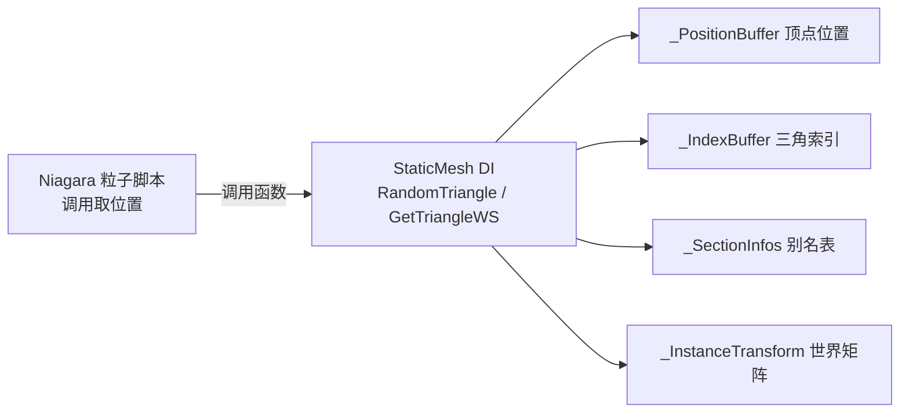
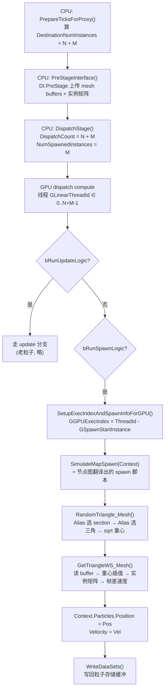
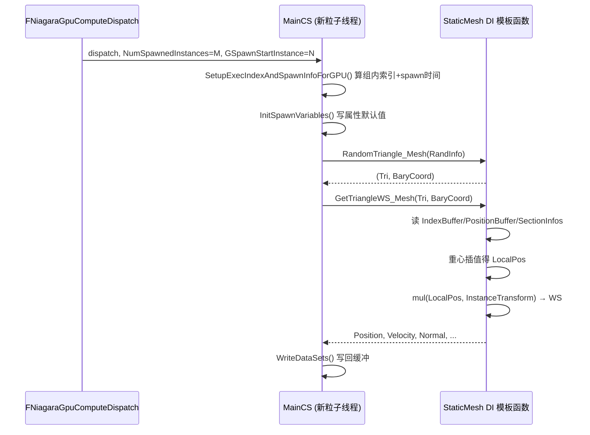

# Niagara GPU Static Mesh Location 粒子 Spawn 流程

**日期:** 2026-06-24
**分支:** UE-5.5.4 源码阅读
**关联 commit:** 无（基于 UnrealEngine 5.5.4 官方源码静态分析，未做改动）
**作者:** yangxu.li

> 本文解析 Niagara GPU emitter 在 **粒子 Spawn 阶段** 如何用 `UNiagaraDataInterfaceStaticMesh` 在静态网格表面采样位置。只讲 GPU 侧，CPU/VectorVM 路径不涉及。读完能回答：spawn 这条数据从"CPU 决定生成几个"到"每个新粒子在世界空间拿到一个表面点"的完整链路。

---

## 0. 一句话概括

GPU spawn 不是一个独立 shader——它是每个 sim stage compute shader 里 `else if (bRunSpawnLogic)` 分支；`StaticMeshLocation` 节点图被 `FNiagaraHlslTranslator` 翻译成 `SimulateMapSpawn(Context)` 内的内联 DI 调用，新粒子线程在此调用 `RandomTriangle`/`GetTriangleWS` 完成面积加权采样、重心插值与世界变换。

---

## 1. 涉及文件 / 关键文件索引

| 文件 | 符号（函数/类/字段） | 职责 |
|---|---|---|
| `NiagaraGpuComputeDispatch.cpp` | `FNiagaraGpuComputeDispatch::ExecuteTicks()` | 每帧 GPU 仿真总入口，遍历 dispatch group 与 sim stage |
| `NiagaraGpuComputeDispatch.cpp` | `FNiagaraGpuComputeDispatch::PrepareTicksForProxy()` | 算出本轮 spawn 数量，填 `DestinationNumInstances` |
| `NiagaraGpuComputeDispatch.cpp` | `FNiagaraGpuComputeDispatch::DispatchStage()` | 计算 dispatch 维度、传 `NumSpawnedInstances` 等 uniform、下发 compute |
| `NiagaraGpuComputeDispatch.cpp` | `FNiagaraGpuComputeDispatch::PreStageInterface()` | 每 stage 执行前调各 DI proxy 的 `PreStage()`，绑定 buffer/uniform |
| `NiagaraHlslTranslator.cpp` | `FNiagaraHlslTranslator`（生成 `MainCS`） | 把节点图翻译成 HLSL，spawn/update 两分支拼在同一 `main` |
| `NiagaraEmitterInstanceShader.usf` | `SetupExecIndexAndSpawnInfoForGPU()` | 新粒子线程把 `GLinearThreadId` 翻译成"组内新粒子索引"+ spawn 时间 |
| `NiagaraEmitterInstanceShader.usf` | `NiagaraRandomBaryCoord()` | sqrt 技巧生成面积均匀的重心坐标 |
| `NiagaraDataInterfaceStaticMeshTemplate.ush` | `RandomTriangle_{P}()` / `RandomSection_{P}()` / `RandomSectionTriangle_{P}()` | Alias 法两级选三角 + 生成重心 |
| `NiagaraDataInterfaceStaticMeshTemplate.ush` | `UniformTriangle_{P}()` | 逐三角 Alias 加权（启用均匀采样时） |
| `NiagaraDataInterfaceStaticMeshTemplate.ush` | `GetTriangle_{P}()` / `GetTriangleWS_{P}()` | 重心插值得局部点 → 世界变换 → 帧差算速度 |
| `NiagaraDataInterfaceStaticMeshTemplate.ush` | `GetVertex_{P}()` / `GetVertexWS_{P}()` | 顶点级采样（Location 模块顶点模式的入口） |
| `NiagaraDataInterfaceStaticMesh.cpp` | `UNiagaraDataInterfaceStaticMesh::GetCommonHLSL()` | shader 头插入 `.ush` 模板 `#include` + 声明 DI buffer |
| `NiagaraDataInterfaceStaticMesh.cpp` | `UNiagaraDataInterfaceStaticMesh::GetFunctionHLSL()` | 为每个 DI 函数生成 `{InstanceFunctionName}` 适配 wrapper |
| `NiagaraDataInterfaceStaticMesh.cpp` | `UNiagaraDataInterfaceStaticMesh::GetVMExternalFunction()` | CPU 路径绑定（仅对照，本文不展开） |
| `NiagaraDataInterfaceStaticMesh.cpp` | `FNDISectionInfo` / `FNDISectionAreaWeightedSampler` | section 级 Alias 表数据（CPU 烘焙，GPU 查表） |

---

## 2. 背景 / 概念

### 2.0 什么是 StaticMesh DI（Data Interface）

StaticMesh DI（`UNiagaraDataInterfaceStaticMesh`）是 Niagara 体系的**数据源插件**——在粒子脚本与外部数据之间做接口。它不是"给你一个 mesh"，而是**暴露一组 mesh 表面查询函数 + 持有这些函数的输入数据**。同类 DI 还有 `NiagaraDataInterfaceSkeletalMesh`、`NiagaraDataInterfaceTexture`、`NiagaraDataInterfaceColorCurve`——同一模式的不同实例。本文所述"StaticMesh Location"即指用 StaticMesh DI 在 mesh 表面采样的 emitter。

DI 同时扮演三个角色，下面逐一配真实代码说明。

#### 角色 1：函数定义者——告诉 Niagara"我提供哪些函数、签名是什么"

DI 通过 `GetFunctionsInternal()` 把自己的函数注册成 `FNiagaraFunctionSignature`（函数名 + 输入输出类型）。这是粒子脚本能在节点图里搜到 `RandomTriangle`、`GetVertex` 等节点的根本原因——编辑器枚举所有 DI 的签名建节点菜单。

```cpp
// 讲解性摘录（不会入库，注释中文）：注册函数签名
void UNiagaraDataInterfaceStaticMesh::GetFunctionsInternal(TArray<FNiagaraFunctionSignature>& OutFunctions) const
{
    FNiagaraFunctionSignature BaseSignature;
    BaseSignature.Inputs.Emplace(FNiagaraTypeDefinition(GetClass()), TEXT("StaticMesh"));
    BaseSignature.bMemberFunction = true;          // 是成员函数，调用时需绑 DI 实例
    // ...
    GetVertexSamplingFunctions(OutFunctions, BaseSignature);
    GetTriangleSamplingFunctions(OutFunctions, BaseSignature);
    GetSocketSamplingFunctions(OutFunctions, BaseSignature);
    // ...
}

// 单个签名示例：GetVertex(int Vertex) -> (Position, Velocity, Normal, Bitangent, Tangent)
FNiagaraFunctionSignature Sig = BaseSignature;
Sig.Inputs.Emplace(FNiagaraTypeDefinition::GetIntDef(), TEXT("Vertex"));
Sig.Outputs.Emplace(FNiagaraTypeDefinition::GetPositionDef(), TEXT("Position"));
Sig.Outputs.Emplace(FNiagaraTypeDefinition::GetVec3Def(), TEXT("Velocity"));
Sig.Outputs.Emplace(FNiagaraTypeDefinition::GetVec3Def(), TEXT("Normal"));
// ...
OutFunctions.Add_GetRef(Sig).Name = GetVertexName;   // Name = "GetVertex"
```

注册只是声明"有这么个函数"。函数体在哪实现，取决于脚本编译目标——见角色 2。

#### 角色 2：算法实现者——GPU 与 CPU 各一套实现，同名同签名

**GPU 路径**：函数体在 `NiagaraDataInterfaceStaticMeshTemplate.ush` 的 HLSL 模板里。编译期 `GetFunctionHLSL()` 把它文本拼接进 emitter 的 compute shader。例 `GetVertex`：

```hlsl
// 讲解性摘录：GPU 实现，读 _PositionBuffer 取顶点位置
void GetVertex_{P}(int Vertex, out float3 Position, out float3 Velocity,
                   out float3 Normal, out float3 Bitangent, out float3 Tangent)
{
    Vertex = clamp(Vertex, 0, {P}_NumVertices - 1);
    Position.x = {P}_PositionBuffer[Vertex * 3 + 0];   // packed float buffer
    Position.y = {P}_PositionBuffer[Vertex * 3 + 1];
    Position.z = {P}_PositionBuffer[Vertex * 3 + 2];
    // ... 从 _TangentBuffer 解出 TBN
}
```

`{P}`（ParameterName）是文本宏，编译期替换成 DI 实例符号（如 `Mesh`），故多个 DI 实例不重名（`GetVertex_Mesh` / `GetVertex_SecondMesh`）。

**CPU 路径**：函数体是 `.cpp` 里的 C++ lambda，由 `GetVMExternalFunction()` 按函数名绑定。例 `GetVertex` 的 CPU 实现 `VMGetVertex` 直接读 `FStaticMeshLODResources`：

```cpp
// 讲解性摘录：CPU 实现，直接读 CPU 侧渲染数据
// VMGetVertex 内部经 GetLocalTrianglePosition 之类访问：
Position  = LODResource->VertexBuffers.PositionVertexBuffer.VertexPosition(Index0) * BaryCoord.X;
Position += LODResource->VertexBuffers.PositionVertexBuffer.VertexPosition(Index1) * BaryCoord.Y;
Position += LODResource->VertexBuffers.PositionVertexBuffer.VertexPosition(Index2) * BaryCoord.Z;
```

**两条路径同算法、不同数据源**：GPU 读 SRV buffer，CPU 读 `FStaticMeshLODResources`。这是 DI 设计的核心复用——节点图一份，编译时分叉。

#### 角色 3：数据持有者——把 mesh 渲染数据搬成 DI 的可消费形态

DI 不直接持有 `UStaticMesh`，而是把所需的渲染数据缓存到 `FInstanceData_GameThread`，再在 `InitRD()` / GPU tick 时上传成 SRV/uniform。数据来源全部是 `UStaticMesh->GetRenderData()->LODResources[CachedLODIdx]`。

```cpp
// 讲解性摘录：InitRD 把渲染数据搬成 GPU 可消费的 SRV
if (GpuInitializeData.LODResource)
{
    // 索引/顶点/切线/UV/颜色 buffer —— 直接复用 mesh 渲染数据的 RHI SRV
    MeshPositionBufferSRV = GpuInitializeData.LODResource->VertexBuffers.PositionVertexBuffer.GetSRV();
    MeshTangentBufferSRV  = GpuInitializeData.LODResource->VertexBuffers.StaticMeshVertexBuffer.GetTangentsSRV();
    MeshUVBufferSRV       = GpuInitializeData.LODResource->VertexBuffers.StaticMeshVertexBuffer.GetTexCoordsSRV();
    // 面积加权采样表（alias table），CPU 烘焙的资产数据
    MeshUniformSamplingTriangleSRV = GpuInitializeData.bGpuUniformDistribution
        ? GpuInitializeData.LODResource->AreaWeightedSectionSamplersBuffer.GetBufferSRV() : nullptr;
    // 计数
    NumTriangles.X = GpuInitializeData.LODResource->IndexBuffer.GetNumIndices() / 3;
    NumVertices    = GpuInitializeData.LODResource->VertexBuffers.PositionVertexBuffer.GetNumVertices();
}
```

这些 SRV 就是角色 2 GPU 函数里读的 `_PositionBuffer` / `_TangentBuffer` 等。section 级 alias 表 (`_SectionInfos`) 由 `FNDISectionAreaWeightedSampler::Init()` 从 `FStaticMeshSectionAreaWeightedTriangleSamplerArray` 构建，存 `(FirstTriangle, NumTriangles, Prob, Alias)`。

本图说明：粒子脚本通过 DI 函数访问 mesh 数据，DI 同时提供算法与数据。



三角色协作闭环：角色 1 注册签名 → 节点图能调用 → 脚本编译时按目标选角色 2 的 GPU 或 CPU 实现 → 实现读取角色 3 上传的数据 → 粒子拿到结果。

- **Spawn 阶段 = `bRunSpawnLogic` 分支**：Niagara 的 spawn 与 update 不分两个 dispatch，而是同一个 compute shader 内的两个布尔 uniform 分支。dispatch 维度 = `DestinationNumInstances`（老粒子 N + 新粒子 M）；老粒子线程走 `bRunUpdateLogic`，新粒子线程走 `bRunSpawnLogic`。
- **StaticMesh DI 的 GPU 端是函数库模板**：见 §2.0，`NiagaraDataInterfaceStaticMeshTemplate.ush` 带 `{ParameterName}` 宏占位，编译期被文本拼接进每个 emitter 的 compute shader。
- **采样与取值分离**：`RandomTriangle` 只返回 `(Tri, BaryCoord)`，`GetTriangleWS` 再据此取位置。同一采样点可重复取 Position/Normal/UV/Color，随机数可复现。
- **面积加权 = 两级 Alias Method**：section 级 + triangle 级，O(1) 查表，避免大三角形被低估。
- **速度由帧差反推**：不存速度缓冲，`(当前帧世界位置 − 上一帧世界位置) × InvDeltaSeconds`。

---

## 3. 数据流 / 流程图

本图说明：从 CPU 决定 spawn 数量，到 GPU 每个新粒子线程在 mesh 表面拿到世界位置，逐级数据流向。



本图说明：spawn 线程内部时序——索引翻译、spawn 脚本执行、属性写回。



---

## 4. 逐项详解（以及"为什么"）

### 4.1 CPU 决定 spawn 数量

`FNiagaraGpuComputeDispatch::PrepareTicksForProxy()` 每帧算：

```
CurrentNumInstances = PrevNumInstances + SpawnRateInstances + EventSpawnTotal
```

填入 `FNiagaraSimStageData`。对 spawn stage（`bFirstStage == true`），在 `DispatchStage()` 里：

```cpp
// 讲解性摘录（不会入库）
if (SimStageData.bFirstStage)
{
    InstancesToSpawn = SimStageData.DestinationNumInstances - SimStageData.SourceNumInstances;
}
SimStageData.Destination->SetNumSpawnedInstances(InstancesToSpawn);
```

- `SourceNumInstances` = 老粒子 N
- `DestinationNumInstances` = N + M
- `InstancesToSpawn` = M，作为 uniform `NumSpawnedInstances` 下发 GPU

**为什么 dispatch 维度是 N+M 而不是 M**：粒子缓冲连续存储，新粒子紧接老粒子。合并到一个 dispatch，老线程走 update、新线程走 spawn，省一次 buffer 读写与一次 dispatch 开销。

### 4.2 DI 数据绑定（PreStageInterface）

`FNiagaraGpuComputeDispatch::PreStageInterface()` 对每个 DI proxy 调 `PreStage()`。StaticMesh DI 上传：

- 顶点/索引/切线 buffer → SRV：`_PositionBuffer`、`_IndexBuffer`、`_TangentBuffer`
- section info + alias 表 → SRV：`_SectionInfos`、`_UniformSamplingTriangles`
- 当前/上一帧实例矩阵 → uniform：`_InstanceTransform`、`_InstancePreviousTransform`、`_InstanceTransformInverseTransposed`、`_InstancePreviousTransformInverseTransposed`
- `_InvDeltaSeconds`

**为什么每帧刷矩阵**：mesh 运动时新粒子必须采样当前帧世界位置；上一帧矩阵与当前帧配对才能算出表面速度，粒子继承。

### 4.3 GPU 线程入口——spawn/update 同体

`FNiagaraHlslTranslator` 为每个 emitter 动态生成 `MainCS`，spawn/update 两分支同函数（摘录自生成逻辑）：

```cpp
// 讲解性示例：注释可中文
BRANCH
if (bRunUpdateLogic) {            // 老粒子
    SetupExecIndexForGPU();
    InitConstants(Context);
    LoadUpdateVariables(Context, GLinearThreadId);
    ReadDataSets(Context);
    Simulate{Stage}(Context);
    WriteDataSets(Context);
}
else if (bRunSpawnLogic) {        // 新粒子 ← SPAWN
    SetupExecIndexAndSpawnInfoForGPU();
    InitConstants(Context);
    InitSpawnVariables(Context);
    ReadDataSets(Context);
    Context.MapSpawn.Particles.UniqueID =
        Engine_Emitter_TotalSpawnedParticles + GLinearThreadId - GSpawnStartInstance;
    ConditionalInterpolateParameters(Context);
    SimulateMapSpawn(Context);    // ★ 节点图 spawn 脚本在此
    TransferAttributes(Context);
    WriteDataSets(Context);
}
```

**`SimulateMapSpawn(Context)` 就是节点图**：用户在编辑器连的 `RandomTriangle → GetTriangleWS → Position 写回` 被翻译成内联 HLSL 调用嵌在此函数里。

### 4.4 新粒子索引翻译

`SetupExecIndexAndSpawnInfoForGPU()`：

```hlsl
// 讲解性示例：注释可中文
GGPUExecIndex = GLinearThreadId - GSpawnStartInstance;  // 0..M-1 = "我是第几个新粒子"
// 遍历 EmitterSpawnInfoOffsets 找当前 spawn group
Emitter_SpawnInterval       = EmitterSpawnInfoParams[Idx].x;
Emitter_InterpSpawnStartDt  = EmitterSpawnInfoParams[Idx].y;
Emitter_SpawnGroup          = asint(EmitterSpawnInfoParams[Idx].z);
GroupSpawnStartIndex        = asint(EmitterSpawnInfoParams[Idx].w);
GGPUExecIndex               = GGPUExecIndex - GroupSpawnStartIndex;
```

- `GSpawnStartInstance` = N（老粒子数），uniform 下发
- `NIAGARA_MAX_GPU_SPAWN_INFOS` 是编译期常数，支持多个 spawn group（不同 burst）；遍历找组，组数很小，O(组数)
- spawn 脚本通过 `ExecIndex()` 拿到的是组内索引，对脚本透明

### 4.5 面积加权选三角——两级 Alias Method

`RandomTriangle_{P}()` = `RandomSection_{P}()` + `RandomSectionTriangle_{P}()`。

**第 1 级：选 section（Alias 法，O(1)）**

```hlsl
// 讲解性示例
Section = NiagaraRandomInt(RandInfo, SectionCount);
float Prob = asfloat({P}_SectionInfos[Section].z);  // .z = Prob
int   Alias = {P}_SectionInfos[Section].w;          // .w = Alias
Section = NiagaraRandomFloat(RandInfo) < Prob ? Section : Alias;
```

`_SectionInfos` 是 `uint4`：`(FirstTriangle, NumTriangles, Prob, Alias)`。CPU 在 `FNDISectionAreaWeightedSampler` 烘焙好 Prob/Alias（继承 `FWeightedRandomSampler`），GPU 只查表 + 比较。大 section 按面积比例被选中。

**第 2 级：section 内选三角**

```hlsl
// 讲解性示例
int SectionTriangleOffset = {P}_SectionInfos[Section].x;   // FirstTriangle
Tri = NiagaraRandomInt(RandInfo, SectionTriangleCount) + SectionTriangleOffset;
[branch]
if ({P}_HasUniformSampling)        // uniform 常量驱动, 真实统一分支, 无 warp 发散
{
    Tri = UniformTriangle_{P}(RandInfo, Tri, SectionTriangleOffset);
}
```

`UniformTriangle_{P}()` 对**单个三角形**再做一次 Alias（`_UniformSamplingTriangles`，`uint2(Prob, Alias)`）。未烘焙采样表的资产走快路径跳过。

**为什么两级 alias**：把"按面积加权"压成 O(1)，数千粒子并发采样不退化。`[branch]` + uniform 常量保证无 warp 发散。

### 4.6 重心坐标——sqrt 技巧

`NiagaraRandomBaryCoord()`：

```hlsl
// 讲解性示例
float2 r = float2(NiagaraRandomFloat(RandInfo), NiagaraRandomFloat(RandInfo));
float sqrt0 = sqrt(r.x);
return float3(1.0 - sqrt0, sqrt0 * (1.0 - r.y), r.y * sqrt0);
```

直接映射重心 `(1-u-v, u, v)` 会向顶点聚集；`sqrt(r.x)` 撑开分布得面积均匀采样。三分量和恒为 1 且 ≥ 0。

### 4.7 取位置与世界变换

`GetTriangle_{P}()`（局部）→ `GetTriangleWS_{P}()`（世界）：

```hlsl
// 讲解性示例
// GetTriangle: 读三顶点, 重心插值
int Index[3]; GetTriangleIndices_{P}(Tri, Index[0], Index[1], Index[2]);
float3 Positions[3]; GetVertex_{P}(Index[0..2], Positions[0..2], ...);
Position = Positions[0]*Bary.x + Positions[1]*Bary.y + Positions[2]*Bary.z;

// GetTriangleWS: 世界变换 + 速度
Position          = mul(float4(LocalPos, 1), {P}_InstanceTransform).xyz;
float3 PrevPos    = mul(float4(LocalPos, 1), {P}_InstancePreviousTransform).xyz;
Velocity          = (Position - PrevPos) * {P}_InvDeltaSeconds;
Normal            = normalize(mul(float4(Normal,   0), {P}_InstanceTransformInverseTransposed).xyz);
```

**三个工程要点**：
1. 位置用正向矩阵 `w=1`，法线/切线用逆转置矩阵 `w=0`——非均匀缩放下法线仍垂直表面。
2. 速度 = 帧差 × InvDeltaSeconds；`GetTriangle_` 内部 Velocity 清零，真实速度在 WS 版由帧差算。
3. LWC 大世界下位置需叠加 `_SystemLWCTile` 处理精度。

### 4.8 节点图 → HLSL 的桥接（编译期）

- `GetCommonHLSL()`：shader 头插 `.ush` 模板 `#include`，声明所有 DI buffer/uniform。
- `GetFunctionHLSL()`：为每个 DI 调用生成 `{InstanceFunctionName}` wrapper，包住模板函数并补 `MakeRandInfo()` 等细节：

```cpp
// 讲解性摘录
TEXT("void {InstanceFunctionName}(out MeshTriCoordinate OutTriCoord) "
     "{ RandomTriangle_{ParameterName}(MakeRandInfo(), OutTriCoord.Tri, OutTriCoord.BaryCoord); }")
```

`{ParameterName}` = DI 实例符号（如 `Mesh`），`{InstanceFunctionName}` = 节点唯一符号。同一 shader 多个 DI 实例靠宏实例化不重名（`GetTriangleWS_Mesh`、`GetTriangleWS_SecondMesh`）。

---

## 5. 工程化要点小结

| 设计 | 原因 |
|---|---|
| spawn/update 同 shader 两分支 | 粒子缓冲连续存储，合并 dispatch 省 buffer 读写与开销 |
| `.ush` 模板 + 文本宏拼接 | compute shader 无跨 shader 函数链接，只能文本嵌入复用算法 |
| 两级 Alias Method | 面积加权选三角压成 O(1)，GPU 并发友好 |
| `[branch]` + uniform 常量 | `HasUniformSampling` 是 dispatch 级常量，统一分支无发散 |
| 采样与取值分离 | 同一采样点可重复取多属性，随机可复现 |
| 双变换矩阵算速度 | 不存速度缓冲，mesh 运动时粒子自动继承表面速度 |
| 法线用逆转置矩阵 | 非均匀缩放下保持几何正确 |
| sqrt 重心坐标 | 三角形内面积均匀，避免顶点聚集 |

---

## 6. 已知问题

`GetTriangle_{P}()` 中 Normal/Bitangent/Tangent 的第三顶点权重写作 `*BaryCoord.x`（应为 `*BaryCoord.z`）。Position 那行正确。三分量和为 1，故 TBN 插值略偏但不发散。精确复现 TBN 时需按 `z` 修正。

---

## N. 验证 / 落地清单

本文为源码阅读类文档（无改动），验证清单用于确认文档描述仍与源码一致：

- [ ] `RandomTriangle_{P}` 仍为 `RandomSection_{P}` + `RandomSectionTriangle_{P}` 组合
- [ ] `DispatchStage` 仍以 `DestinationNumInstances` 为 1D dispatch 维度
- [ ] `bFirstStage` 仍用于判定 spawn（`InstancesToSpawn = Dest − Src`）
- [ ] `SetupExecIndexAndSpawnInfoForGPU` 仍由 `FNiagaraHlslTranslator` 生成于 spawn 分支
- [ ] `GetCommonHLSL` 仍 `#include` `NiagaraDataInterfaceStaticMeshTemplate.ush`

---

## 附录

### 术语表

| 术语 | 含义 |
|---|---|
| Spawn stage | `bFirstStage == true` 的 sim stage，负责生成新粒子 |
| Alias Method (Vose) | 加权随机采样 O(1) 算法，用 Prob/Alias 两表 |
| BaryCoord | 重心坐标 `(x, y, z)`，和为 1，定位三角形内一点 |
| DI | Data Interface，Niagara 暴露给脚本的外部数据源 |
| ISM | Instanced Static Mesh，实例化静态网格 |
| LWC | Large World Coordinates，大世界坐标精度方案 |

### 自检命令

```bash
# 校验 spawn 分支生成逻辑仍存在
grep -n "SetupExecIndexAndSpawnInfoForGPU" Engine/Plugins/FX/Niagara/Source/NiagaraEditor/Private/NiagaraHlslTranslator.cpp

# 校验 spawn 数量计算
grep -n "InstancesToSpawn = SimStageData.DestinationNumInstances - SimStageData.SourceNumInstances" \
  Engine/Plugins/FX/Niagara/Source/Niagara/Private/NiagaraGpuComputeDispatch.cpp

# 校验两级 Alias 入口
grep -n "RandomSection_\|RandomSectionTriangle_\|UniformTriangle_" \
  Engine/Plugins/FX/Niagara/Shaders/Private/NiagaraDataInterfaceStaticMeshTemplate.ush

# 校验 DI shader 桥接
grep -n "GetCommonHLSL\|GetFunctionHLSL" \
  Engine/Plugins/FX/Niagara/Source/Niagara/Private/DataInterface/NiagaraDataInterfaceStaticMesh.cpp

# 校验已知问题（TBN 第三顶点权重）
grep -n "BaryCoord.x + Positions\[1\]\*BaryCoord.y\|Bitangents\[2\]\*BaryCoord.x" \
  Engine/Plugins/FX/Niagara/Shaders/Private/NiagaraDataInterfaceStaticMeshTemplate.ush
```
